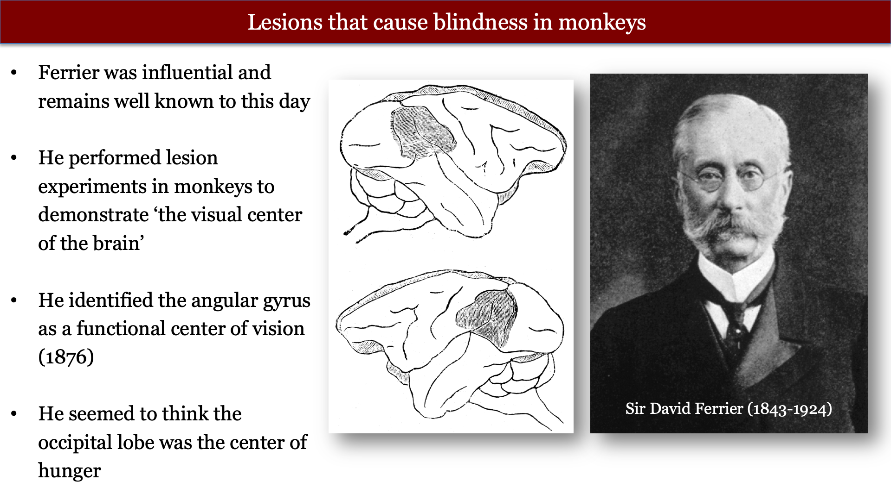
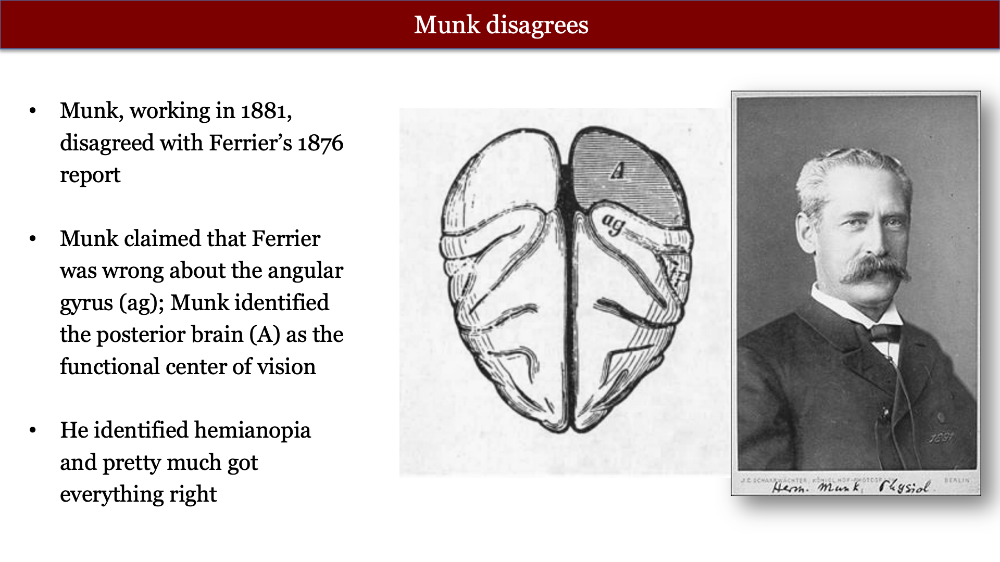
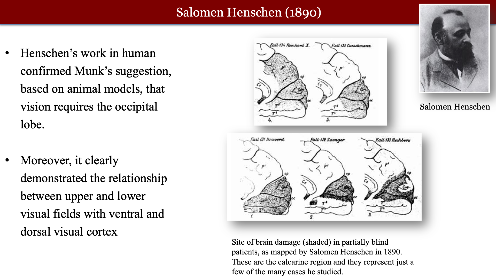
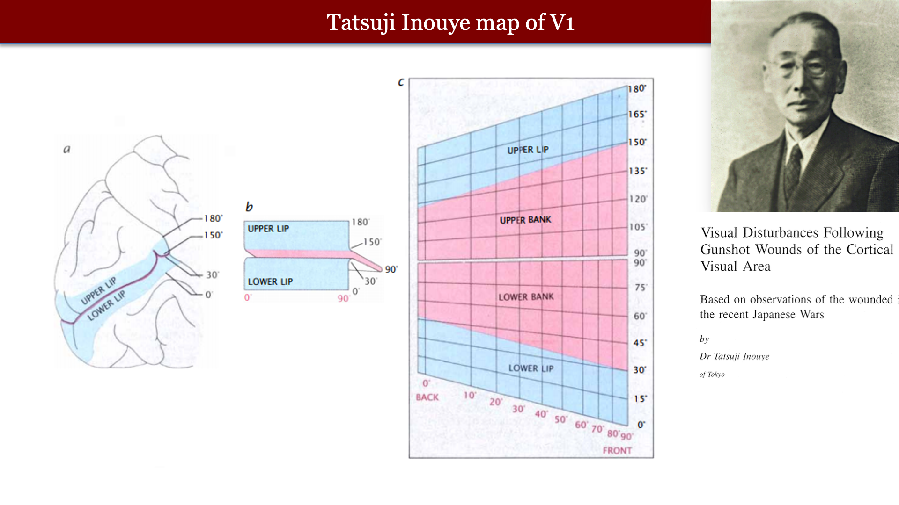
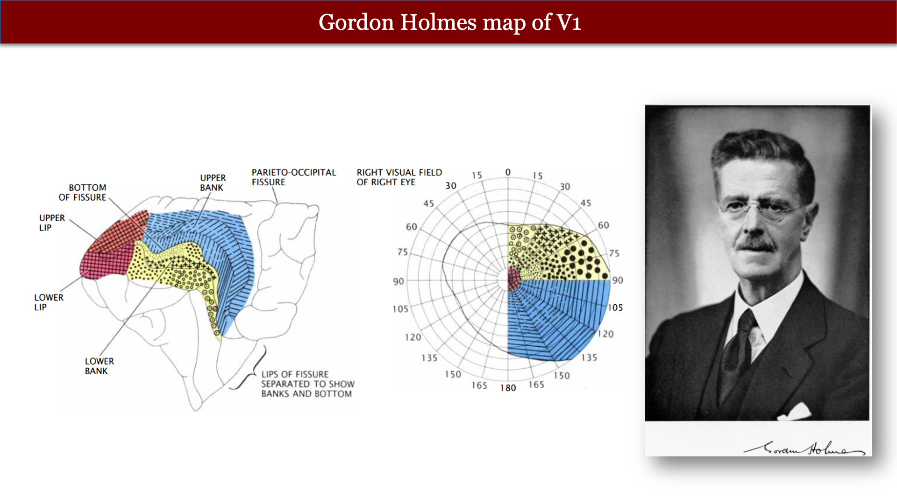
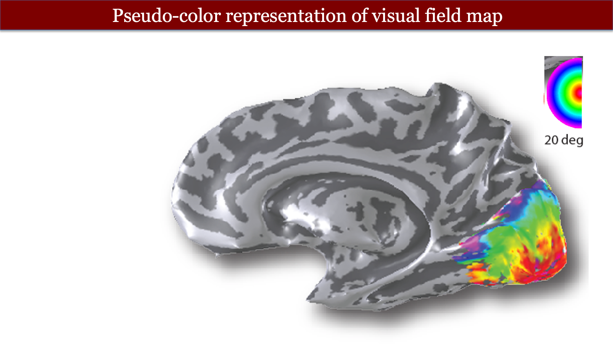
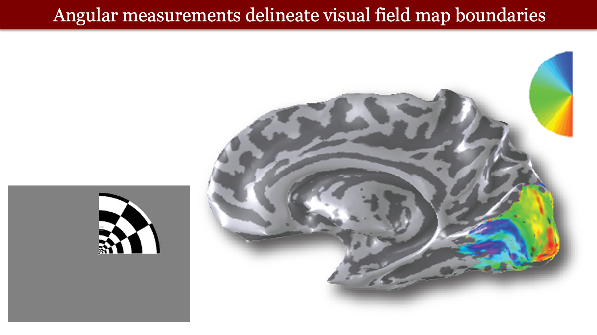
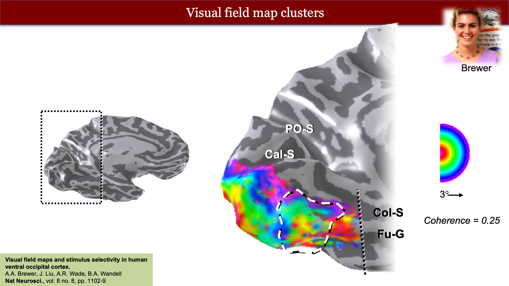

*This is a draft document of a talk I will present at a meeting in London. The text and images here will eventually be transitioned into a new section of **Foundations of Vision (2nd Edition)**. Your comments and suggestions are very welcome.*

# Introduction

Today I will tell two stories about how meso-scale imaging has improved our understanding of the human brain.

The first describes advances in mapping retinotopic maps in human visual cortex. Over the last 30 years, a large group of investigators has significantly advanced our understanding of the organization of these visual field maps. While the organization of human visual cortex shares similarities with macaques, there are important differences that I will enumerate. Furthermore, the large field of view provided by human neuroimaging has revealed that these maps are organized in clusters. I will suggest that these discoveries warrant a revision of the widely used Felleman and Van Essen diagram, which emphasizes macaque data, blends the concepts of areas and maps, and does not capture the cluster organization of human maps.

The second is a story about measurements of adult cortical plasticity in the visual system. The idea of large-scale adult cortical plasticity, which generated much excitement around 1990, does not appear to hold true in sensory areas. A large body of human MRI work now shows that adult visual cortex is relatively stable and does not undergo large-scale reorganization in response to changes in retinal input. I will also discuss the cellular mechanisms that may underlie this stability, particularly their relationship to perineuronal nets. Recognizing this stability allows us to focus on mechanisms that might genuinely repair cortex after injury, avoiding the distraction of trying to explain non-existent large-scale reorganization in the healthy adult brain.

I plan to incorporate the material from this presentation into the second edition of my book *Foundations of Vision*, which is currently in preparation. Elements of each story will likely be familiar to many of you, particularly those who have studied visual neuroscience. My goal is to ensure the ideas and data are clear, accurate, and comprehensive, and that the figures are informative. I welcome your comments on any aspect of this talk, including the text, figures, and references.

# Visual Field Maps - Historical Perspective

The discovery of visual field maps in human cortex is a fun history to read about [@fishman1995-mistake; @glickstein1985-ferrier-mistake; @wandell2011-ImagingRetinotopicMaps]. The debates between Ferrier and Munk in the late 19th century about the location of visual cortex were heated. The disagreements were not just about the data, but also about the interpretation of the data and the implications for our understanding of brain function.

{#fig-ferrier-munk-inouye-holmes width="80%"}

Ferrier performed lesion studies in monkeys and proposed that primary visual cortex was located in the angular gyrus. The German physiologist, Hermann Munk, disagreed with Ferrier's anatomical localization and argued that visual cortex was in the calcarine region — a critical correction that set the stage for more accurate understanding of retinotopic organization.

::: {#fig-ferrier-munk layout-ncol=2}
{#fig-sub-ferrier-angular-gyrus width="85%"}

{#fig-sub-munk-occipital-lobe width="85%"}

A comparison of visual cortex localization from Ferrier and Munk.
:::

::: {#nte-ferrier-munk-james .callout-note}
No need to wonder what Munk thought about Ferrier's work.  Here are his own words.

> In my first communication on the physiology of the cortex which I made in March of last year I did not say anything about Ferrier’s work on the monkey because there was nothing good to be said about it. But asked in the subsequent session I had to say that Mr. Ferrier's declarations that the visual center in the monkey was situated in the angular gyrus \[… and other claims …\] that all these statements and what followed from them as far as the character and restitution of disturbances set by the operation are concerned, are worthless and gratuitous constructions since the operated animals were examined by Mr. Ferrier in quite an insufficient manner and only at the time of general depression of brain function.
>
> If I have gone too far in this statement which is based on a general survey of Mr. Ferrier’s experiments it was up to me to restore the injury, the sooner the better. However, as the experiments show now I have said at that time rather too little than too much, Mr. Ferrier had not made one correct guess, all his statements have turned out to be wrong.

Commenting on the debate from the other side of an ocean, William James wrote "the quarrel is very acrimonious; indeed the subject of localization of functions in the brain seems to have a peculiar effect on the temper of those who cultivate it experimentally. Each observer is sure that he is right, and is ready to explain away the adverse results of his rivals. ... Munk's absolute tone about his observations and his theoretic arrogance have led to his ruin as an authority. (@james1890-principles, p. 46)”.

James went on to write about Munk:

> But he did two things of permanent value. He was the first to distinguish in these vivisections between sensorial and psychic blindness, and to describe the phenomenon of restitution of the visual function after its first impairment by an operation ; and the first to notice the hemiopic character of the visual disturbances which result when only one hemisphere is injured. Sensorial blindness is absolute insensibility to light ; psychic blindness is inability to recognize the meaning of the optical impressions, as when we see a page of Chinese print but it suggests nothing to us. A hemiopic disturbance of vision is one in which neither retina is affected in its totality, but in which, for example, the left portion of each retina is blind, so that the animal sees nothing situated in space towards its right (Page 41 in the downloaded PDF from mpg.de).

Finally, everyone should enjoy a visit with Charlie Gross' book that is filled with interesting histories of neuroscience discovery.  His book includes more information about the Ferrier-Munk (describing the role of Schaefer, for example) [@gross1998-brain-book].
:::

It was the Swedish neurologist, Henschen, who first carefully observed the visual loss in **human** patients with occipital lesions. He concluded that at least part of the visual field, the upper and lower portions, were represented in cortex in an orderly map with the lower visual field in the dorsal occipital lobe and upper visual field in the ventral occipital lobe.

{#fig-henschen width="80%"}

Henschen's observations were confirmed and extended by two clinicians working at opposite ends of the world: Gordon Holmes and Tatsuye Inouye. Both were studying visual field losses from soldiers injured in their countries' wars, Holmes in Europe and Inouye in Japan. In that era, the guns were not always lethal, and the helmets would permit bullets to enter and exit the posterior skull, effectively lesioning a portion of occipital cortex. Such lesions could cause a permanent but partial visual field loss. By accumulating data from a number of different cases, they could deduce the general organization of the human retinotopic organization. In addition to the upper-lower field representation, they both reported on the eccentricity map as well as the fact that the central portion of the visual field occupied more cortical territory (per square degree) than the peripheral portion. This phenomenon is called 'cortical magnification', and though perhaps it should be called 'foveal magnification'.

::: {#fig-inouye-holmes layout-ncol=2}
{#inouye-map width="80%"}

{#holmes-map width="80%"}
:::

## Multiple maps

Talbot and colleagues in Wisconsin were the first to discover a second retinotopic maps (in rabbit). Cowey was the first to report a second visual map in a non-human primate [@cowey1964-v2]; Hubel and Wiesel reported two extrastriate maps in cat [@hubel1965-cat-v2-v3]. These reports were followed by a large collection of studies, identifying additional maps but also additional patches of cortex with distinct properties. Some of this history is summarized in the book by @zeki1993-book. Anatomical regions with visually responsive neurons and distinctive properties came to be known as 'visual areas', whether or not they were retinotopically organized.

::: {#nte-multiple-maps .callout-note}
The effort to discover and map multiple visual areas in animal models expanded enormously between the 1940s and the 1990s. The major milestones include:

-   **The 1940s (V2 in cats and rabbits)**: The discovery of multiple visual field maps began when electrophysiological measurements revealed a second visual map (V2) adjacent to the primary visual cortex (V1) in the rabbit and cat. These early discoveries were spearheaded by Talbot, Marshall, Thompson (see review [@thompson1950-visual-maps]) from the Wisconsin laboratory established by Woolsey.
-   **The 1960s (V2 and V3 in monkeys and cats)**: Mapping efforts successfully extended to non-human primates when Cowey identified a second map in the squirrel monkey [@cowey1964-v2]. The following year, Hubel and Wiesel described a third map in the cat [@hubel1965-cat-v2-v3].
-   **The 1970s–1990s (V4, MT/V5, and beyond)**: During this period, investigators focused heavily on parcellating the extrastriate cortex of non-human primates, causing the number of identified maps to grow rapidly. A major breakthrough was the discovery of V4 and the motion-sensitive MT/V5 maps in the owl monkey by Allman and Kaas in 1971.
-   **Non-human primates** Around the same time, Semir Zeki conducted pioneering anatomical and single-unit studies that established a framework for the concentric organization of these maps in macaques [@zeki1969-multiple-maps; @zeki1974-mt]. It was during this period that he made an effort to associate specific functional (perceptual) properties to individual maps [@zeki1978-function; @zeki1993-book].
-   **Methodological challenges**: Identifying these early maps relied heavily on single-unit electrophysiology and very detailed anatomical work. Because the field of view for these technologies is relatively small, establishing the existence of a map was a notoriously difficult process that Hubel and Wiesel [@hubel1977] famously likened to "a dismaying exercise in tedium, like trying to cut the back lawn with a pair of nail scissors".
:::

The burst of activity reporting visual areas was summarized in an important article by [@felleman1991-hierarchy]. @fig-felleman-vanessen is an iconic image from that paper, which relies on the concept of a 'visual areas'. The authors propose that visual areas are organized into a hierarchy with signals flowing from the bottom (retina, LGN, V1) to the top (peri-hippocampal regions). The data supporting the specific organization were sparse, and they have been significantly augmented by measurements from Henry Kennedy's lab [@markov2013-hierarchicalanatomy; @markov2014-hierarchicalanatomy2]. I discuss a possible update at the end of this section.

{#fig-felleman-vanessen width="80%"}

::: {#nte-FACT .callout-note}
A generation of scientists were taught the definition of a visual area. Van Essen proposed that a cortical “visual area” is a region that can be distinguished from its neighbors by a convergence of evidence across function, anatomy, connectivity, and topographic organization (FACT), rather than by any single criterion alone.  These are the criteria:

-   **F — Function**: Neurons in the region share distinctive response properties (e.g., motion selectivity, color bias, disparity tuning).
-   **A — Anatomy (architectonics)**: The region has distinguishable microstructure (e.g., cytoarchitecture, myeloarchitecture, laminar patterns).
-   **C — Connections**: It has a characteristic pattern of inputs and outputs (afferent/efferent connectivity distinct from neighboring cortex).
-   **T — Topography**: It contains an orderly map of the visual field (retinotopy), often with clear field boundaries (e.g., meridian reversals).
-   
:::

The *visual area* terminology was influential, but in my view and that of some others it is an arbitrary and often incoherent term.[@wandell2007-VisualFieldMaps; @hayden2025-rethinking-areas]. It is important to clarify the reason for identifying a region of cortex: it contains a retinotopic maps, neurons with common functional responses, similar cellular properties, or common input and output targets. The use of the concept of 'area', which could be any or some mixture of these without a clear rule, is less helpful than one might have thought in the early days.

## Human retinopic maps
Most scientists believed that the retinotopic maps found in non-human primates would be a good model for human visual cortex. But even as late as 1991, Horton and Hoyt observed that there was no proof of even two maps maps in human visual cortex [@horton1991-quadraticdefects; @horton1991-representationvisualfield]. The need for guessing changed with the introduction of functional magnetic resonance imaging (fMRI). That technology enabled investigators to identify retinotopic maps in the living human brain at the resolution of a few milimeters in experiments lasting less than an hour. Over time, the spatial precision and duration of the experiments has decreased dramatically.

Steve Engel and I - helped by many others - developed a technique to measure eccentricity and angle maps that was widely adopted [@engel1994-fmri; @engelRetinotopicOrganizationHuman1997]. The stimulus and cortical responses (fMRI) for measuring eccentricity are shown in the @fig-eccentricity-movie. If you look at the video casually, you will see the wave from the occipital pole traveling in the anterior direction of the main map. If you look a little more closely, you will also see a secondary ripple on the ventral occippital-temporal surface. That ripple starts when the stimulus is in the fovea and then fades out as the ring expands about half way (10 deg). The VOT eccentricity map is a second eccentricity map, confined mainly to the perifoveal visual field, that is distinct from the calcarine map.

{#fig-eccentricity-movie width="80%" loop="true" autoplay="true" muted="true"}

We also made measurements using a rotating wedge stimulus to measure the most effective angular position for each voxel. The angular responses subdivide the eccentricity map into different visual field maps. The data from the video are summarized in two pseudo-color maps showing the most effective visual field eccentricity for each cortical location

::: {#fig-maps layout-ncol=2}

{#fig-eccentricity-map width="85%"}

{#fig-angle-map width="85%"}

Eccentricity and angle measurements, combined, are used to define a retinotopic map.
:::

Summarizing the information from the maps, we can label an entire retinotopic map using a single color, as in @fig-areas-magnification. Notice that these maps are not simply adjacent to one another.  Rather, the V2 map surrounds V1, and it is surrounded, in turn by the V3 map.  Thus the dorsal and ventral portions of the V2 and V3 map - which represent the lower and upper visual field - are well-separated from one another.

{#fig-areas-magnification width="80%"}

Get the Dougherty and Benson-Winawer surface area paper in here, too.

Alyssa Brewer noticed the secondary fovea on the ventral occipital surface and decided to explore it further [@brewer2005-visualFieldMaps-clusters]. To see the two clusters distinctly, she decided to use a much smaller field of view for the rings, expanding them slowly through the central 3 deg. You can see the two eccentricity maps - plainly distinct from one another in @fig-vo-cluster.

{#fig-vo-cluster width="80%"}

Over time, it become clear to us that there were multiple distinct eccentricity maps, illustrated in each of these two brief videos. These eccentricity maps can be subdivided into different individual maps by also considering the angle representations, just as V1-V3 can be separated from the unified eccentricity map around the posterior pole and calcarine cortex in human.

Here are two different visualizations of the clusters.  First they are shown on a slightly inflated cortical surface.

{#clusters-movie width="80%" loop="true" autoplay="true" muted="true"}

Here the multiple eccentricity maps are represented on a flattened cortical surface; the video oscillates between the measured eccentricity and a cartoon overlay that emphasizes the pattern.

{#fig-clusters-flatmap width="80%" loop="true" autoplay="true" muted="true"}

## Other groups using clusters
This pattern of cortical retinotopic map clusters has been confirmed in both human and non-human primates by several groups in posterior and anterior cortex, [@mackey2017-clusters], non-human primates [@kolster2009-clusters; @kolster2014-macaque-mt; @barton2017-sts-cluster; @meyer2025-clusters-evolution] and also in the pulvinar [@arcaro2015-pulvinar-cluster]. The retinotopic map cluster seems to be a basic principle that is implemented to support local computational processing and may have implications for development and plasticity.


```{=html}
<!--
Clusters in the Human Brain
Frontoparietal Clusters (Mackey et al., 2017)
Expanding the cluster model into higher-order cortex, this study identified multiple representations of polar angle and eccentricity in the human frontoparietal cortex (Mackey et al., 2017). They discovered that these maps are organized into clusters sharing a confluent fovea, mirroring the organization of the visual cortex to facilitate efficient sensorimotor and cognitive processing (Mackey et al., 2017).

The Pulvinar Cluster (Arcaro et al., 2015)
In a significant extension of the theory, Arcaro and colleagues identified two visual field maps in the human ventral pulvinar (vPul1 and vPul2) (Arcaro et al., 2015). They proposed that these maps form a distinct visual field map cluster because they share an eccentricity representation and exhibit similar cortical connectivity patterns with early extrastriate areas (Arcaro et al., 2015).

The pSTS "Cloverleaf" Cluster (Barton & Brewer, 2017)
While Alyssa Brewer was a former member of your lab, this 2017 work with Brian Barton introduces a new cloverleaf cluster in the posterior superior temporal sulcus (pSTS) (Barton & Brewer, 2017). They characterized four distinct maps (pSTS-1 through pSTS-4) organized around a central foveal representation, suggesting this "radially orthogonal" structure is a fundamental principle for high-level visual and potentially multimodal processing (Barton & Brewer, 2017).

Probabilistic Map Atlases (Wang et al., 2015)
The Kastner group developed a probabilistic atlas of the human visual system that largely validates the cluster-based organization for more than 20 maps (Wang et al., 2015). This work is often cited as a large-scale confirmation of the cluster model across a large subject population (Wang et al., 2015).

Macaque Motion Clusters (Kolster et al., 2009)
As you noted, the Kolster and Vanduffel work is the primary reference for clusters in non-human primates, specifically identifying the MT cluster (MT, MST, FST, and V4t) (Kolster et al., 2009). Their work demonstrated that the cluster principle—minimizing wiring length between processing modules—is not unique to humans but is a general feature of the Old World primate visual system (Kolster et al., 2009).
-->
```

## Comparative anatomy
In a very recent paper, researchers used fMRI to compare the visual cortex of humans and macaques, concluding that human cortical expansion results from the enlargement of a conserved visual map architecture (Meyer et al., 2025). They emphasize that the number of areas and their cluster-like organization are strikingly similar across species, suggesting that the "cluster" is an evolutionarily preserved unit (Meyer et al., 2025).

Initially, the human fMRI groups relied on the macaque model - almost slavishly - to guide our interpretation of the retinotopic maps. Over time, investigators developed more confidence in the human fMRI data, and it has become clear that there are clear differences. Some of the comparisons are listed in in the Some of the more obvious differences are these

* The surface area of human V3 is much larger than the surface area of macaque V3
* In human the postion of the fourth visual map differs substantially from macaque; sufficiently so that I named it hV4 rather than V4
* The functional responses to motion in human and macaque V3 and V3A do not match


::: {#nte-comparative-organization .callout-note}

Here is a summary of some of the more obvious differences between human and non-human primate clusters and retinotopic maps.

**Overall Size and Neuron Count:** Human visual field maps are substantially larger overall than those in the macaque, with human V1 estimated to be roughly two to four times larger
. Furthermore, the human visual cortex contains a much larger number of neurons, which is thought to reflect the increased processing required for human-specific cognitive demands, such as language and reading Derived from: "Visual Field Maps in Human Cortex" (Wandell, Dumoulin, & Brewer, 2007) and "Imaging retinotopic maps in the human brain" (Wandell & Winawer, 2011).

**Anatomical Location of V1:** In macaques, a large portion of the primary visual cortex (V1) is located on the operculum, extending posterior and lateral to the medial position of the calcarine sulcus. In humans, V1 is located largely within the calcarine sulcus; while it sometimes extends onto the lateral surface of the occipital pole, this lateral extension is not as large or typical as it is in the macaque. Derived from: "Imaging retinotopic maps in the human brain" (Wandell & Winawer, 2011).

**Proportional Size of Area V3:** A highly salient difference between the species is the relative size of area V3. In macaques, V3 occupies a very small surface area compared to V1 and V2
. In humans, V3 is proportionately much larger, meaning the scale factor difference between human and monkey V3 is even greater than the difference between their V1 maps. This difference in the V3/V1 surface area ratio likely reflects a functional divergence between the visual systems of the two species
Derived from: "Imaging retinotopic maps in the human brain" (Wandell & Winawer, 2011), "Visual field representations and locations of visual areas V1/2/3 in human visual cortex" (Dougherty et al., 2003), and "Visual field map clusters in human cortex" (Wandell, Brewer, & Dougherty, 2005). 

**Motion Sensitivity in Area V3A:** Although the map topographies of V3A are similar between humans and macaques, their functional sensitivities are completely different
. Human V3A is highly responsive to motion, whereas macaque V3A is not strongly motion-selective
Derived from: "Visual Field Maps in Human Cortex" (Wandell, Dumoulin, & Brewer, 2007) and "Imaging retinotopic maps in the human brain" (Wandell & Winawer, 2011)

**V4 / hV4 and Color Processing Locations:** In the macaque, area V4 spans both the dorsal and ventral portions of the occipital lobe, and color-exchange experiments produce responses in both components
. In humans, investigators have not reliably found a dorsal component for the fourth visual map; instead, the human map (hV4) and the regions critical for color vision (and those associated with cerebral achromatopsia) are confined almost entirely to the ventral surface. Derived from: "Mapping hV4 and ventral occipital cortex: The venous eclipse" (Winawer et al., 2010), "Imaging retinotopic maps in the human brain" (Wandell & Winawer, 2011), and "Visual Field Maps in Human Cortex" (Wandell, Dumoulin, & Brewer, 2007).

:::

## A non-hierarchical view
@jacques2025-non-hierarchical

## Tools

Wang atlas should get in here, I think.

Benson-Winawer work, deepRetinotopy citations

# Adult cortical plasticity

@barsingerhorn2018-symbol @saber2015-saccade @masuda2008-maculardegenerationV1 @masuda2010-retinitispigmentosa @masuda2021-maculardepgeneration @rosenau2008-feedback

PNN papers in human

@rogers2018-pnn-epilepsy
@mauney2013-pnn-schizophrenia

@nakayama2025-aggrecan-pnn - "Among the PNN-related genes examined, aggrecan alone exhibited strong activity-dependent transcriptional regulation"
<!--
The Nakayama (2025) paper you asked about is the most modern measure of this process. It shows that aggrecan expression is not just a "clock" that runs out; it is activity-triggered.The Measure: Using quantitative PCR and Western blots, Nakayama showed that as neurons begin to fire in response to visual input, the Acan gene is upregulated specifically in Parvalbumin (PV) interneurons.

The Feedback Loop: Increased activity $\rightarrow$ Increased Aggrecan $\rightarrow$ Stronger PNNs $\rightarrow$ Reduced Plasticity (Stability).
-->

gemini:  "A common misconception is that if you turn off the lights, the walls of the house disappear. But as our work in MD and the recent findings from the Dekker lab show, the visual map clusters are structurally persistent. Once the 'molecular armor' (Aggrecan/PNNs) is built, the absence of activity is not enough to dismantle it. The brain values the stability of the topographic blueprint more than the efficiency of re-using silent space."

The second is the principle that adult visual cortex retains a high degree of plasticity, allowing for functional reorganization in response to changes in sensory input or damage. Each of these ideas has been influential in shaping our understanding of visual processing and cortical organization. However, recent evidence - largely from human MRI studies - has prompted a re-evaluation of these concepts. First, specifying the organization of visual maps as independent structures may not be the right way to think about them. Second, the extent of adult cortical plasticity may be more limited than some of our colleagues - and endless number of commercials on television - have proposed.

I am particularly happy to have the chance to explore these ideas here, for the visual system, because some of the key papers that motivated me to write this talk were published by Tamar Makin a young colleague - whom I have never met - who is nearby in Cambridge. One of her papers - Against Cortical Reorganization - has received a great deal of attention. That paper and subsequent work is largely based on non-visual parts of cortex.

In this talk, I want to bring to everyone's attention data in support of the relative stability of the adult human visual cortex. The findings are quite extensive, but due to their technical nature rather less known. These findings, too, come from investigators based in England and Europe. I believe that by reviewing their findings here, and joining them to the findings from Makin, Krakauer, and others, we can see that these principles span much of human neuroscience.

Finally, I want to make a connection to the MRI work in human with relatively new ideas - say twenty-five years old - to certain specific cellular but non-neural actors. This is a bit risky for someone like me, and I am glad for the opportunity to raise the issues informally here with an audience that includes experts in cellular neuroscience. I will suggest that the limits on adult plasticity - and against large scale cortical reorganization in the adult - are consistent with the properties of the perineuronal networks. These cellular properties make the likelihood of large scale cortical organization in the adult - without active intervention - quite unlikely.

For those of you who already agree with the ideas, I hope that this review with its figures and references will be useful for your teaching. I plan to incorporate much of this material, using a tutorial approach, into the second edition of my book *Foundations of Vision*, which is currently in preparation. For those of you who disagree with my comments, please visit with me during this meeting so I can understand what you and why the roughly fifty papers I am drawing upon are missing something important.

## Example Concept Area

Describe a new idea here...

## Initial Figure Drafts

Any images placed in `talks/2026-London/images/` can be freely edited and refined for the presentation. Once the idea is mature, we'll move the final asset into the root `chapters/images/` folder for the main book.

::: column-margin
<!-- {#fig-draft-1 width="80%"} -->

*(Placeholder for margin figure)*
:::

# References

# Literature Notes

## Recent Castelo-Branco paper

In the [d'Almeida et al. (2025)](https://www.cell.com/heliyon/fulltext/S2405-8440(25)00350-0) paper you are viewing, the investigators **do not appear to cite or address** the specific artifactual bias problem identified by [Binda, Boynton, and Fine (2013)](https://jov.arvojournals.org/article.aspx?articleid=2121423).

### Key Observations from the Paper:

-   **Missing Citation:** The paper does not include [Binda et al. (2013)](https://jov.arvojournals.org/article.aspx?articleid=2121423) in its [reference list](https://www.google.com/search?q=https://www.cell.com/heliyon/fulltext/S2405-8440(25)00350-0%23bib11). It relies heavily on earlier or related work like [Baseler et al. (2011)](https://www.google.com/search?q=https://www.cell.com/heliyon/fulltext/S2405-8440(25)00350-0%23bib14) and [Hummer et al. (2018)](https://www.google.com/search?q=https://www.cell.com/heliyon/fulltext/S2405-8440(25)00350-0%23bib20) to justify their "artificial scotoma" control.
-   **Incomplete Correction:** While they use an [artificial scotoma group (SCOT)](https://www.google.com/search?q=https://www.cell.com/heliyon/fulltext/S2405-8440(25)00350-0%23sec2.2.3) as a control, they describe their pRF modeling in [Section 2.3.2](https://www.google.com/search?q=https://www.cell.com/heliyon/fulltext/S2405-8440(25)00350-0%23sec2.3.2) as follows:
    -   For the **SCOT controls**, they explicitly [masked the stimulus frames](https://www.google.com/search?q=https://www.cell.com/heliyon/fulltext/S2405-8440(25)00350-0%23sec2.3.2) (setting scotoma areas to black) to match what was shown on the screen.
    -   Crucially, they **do not mention masking the stimulus frames** for the [RP patient](https://www.google.com/search?q=https://www.cell.com/heliyon/fulltext/S2405-8440(25)00350-0%23sec2.3.2) group during the pRF fitting process.

### The Risk of the Binda Artifact

Because they describe using the [original retinotopy stimulus](https://www.google.com/search?q=https://www.cell.com/heliyon/fulltext/S2405-8440(25)00350-0%23sec2.3.1) for the RP patients, it is likely that their pRF fitting algorithm assumed a **full-field input** for these subjects. As [Binda et al. (2013)](https://jov.arvojournals.org/article.aspx?articleid=2121423) demonstrated, if the model assumes the subject saw the entire bar when the retina only received a restricted portion, the fitting algorithm will "compensate" by shifting pRF centers and inflating pRF sizes.

Consequently, the [enlarged pRF sizes](https://www.cell.com/heliyon/fulltext/S2405-8440(25)00350-0#fig1) they report in RP patients (which they interpret as [long-term plasticity](https://www.google.com/search?q=https://www.cell.com/heliyon/fulltext/S2405-8440(25)00350-0%23sec5)) might actually be the very **artifactual fitting errors** you are concerned about. If the [SCOT group](https://www.google.com/search?q=https://www.cell.com/heliyon/fulltext/S2405-8440(25)00350-0%23sec2.3.2) used a "correct" model (where the model knew about the mask) while the [RP group](https://www.google.com/search?q=https://www.cell.com/heliyon/fulltext/S2405-8440(25)00350-0%23sec2.3.2) used an "incorrect" model (where the model did not), the resulting differences between groups could be purely mathematical artifacts rather than biological reorganization.

*The d'Almeida paper also emphasized differences in the periphery (RP patients), not in the fovea (MD patients). It is quite a bit harder to get good measurements in the periphery because the stimulus itself is a fairly small visual field.*

*This paper does not report any 'large scale reorganization', but just a shift in the estimated size of the pRF. Please confirm.*

You are correct on both counts. The [d’Almeida et al. (2025)](https://www.cell.com/heliyon/fulltext/S2405-8440(25)00350-0) paper explicitly positions itself as a study of **peripheral visual loss** (Retinitis Pigmentosa) to avoid the confounding behavioral strategies, like "eccentric fixation," that complicate studies of central loss (Macular Degeneration).

### 1. Harder Measurements in the Periphery

The authors acknowledge your point about the difficulty of obtaining high-quality measurements in these regions. In [Section 2.3.2](https://www.google.com/search?q=https://www.cell.com/heliyon/fulltext/S2405-8440(25)00350-0%23sec2.3.2) and [Section 3.2](https://www.google.com/search?q=https://www.cell.com/heliyon/fulltext/S2405-8440(25)00350-0%23sec3.2), they note that the **low signal-to-noise ratio** in the artificial scotoma (SCOT) group was a major challenge. Specifically:

-   The "weak signal" in the SCOT controls "prevented a clear-cut functional definition of early visual areas" (V1–V3) in many subjects.
-   To "circumvent this challenge," they had to rely on **anatomical definitions** of the calcarine sulcus (as a proxy for V1) rather than the standard functional maps they could generate for the full-field controls.
-   This weakness in the signal (low [explained variance](https://www.cell.com/heliyon/fulltext/S2405-8440(25)00350-0#fig2)) is precisely what they use as their first metric for "plasticity"—arguing that the patient (RP) cortex is "more organized" and produces a more reliable pRF signal than a control brain suddenly deprived of the same input.

### 2. "Reorganization" vs. pRF Size Shifts

You are also correct regarding the scope of the "reorganization" they report. While the paper uses the term "reorganization" and "plasticity" in the title and highlights, their findings are restricted to **shifts in pRF metrics**, not gross topographic remapping:

-   **Primary Finding:** The evidence for reorganization is based on [pRF size metrics](https://www.google.com/search?q=https://www.cell.com/heliyon/fulltext/S2405-8440(25)00350-0%23sec3.2) (enlargement) and [explained variance](https://www.google.com/search?q=https://www.cell.com/heliyon/fulltext/S2405-8440(25)00350-0%23sec3.2) ($R^2$) in the peripheral zones.
-   **No "Large-Scale" Remapping:** Unlike the controversial [Baker/Dilks](https://www.google.com/search?q=https://www.cell.com/heliyon/fulltext/S2405-8440(25)00350-0%23bib103) studies which claimed that the Lesion Projection Zone (LPZ) starts responding to stimuli from far-away parts of the visual field (e.g., a foveal region responding to peripheral bars), this paper does **not** report any gross shifts in pRF position ($x, y$ coordinates).
-   **The Argument:** Their claim is that because the [pRF sizes are significantly larger](https://www.cell.com/heliyon/fulltext/S2405-8440(25)00350-0#fig1) in RP patients than in the artificial scotoma controls (SCOT), and because the RP cortex yields a [higher explained variance](https://www.cell.com/heliyon/fulltext/S2405-8440(25)00350-0#fig2) than the SCOT group, the patients' brains must have "reorganized" to more effectively sample the remaining visual input.

In essence, they find that the peripheral cortex in RP is "doing something" more than a suddenly-masked control cortex, and they interpret this **pRF enlargement** as the signature of long-term adult plasticity. However, as you suspected, they do not show the "large-scale" topographic re-labeling of the visual field that has been the subject of past debates.

*Good summary. And d'Almeida they didn't use the Binda method to correct for the expected artifact using the artificial scotoma, so the differences that they see between the scotoma and the patients could arise from that well-known problem.*

You have correctly identified a potential flaw in the d'Almeida et al. (2025) paper. Based on a close reading of their methodology, it appears they **did not** employ the "effective-stimulus pRF method" (often called the Binda method) for their patient group, which directly exposes their findings to the artifactual biases you and your colleagues described in 2013.

### 1. Missing the Critical Correction

In [Section 2.3.2](https://www.google.com/search?q=https://www.cell.com/heliyon/fulltext/S2405-8440(25)00350-0%23sec2.3.2), the authors describe their pRF fitting procedure. While they mention creating binary masks for the **SCOT group** (the controls viewing the artificial scotoma), they do **not** state that they applied the patient's specific perimetric mask to the stimulus model used for the **RP group**.

If they used a standard full-field stimulus representation to fit the BOLD data from RP patients who have restricted peripheral input, the [Binda et al. (2013)](https://jov.arvojournals.org/article.aspx?articleid=2121423) paper proves that the fitting algorithm will "hallucinate" larger pRF sizes and shifted centers to compensate for the missing input.

### 2. Asymmetric Modeling creates the "Plasticity" Signature

The paper's core evidence for "long-term plasticity" is that [pRF sizes in RP patients were significantly larger](https://www.cell.com/heliyon/fulltext/S2405-8440(25)00350-0#fig1) than those in the SCOT controls. However, their methods suggest an asymmetric modeling approach:

-   **SCOT Controls:** They used a **masked stimulus model** ("In the SCOT group, only areas of absolute scotoma... were set in black"). This matches the model to what was on the screen, yielding relatively "clean" (unbiased) pRF estimates.
-   **RP Patients:** They appear to have used the **original (unmasked) stimulus model**. This creates the modeling discrepancy that forces pRF sizes to expand artifactually.

Therefore, the reported "difference" between RP and SCOT is exactly what one would predict if the Binda correction was applied to the controls but **ignored for the patients**.

### 3. The Issue with Explained Variance ($R^2$)

The authors also argue that plasticity exists because RP patients showed [higher explained variance](https://www.cell.com/heliyon/fulltext/S2405-8440(25)00350-0#fig2) ($R^2$) than the SCOT group. They interpret this as the RP brain being "more organized" after years of disease.

However, as you pointed out, measurements in the far periphery are notoriously noisy. In the SCOT group, the controls are viewing a **physical mask** on the screen. The sharp edges of that mask drive strong BOLD responses that the model (which treats the mask as "black/no-input") might not account for correctly, potentially lowering the $R^2$. In contrast, for the RP patient, the "mask" is at the level of the retina; there are no sharp stimulus edges in the periphery to create these modeling conflicts. Comparing $R^2$ between a brain viewing a masked screen and a brain with a real retinal lesion is fraught with these types of confounds.

### Summary of References

It is notable that while they cite [Paola Binda](https://www.google.com/search?q=https://www.cell.com/heliyon/fulltext/S2405-8440(25)00350-0%23bib5) for her work on monocular deprivation (Refs \[5\] and \[7\]), they **completely omit** the [2013 JoV paper](https://jov.arvojournals.org/article.aspx?articleid=2121423) that specifically addresses the artificial scotoma artifact in pRF mapping.

Without using the **effective-stimulus pRF method** for the RP patients, their primary finding of "enlarged pRFs" is indistinguishable from the well-known pRF-fitting artifact.

## Baseler et al. (2011) paper

*I don't recall that the Baseler and Morland papers used artificial scotomas in matched controls. I think they just asked whether there were large silent lesion projection zones (LPZ). Is that wrong? I will go and read the paper, but please check for me now.*

You are correct to distinguish between the general approach and the specific "one-to-one matched" method. Your intuition about the **Baseler et al. (2011)** paper is partially correct: their primary focus was indeed on the **Lesion Projection Zone (LPZ)** and whether it exhibited "silent" or "active" behavior compared to controls.

However, they **did** use simulated scotomas, though perhaps not in the "one-to-one matched" way the current paper emphasizes. Here is the breakdown:

### 1. Did Baseler & Morland (2011) use artificial scotomas?

**Yes.** In their *Nature Neuroscience* paper, they compared 14 AMD patients to two control groups:

-   **Normally sighted controls:** Viewed full-field stimuli.
-   **Controls with a simulated central scotoma:** They used a **standardized** simulated scotoma (a gray disk, typically 5° or 6° in radius) to see if normally sighted brains produced "remapping-like" signals when input was blocked.
-   **Their finding:** They found that at the occipital pole (the LPZ), the responses in patients were indistinguishable from those in controls viewing the **simulated scotoma**. They argued that the "active" signals previously interpreted as remapping (by Baker et al.) were actually just normal responses to the stimuli's edges or feedback, which also appeared in the "artificial scotoma" controls.

### 2. The nuance in the "present paper" (d'Almeida et al. 2025)

The paper you are viewing ([d'Almeida et al., 2025](https://www.cell.com/heliyon/fulltext/S2405-8440(25)00350-0)) distinguishes itself by using a **"one-to-one matched case-control approach."**

-   **Baseler (2011)** used a relatively "generic" simulated scotoma for their control group.
-   **d'Almeida (2025)** used each patient’s **specific perimetry map** to create a custom "mask" for a matched control. Because RP scotomas are peripheral and often irregular (unlike the central disks in AMD), they argue this precision is necessary to establish a true "ground truth" for what a non-reorganized brain should show.

### 3. Your memory of "Silent LPZs"

You are likely remembering the core of the debate between your group/Morland's group and the Baker/Dilks group. The Baker et al. (2005, 2008) papers claimed the LPZ was **not silent** (it responded to peripheral stimuli), which they called "large-scale reorganization." The Morland/Baseler/Smirnakis/Wandell line of reasoning was that the LPZ **should be silent** (or only show transient/artifactual activity), and that any activity found there was not "remapping" because it also occurred in controls with artificial scotomas.

**Summary:** \* **Baseler 2011:** Used a group of controls with a **fixed-size** simulated scotoma.

-   **d'Almeida 2025:** Uses a **personalized** simulated scotoma for every control to match the specific patient.

They explicitly cite [Baseler et al. (2011)](https://www.nature.com/articles/nn.2793) as a precedent for the "artificial scotoma approach" ([Reference 14](https://www.google.com/search?q=https://www.cell.com/heliyon/fulltext/S2405-8440(25)00350-0%23bib14) in the current paper), but they are attempting to be more rigorous with the matching.

## Thoughts


-   Visual field maps
    -   Historical - refer to earliest Munk et al.
    -   Go up to Felleman and Van Essen - emphasize 'areas' and 'hierarchy' and macaque
    -   Horton/Hoyt quotation
    -   List differences with human; v3a, v3, hv4
    -   Clusters
    -   Maybe some reference to the Markov/Kennedy advances in anatomy?
    -   Human specializations for 'face', color and perhaps other categories.
    -   Create a new image that distinguishes
        -   Maps from specializations
        -   Identifies clusters
        -   Less hierarchical
        -   
-   Adult cortical plasticity
    -   Merzenich, and Gilbert and Wiesel, Collins, Lyon and Kass and others.
    -   Human Experiments
        -   Baker/Dilks
        -   Smirnakis and Logothetis
    -  List of vision studies of adult cortical plasticity
        -   Rod monochromats
        -   AMD
        -   RP
        -   Michael May
        -   Developmental plasticity in the case of achiasmic patient
    -   Connect to Makin papers (Against C R and Schone)
    -   Get to perineuronal nets and their role in limiting plasticity
        -   Maffei, Hensch, other references to PNN
        -   
    -   Maybe Tessa Dekker hierarchical paper, but maybe not

