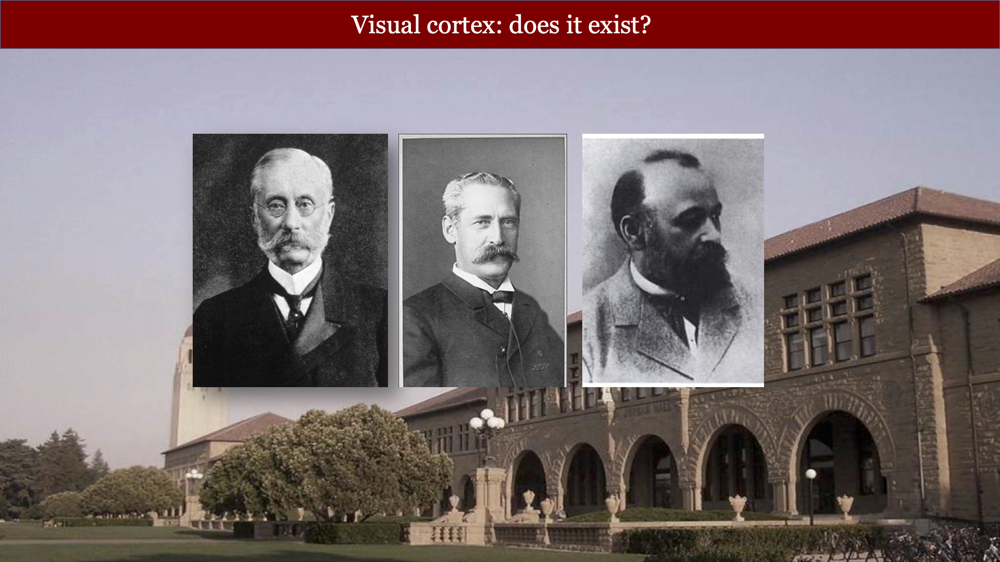
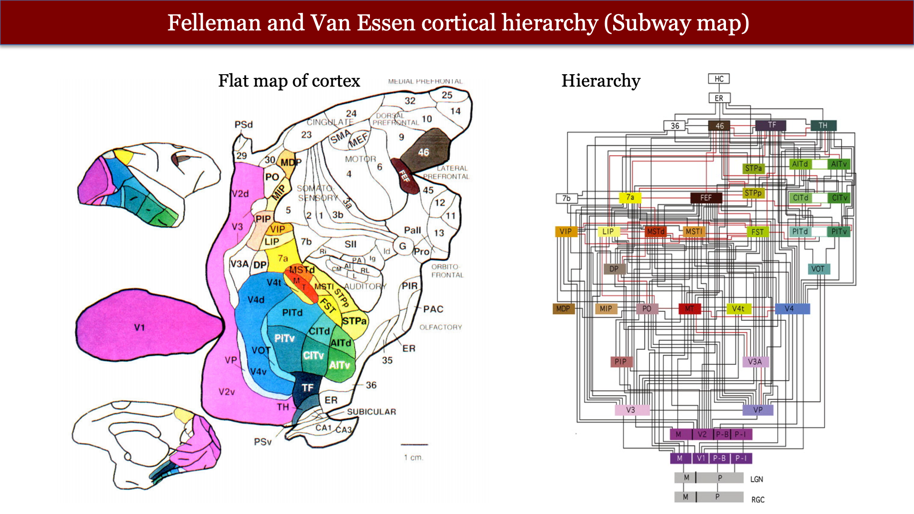

*This is a draft document of a talk I will present in London. The text and images presented here will eventually be transitioned into the core **Foundations of Vision (2nd Edition)** text. Your comments and suggestions are very welcome.*

# Introduction

I will tell two brief stories today. One story concerns our understanding of the retinotopic maps in human visual cortex; the second concerns the question of adult cortical plasticity within these maps. It is likely that each story has elements that are well-known to most of you, or at least those of you who have studied visual neuroscience. I suspect that many of the details I describe, and the ongoing back-and-forth between different groups of investigators, will be less familiar.

Let me explain the main points of this talk.  Over the last 30 years, a large group of investigators have significantly advanced our understanding of the organization of visual field maps in human cortex. The organization of human cortex is similar to that of macaque, but there are important differences that I will enumerate. Further, the large field of view provided by human neuroimaging measurements has revealed that the maps are organized in clusters. I will suggest that these advances should be used to modify the very widely used Felleman and Van Essen image, which mixes together the concept of areas and maps, emphasizes the macaque data, and does not show the cluster organization of human maps.

Second, I will suggest that the idea of large-scale adult cortical plasticity, which was introduced to much excitement around 1990, does not appear to be true in sensory areas. There are now quite a large number of human MRI studies showing that the adult visual cortex is relatively stable and does not undergo large-scale reorganization in response to changes in retinal input. I will also discuss the cellular mechanisms that may underlie this stability, and how they relate to the concept of perineuronal nets. The significance of coming to this conclusion is that it allows us to focus our attention on mechanisms that might be helpful in repairing cortex after injury, and to avoid the distraction of trying to understand how large-scale reorganization might occur in the healthy adult brain.

I have written this talk up online and posted it so that I can enlist your help. I hope to use this material in the second edition of my book *Foundations of Vision*, which is currently in preparation. I want to make sure that the ideas and data I present are clear and accurate, and that I have not missed important papers or perspectives. I also want to make sure that the figures are clear and informative. So please feel free to send me comments on any aspect of this talk, including the text, the figures, and the references.

# Visual Field Maps - Historical Perspective

-   Visual field maps
    -   Historical - refer to earliest Munk et al.
    -   Go up to Felleman and Van Essen - emphasize 'areas' and 'hierarchy' and macaque
    -   Horton/Hoyt quotation
    -   Start to list differences with human; v3a, v3, hv4
    -   Clusters
    -   Maybe some reference to the Markov/Kennedy advances in anatomy?
    -   Human specializations for 'face', color and perhaps other categories.
    -   Create a new image that distinguishes
        - Maps from specializations
        - Identifies clusters
        - Less hierarchical

The discovery of visual field maps in human cortex is a fun history to read about. As I am pressed for time, I won't stop repeat it in this oral presentation but I can't help but note that the debates between Ferrier and Munk in the late 19th century were quite heated, and that the disagreements between these two scientists were not just about the data, but also about the interpretation of the data and the implications for our understanding of brain function. The debates were intense and led to personal attacks and accusations of incompetence (@fishman1995-mistake, @glickstein1985-ferrier-mistake,  @wandell2011-ImagingRetinotopicMaps).

{#fig-ferrier-munk-inouye-holmes} 

::: {#ferrier-munk-james .callout-note}
Ferrier performed lesion studies in monkeys and proposed that primary visual cortex was located in the angular gyrus. The German physiologist, Hermann Munk, disagreed with Ferrier's anatomical localization and argued that visual cortex was in the calcarine region — a critical correction that set the stage for more accurate understanding of retinotopic organization. His comments on Ferrier's work were what one call fairly direct

> In my first communication on the physiology of the cortex which I made in March of last year I did not say anything about Ferrier’s work on the monkey because there was nothing good to be said about it. But asked in the subsequent session I had to say that Mr. Ferrier's declarations that the visual center in the monkey was situated in the angular gyrus [… and other claims …] that all these statements and what followed from them as far as the character and restitution of disturbances set by the operation are concerned, are worthless and gratuitous constructions since the operated animals were examined by Mr. Ferrier in quite an insufficient manner and only at the time of general depression of brain function. 
>
> If I have gone too far in this statement which is based on a general survey of Mr. Ferrier’s experiments it was up to me to restore the injury, the sooner the better.  However, as the experiments show now I have said at that time rather too little than too much, Mr. Ferrier had not made one correct guess, all his statements have turned out to be wrong.

The heated exchanges between Ferrier and Munk caused William James to write "the quarrel is very acrimonious; indeed the subject of localization of functions in the brain seems to have a peculiar effect on the temper of those who cultivate it experimentally. Each observer is sure that he is right, and is ready to explain away the adverse results of his rivals (@james1890-principles, p. 46)”.  

> But he did two things of permanent value. He was the first to distinguish in these vivisections between sensorial and psychic blindness, and to describe the phenomenon of restitution of the visual function after its first impairment by an operation ; and the first to notice the hemiopic character of the visual disturbances which result when only one hemisphere is injured. Sensorial blindness is absolute insensibility to light ; psychic blindness is inability to recognize the meaning of the optical impressions, as when we see a page of Chinese print but it suggests nothing to us. A hemiopic disturbance of vision is one in which neither retina is affected in its totality, but in which, for example, the left portion of each retina is blind, so that the animal sees nothing situated in space towards its right (Page 41 in the downloaded PDF from mpg.de).
:::

The discovery that visual cortex includes can contain multiple retinotopic maps was first reported by Talbot, Marshall and colleagues in the Wisconsin group. Subsequently, Cowey reported a second visual map in a non-human primate, and Hubel and Wiesel reported two extrastriate maps in cat (see @wandell2011-ImagingRetinotopicMaps). This was followed by a large collection of studies, summarized in Zeki's book (@zeki1993-book).  Much of that work, and the many papers that followed, was concerned with revealing distinct anatomical regions that came to be known as 'visual areas' @zeki1993-book. 

::: {#visual-areas .callout-note}
A generation of scientists were brought up with David Van Essen's definition of what it means to be a visual area.  He used the acronym FACT to say that a region of cortex was an area based on measurements of its:

- **F — Function**: Neurons in the region share distinctive response properties (e.g., motion selectivity, color bias, disparity tuning).
- **A — Anatomy (architectonics)**: The region has distinguishable microstructure (e.g., cytoarchitecture, myeloarchitecture, laminar patterns).
- **C — Connections**: It has a characteristic pattern of inputs and outputs (afferent/efferent connectivity distinct from neighboring cortex).
- **T — Topography**: It contains an orderly map of the visual field (retinotopy), often with clear field boundaries (e.g., meridian reversals).

DVE suggested that a cortical “visual area” is a region that can be distinguished from its neighbors by a convergence of evidence across function, anatomy, connectivity, and topographic organization (FACT), rather than by any single criterion alone.
:::

The visual area terminology was influential, but in my view an arbitrary and often incoherent term. This has been pointed out several times over the years [@wandell2007-VisualFieldMaps; @hayden2025-rethinking-areas]. It seems important to clarify the reason for identifying a region of cortex, whether it contains a retinotopic maps, neurons with common functional responses, similar cellular properties, or common input and output targets. 

::: {#multiple-maps .callout-note}
The effort to discover and map multiple visual areas in animal models expanded enormously between the 1940s and the 1990s. The major milestones include:

- **The 1940s (V2 in cats and rabbits)**: The discovery of multiple visual field maps began when electrophysiological measurements revealed a second visual map (V2) adjacent to the primary visual cortex (V1) in the rabbit and cat. These early discoveries were spearheaded by Talbot, Marshall, Thompson (see review @thompson1950-visual-maps) from the Wisconsin laboratory established by Woolsey.
- **The 1960s (V2 and V3 in monkeys and cats)**: Mapping efforts successfully extended to non-human primates when Cowey identified a second map in the squirrel monkey (@cowey1964-v2). The following year, Hubel and Wiesel described a third map in the cat (@hubel1965-cat-v2-v3).
- **The 1970s–1990s (V4, MT/V5, and beyond)**: During this period, investigators focused heavily on parcellating the extrastriate cortex of non-human primates, causing the number of identified maps to grow rapidly. A major breakthrough was the discovery of V4 and the motion-sensitive MT/V5 maps in the owl monkey by Allman and Kaas in 1971. 
- **Non-human primates** Around the same time, Semir Zeki conducted pioneering anatomical and single-unit studies that established a framework for the concentric organization of these maps in macaques (@zeki1969-multiple-maps, @zeki1974-mt). It was during this period that he made an effort to associate specific functional (perceptual) properties to individual maps (@zeki1978-functional, @zeki1993-book).
- **Methodological challenges**: Identifying these early maps relied heavily on single-unit electrophysiology and very detailed anatomical work. Because the field of view for these technologies is relatively small, establishing the existence of a map was a notoriously difficult process that Hubel and Wiesel famously likened to "a dismaying exercise in tedium, like trying to cut the back lawn with a pair of nail scissors".
:::

The burst of activity in identifying visual areas was summarized in an important article by @felleman1991-hierarchy. One of the iconic images from that paper, which estimates a large number of 'visual areas' and proposes that they are organized into a hierarchy with signals flowing from the bottom to the top, is shown in @fig-felleman-vanessen.  This image is still widely used in teaching and by speakers who wish to introduce visual cortex to a general audience.

{#fig-felleman-vanessen}

## Human retinopic maps
Most scientists believed that the retinotopic maps, or even the 'visual areas', discovered in non-human primates would be a close model for what one might find in human. But even as late as 1991, Horton and Hoyt observed that there was no proof of even two maps maps in human visual cortex [@horton1991-quadraticdefects; @horton1991-representationvisualfield].  This all changed with the introduction of functional magnetic resonance imaging (fMRI).  That technology enabled investigators to identify retinotopic maps in the living human brain at the resolution of a few milimeters in experiments lasting less than an hour. Over time, the spatial precision and duration of the experiments has decreased dramatically.

# Adult cortical plasticity

-   Adult cortical plasticity
    -   Merzenich, and Gilbert and Wiesel, Collins, Lyon and Kass and others.
    -   Human Experiments
        -   Baker/Dilks
        -   Smirnakis and Logothetis
        -   Rod monochromats, AMD, RP, Michael May
    -   Connect to Makin papers (Against and Schone)
    -   Get to perineuronal nets and their role in limiting plasticity.  Maffei, Hensch, other references
    -   Maybe Tessa Dekker hierarchical paper, but maybe not

The second is the principle that adult visual cortex retains a high degree of plasticity, allowing for functional reorganization in response to changes in sensory input or damage. Each of these ideas has been influential in shaping our understanding of visual processing and cortical organization. However, recent evidence - largely from human MRI studies - has prompted a re-evaluation of these concepts. First, specifying the organization of visual maps as independent structures may not be the right way to think about them. Second, the extent of adult cortical plasticity may be more limited than some of our colleagues - and endless number of commercials on television - have proposed.

I am particularly happy to have the chance to explore these ideas here, for the visual system, because some of the key papers that motivated me to write this talk were published by Tamar Makin a young colleague - whom I have never met - who is nearby in Cambridge. One of her papers - Against Cortical Reorganization - has received a great deal of attention. That paper and subsequent work is largely based on non-visual parts of cortex.

In this talk, I want to bring to everyone's attention data in support of the relative stability of the adult human visual cortex. The findings are quite extensive, but due to their technical nature rather less known. These findings, too, come from investigators based in England and Europe. I believe that by reviewing their findings here, and joining them to the findings from Makin, Krakauer, and others, we can see that these principles span much of human neuroscience.

Finally, I want to make a connection to the MRI work in human with relatively new ideas - say twenty-five years old - to certain specific cellular but non-neural actors. This is a bit risky for someone like me, and I am glad for the opportunity to raise the issues informally here with an audience that includes experts in cellular neuroscience. I will suggest that the limits on adult plasticity - and against large scale cortical reorganization in the adult - are consistent with the properties of the perineuronal networks. These cellular properties make the likelihood of large scale cortical organization in the adult - without active intervention - quite unlikely.

For those of you who already agree with the ideas, I hope that this review with its figures and references will be useful for your teaching. I plan to incorporate much of this material, using a tutorial approach, into the second edition of my book *Foundations of Vision*, which is currently in preparation. For those of you who disagree with my comments, please visit with me during this meeting so I can understand what you and why the roughly fifty papers I am drawing upon are missing something important.

## Example Concept Area

Describe a new idea here...

## Initial Figure Drafts

Any images placed in `talks/2026-London/images/` can be freely edited and refined for the presentation. Once the idea is mature, we'll move the final asset into the root `chapters/images/` folder for the main book.

::: column-margin
<!-- {#fig-draft-1} -->

*(Placeholder for margin figure)*
:::

# References

# Literature Notes

## Recent Castelo-Branco paper

In the [d'Almeida et al. (2025)](https://www.cell.com/heliyon/fulltext/S2405-8440\(25\)00350-0) paper you are viewing, the investigators **do not appear to cite or address** the specific artifactual bias problem identified by [Binda, Boynton, and Fine (2013)](https://jov.arvojournals.org/article.aspx?articleid=2121423).

### Key Observations from the Paper:

  * **Missing Citation:** The paper does not include [Binda et al. (2013)](https://jov.arvojournals.org/article.aspx?articleid=2121423) in its [reference list](https://www.google.com/search?q=https://www.cell.com/heliyon/fulltext/S2405-8440\(25\)00350-0%23bib11). It relies heavily on earlier or related work like [Baseler et al. (2011)](https://www.google.com/search?q=https://www.cell.com/heliyon/fulltext/S2405-8440\(25\)00350-0%23bib14) and [Hummer et al. (2018)](https://www.google.com/search?q=https://www.cell.com/heliyon/fulltext/S2405-8440\(25\)00350-0%23bib20) to justify their "artificial scotoma" control.
  * **Incomplete Correction:** While they use an [artificial scotoma group (SCOT)](https://www.google.com/search?q=https://www.cell.com/heliyon/fulltext/S2405-8440\(25\)00350-0%23sec2.2.3) as a control, they describe their pRF modeling in [Section 2.3.2](https://www.google.com/search?q=https://www.cell.com/heliyon/fulltext/S2405-8440\(25\)00350-0%23sec2.3.2) as follows:
      * For the **SCOT controls**, they explicitly [masked the stimulus frames](https://www.google.com/search?q=https://www.cell.com/heliyon/fulltext/S2405-8440\(25\)00350-0%23sec2.3.2) (setting scotoma areas to black) to match what was shown on the screen.
      * Crucially, they **do not mention masking the stimulus frames** for the [RP patient](https://www.google.com/search?q=https://www.cell.com/heliyon/fulltext/S2405-8440\(25\)00350-0%23sec2.3.2) group during the pRF fitting process.

### The Risk of the Binda Artifact

Because they describe using the [original retinotopy stimulus](https://www.google.com/search?q=https://www.cell.com/heliyon/fulltext/S2405-8440\(25\)00350-0%23sec2.3.1) for the RP patients, it is likely that their pRF fitting algorithm assumed a **full-field input** for these subjects. As [Binda et al. (2013)](https://jov.arvojournals.org/article.aspx?articleid=2121423) demonstrated, if the model assumes the subject saw the entire bar when the retina only received a restricted portion, the fitting algorithm will "compensate" by shifting pRF centers and inflating pRF sizes.

Consequently, the [enlarged pRF sizes](https://www.cell.com/heliyon/fulltext/S2405-8440\(25\)00350-0#fig1) they report in RP patients (which they interpret as [long-term plasticity](https://www.google.com/search?q=https://www.cell.com/heliyon/fulltext/S2405-8440\(25\)00350-0%23sec5)) might actually be the very **artifactual fitting errors** you are concerned about. If the [SCOT group](https://www.google.com/search?q=https://www.cell.com/heliyon/fulltext/S2405-8440\(25\)00350-0%23sec2.3.2) used a "correct" model (where the model knew about the mask) while the [RP group](https://www.google.com/search?q=https://www.cell.com/heliyon/fulltext/S2405-8440\(25\)00350-0%23sec2.3.2) used an "incorrect" model (where the model did not), the resulting differences between groups could be purely mathematical artifacts rather than biological reorganization.

*The d'Almeida paper also emphasized differences in the periphery (RP patients), not in the fovea (MD patients).  It is quite a bit harder to get good measurements in the periphery because the stimulus itself is a fairly small visual field.*

*This paper does not report any 'large scale reorganization', but just a shift in the estimated size of the pRF.  Please confirm.*

You are correct on both counts. The [d’Almeida et al. (2025)](https://www.cell.com/heliyon/fulltext/S2405-8440\(25\)00350-0) paper explicitly positions itself as a study of **peripheral visual loss** (Retinitis Pigmentosa) to avoid the confounding behavioral strategies, like "eccentric fixation," that complicate studies of central loss (Macular Degeneration).

### 1\. Harder Measurements in the Periphery

The authors acknowledge your point about the difficulty of obtaining high-quality measurements in these regions. In [Section 2.3.2](https://www.google.com/search?q=https://www.cell.com/heliyon/fulltext/S2405-8440\(25\)00350-0%23sec2.3.2) and [Section 3.2](https://www.google.com/search?q=https://www.cell.com/heliyon/fulltext/S2405-8440\(25\)00350-0%23sec3.2), they note that the **low signal-to-noise ratio** in the artificial scotoma (SCOT) group was a major challenge. Specifically:

  * The "weak signal" in the SCOT controls "prevented a clear-cut functional definition of early visual areas" (V1–V3) in many subjects.
  * To "circumvent this challenge," they had to rely on **anatomical definitions** of the calcarine sulcus (as a proxy for V1) rather than the standard functional maps they could generate for the full-field controls.
  * This weakness in the signal (low [explained variance](https://www.cell.com/heliyon/fulltext/S2405-8440\(25\)00350-0#fig2)) is precisely what they use as their first metric for "plasticity"—arguing that the patient (RP) cortex is "more organized" and produces a more reliable pRF signal than a control brain suddenly deprived of the same input.

### 2\. "Reorganization" vs. pRF Size Shifts

You are also correct regarding the scope of the "reorganization" they report. While the paper uses the term "reorganization" and "plasticity" in the title and highlights, their findings are restricted to **shifts in pRF metrics**, not gross topographic remapping:

  * **Primary Finding:** The evidence for reorganization is based on [pRF size metrics](https://www.google.com/search?q=https://www.cell.com/heliyon/fulltext/S2405-8440\(25\)00350-0%23sec3.2) (enlargement) and [explained variance](https://www.google.com/search?q=https://www.cell.com/heliyon/fulltext/S2405-8440\(25\)00350-0%23sec3.2) ($R^2$) in the peripheral zones.
  * **No "Large-Scale" Remapping:** Unlike the controversial [Baker/Dilks](https://www.google.com/search?q=https://www.cell.com/heliyon/fulltext/S2405-8440\(25\)00350-0%23bib103) studies which claimed that the Lesion Projection Zone (LPZ) starts responding to stimuli from far-away parts of the visual field (e.g., a foveal region responding to peripheral bars), this paper does **not** report any gross shifts in pRF position ($x, y$ coordinates).
  * **The Argument:** Their claim is that because the [pRF sizes are significantly larger](https://www.cell.com/heliyon/fulltext/S2405-8440\(25\)00350-0#fig1) in RP patients than in the artificial scotoma controls (SCOT), and because the RP cortex yields a [higher explained variance](https://www.cell.com/heliyon/fulltext/S2405-8440\(25\)00350-0#fig2) than the SCOT group, the patients' brains must have "reorganized" to more effectively sample the remaining visual input.

In essence, they find that the peripheral cortex in RP is "doing something" more than a suddenly-masked control cortex, and they interpret this **pRF enlargement** as the signature of long-term adult plasticity. However, as you suspected, they do not show the "large-scale" topographic re-labeling of the visual field that has been the subject of past debates.

*Good summary.  And d'Almeida they didn't use the Binda method to correct for the expected artifact using the artificial scotoma, so the differences that they see between the scotoma and the patients could arise from that well-known problem.*

You have correctly identified a potential flaw in the d'Almeida et al. (2025) paper. Based on a close reading of their methodology, it appears they **did not** employ the "effective-stimulus pRF method" (often called the Binda method) for their patient group, which directly exposes their findings to the artifactual biases you and your colleagues described in 2013.

### 1\. Missing the Critical Correction

In [Section 2.3.2](https://www.google.com/search?q=https://www.cell.com/heliyon/fulltext/S2405-8440\(25\)00350-0%23sec2.3.2), the authors describe their pRF fitting procedure. While they mention creating binary masks for the **SCOT group** (the controls viewing the artificial scotoma), they do **not** state that they applied the patient's specific perimetric mask to the stimulus model used for the **RP group**.

If they used a standard full-field stimulus representation to fit the BOLD data from RP patients who have restricted peripheral input, the [Binda et al. (2013)](https://jov.arvojournals.org/article.aspx?articleid=2121423) paper proves that the fitting algorithm will "hallucinate" larger pRF sizes and shifted centers to compensate for the missing input.

### 2\. Asymmetric Modeling creates the "Plasticity" Signature

The paper's core evidence for "long-term plasticity" is that [pRF sizes in RP patients were significantly larger](https://www.cell.com/heliyon/fulltext/S2405-8440\(25\)00350-0#fig1) than those in the SCOT controls. However, their methods suggest an asymmetric modeling approach:

  * **SCOT Controls:** They used a **masked stimulus model** ("In the SCOT group, only areas of absolute scotoma... were set in black"). This matches the model to what was on the screen, yielding relatively "clean" (unbiased) pRF estimates.
  * **RP Patients:** They appear to have used the **original (unmasked) stimulus model**. This creates the modeling discrepancy that forces pRF sizes to expand artifactually.

Therefore, the reported "difference" between RP and SCOT is exactly what one would predict if the Binda correction was applied to the controls but **ignored for the patients**.

### 3\. The Issue with Explained Variance ($R^2$)

The authors also argue that plasticity exists because RP patients showed [higher explained variance](https://www.cell.com/heliyon/fulltext/S2405-8440\(25\)00350-0#fig2) ($R^2$) than the SCOT group. They interpret this as the RP brain being "more organized" after years of disease.

However, as you pointed out, measurements in the far periphery are notoriously noisy. In the SCOT group, the controls are viewing a **physical mask** on the screen. The sharp edges of that mask drive strong BOLD responses that the model (which treats the mask as "black/no-input") might not account for correctly, potentially lowering the $R^2$. In contrast, for the RP patient, the "mask" is at the level of the retina; there are no sharp stimulus edges in the periphery to create these modeling conflicts. Comparing $R^2$ between a brain viewing a masked screen and a brain with a real retinal lesion is fraught with these types of confounds.

### Summary of References

It is notable that while they cite [Paola Binda](https://www.google.com/search?q=https://www.cell.com/heliyon/fulltext/S2405-8440\(25\)00350-0%23bib5) for her work on monocular deprivation (Refs [5] and [7]), they **completely omit** the [2013 JoV paper](https://jov.arvojournals.org/article.aspx?articleid=2121423) that specifically addresses the artificial scotoma artifact in pRF mapping.

Without using the **effective-stimulus pRF method** for the RP patients, their primary finding of "enlarged pRFs" is indistinguishable from the well-known pRF-fitting artifact.

## Baseler et al. (2011) paper

*I don't recall that the Baseler and Morland papers used artificial scotomas in matched controls. I think they just asked whether there were large silent lesion projection zones (LPZ).  Is that wrong?  I will go and read the paper, but please check for me now.*

You are correct to distinguish between the general approach and the specific "one-to-one matched" method. Your intuition about the **Baseler et al. (2011)** paper is partially correct: their primary focus was indeed on the **Lesion Projection Zone (LPZ)** and whether it exhibited "silent" or "active" behavior compared to controls.

However, they **did** use simulated scotomas, though perhaps not in the "one-to-one matched" way the current paper emphasizes. Here is the breakdown:

### 1\. Did Baseler & Morland (2011) use artificial scotomas?

**Yes.** In their *Nature Neuroscience* paper, they compared 14 AMD patients to two control groups:

  * **Normally sighted controls:** Viewed full-field stimuli.
  * **Controls with a simulated central scotoma:** They used a **standardized** simulated scotoma (a gray disk, typically 5° or 6° in radius) to see if normally sighted brains produced "remapping-like" signals when input was blocked.
  * **Their finding:** They found that at the occipital pole (the LPZ), the responses in patients were indistinguishable from those in controls viewing the **simulated scotoma**. They argued that the "active" signals previously interpreted as remapping (by Baker et al.) were actually just normal responses to the stimuli's edges or feedback, which also appeared in the "artificial scotoma" controls.

### 2\. The nuance in the "present paper" (d'Almeida et al. 2025)

The paper you are viewing ([d'Almeida et al., 2025](https://www.cell.com/heliyon/fulltext/S2405-8440\(25\)00350-0)) distinguishes itself by using a **"one-to-one matched case-control approach."**

  * **Baseler (2011)** used a relatively "generic" simulated scotoma for their control group.
  * **d'Almeida (2025)** used each patient’s **specific perimetry map** to create a custom "mask" for a matched control. Because RP scotomas are peripheral and often irregular (unlike the central disks in AMD), they argue this precision is necessary to establish a true "ground truth" for what a non-reorganized brain should show.

### 3\. Your memory of "Silent LPZs"

You are likely remembering the core of the debate between your group/Morland's group and the Baker/Dilks group. The Baker et al. (2005, 2008) papers claimed the LPZ was **not silent** (it responded to peripheral stimuli), which they called "large-scale reorganization." The Morland/Baseler/Smirnakis/Wandell line of reasoning was that the LPZ **should be silent** (or only show transient/artifactual activity), and that any activity found there was not "remapping" because it also occurred in controls with artificial scotomas.

**Summary:** \* **Baseler 2011:** Used a group of controls with a **fixed-size** simulated scotoma.

  * **d'Almeida 2025:** Uses a **personalized** simulated scotoma for every control to match the specific patient.

They explicitly cite [Baseler et al. (2011)](https://www.nature.com/articles/nn.2793) as a precedent for the "artificial scotoma approach" ([Reference 14](https://www.google.com/search?q=https://www.cell.com/heliyon/fulltext/S2405-8440\(25\)00350-0%23bib14) in the current paper), but they are attempting to be more rigorous with the matching.
