*This is a draft document of a talk I will present at a meeting in London. The text and images here will eventually be transitioned into a new section of **Foundations of Vision (2nd Edition)**. Your comments and suggestions are very welcome.*

# Introduction

Today I will tell two stories about how meso-scale imaging has improved our understanding of the human brain.

The first story describes advances in mapping visual field maps in human cortex. Over the past 30 years, a large group of investigators has significantly advanced our understanding of the organization of these maps. While the organization of human visual cortex shares similarities with macaques, there are important differences that I will enumerate. Furthermore, the large field of view provided by human neuroimaging has revealed that these maps are organized in clusters. I will suggest that these discoveries warrant a revision of the widely used Felleman and Van Essen diagram, which emphasizes macaque data, blends the concepts of areas and maps, and does not capture the cluster organization of human maps.

The second story focuses on measurements of adult cortical plasticity in the visual system. The idea of large-scale adult cortical plasticity, which generated much excitement around 1990, does not appear to hold true in sensory areas. A large body of human MRI work now shows that adult visual cortex is relatively stable and does not undergo large-scale reorganization in response to changes in retinal input. I will also discuss the cellular mechanisms that may underlie this stability, particularly their relationship to perineuronal nets. Recognizing this stability allows us to focus on mechanisms that might genuinely repair cortex after injury, avoiding the distraction of trying to explain non-existent large-scale reorganization in the healthy adult brain.

I plan to incorporate the material from this presentation into the second edition of my book *Foundations of Vision*, which is currently in preparation. Elements of each story will likely be familiar to many of you, particularly those who have studied visual neuroscience. My goal is to ensure the ideas and data are clear, accurate, and comprehensive, and that the figures are informative. I welcome your comments on any aspect of this talk, including the text, figures, and references.

# Visual Field Maps - Historical Perspective

The discovery of visual field maps in the cortex is a fascinating history [@fishman1995-mistake; @glickstein1985-ferrier-mistake; @wandell2011-ImagingRetinotopicMaps]. The debates between Ferrier and Munk in the late 19th century about the location of visual cortex were heated. The disagreements were not just about the data, but also about the interpretation of the data and the implications for our understanding of brain function.

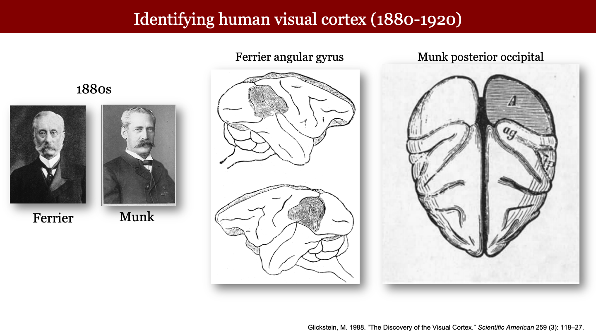{#fig-ferrier-munk width="100%"}

Ferrier performed lesion studies in monkeys and proposed that primary visual cortex was located in the angular gyrus. The German physiologist Hermann Munk disagreed with Ferrier's anatomical localization and argued that visual cortex was in the occipital region — a critical correction that set the stage for a more accurate understanding of retinotopic organization.

::: {#nte-ferrier-munk-james .callout-note title="Ferrier and Munk"}
No need to wonder what Munk thought about Ferrier's work. Here are his own words:

> In my first communication on the physiology of the cortex which I made in March of last year I did not say anything about Ferrier’s work on the monkey because there was nothing good to be said about it. But asked in the subsequent session I had to say that Mr. Ferrier's declarations that the visual center in the monkey was situated in the angular gyrus \[… and other claims …\] that all these statements and what followed from them as far as the character and restitution of disturbances set by the operation are concerned, are worthless and gratuitous constructions since the operated animals were examined by Mr. Ferrier in quite an insufficient manner and only at the time of general depression of brain function.
>
> If I have gone too far in this statement which is based on a general survey of Mr. Ferrier’s experiments it was up to me to restore the injury, the sooner the better. However, as the experiments show now I have said at that time rather too little than too much, Mr. Ferrier had not made one correct guess, all his statements have turned out to be wrong.

Commenting on the debate from the other side of the ocean, William James wrote, "Munk's absolute tone about his observations and his theoretic arrogance have led to his ruin as an authority" [@james1890-principles].

James went on to write about Munk:

> But he did two things of permanent value. He was the first to distinguish in these vivisections between sensorial and psychic blindness, and to describe the phenomenon of restitution of the visual function after its first impairment by an operation; and the first to notice the hemiopic character of the visual disturbances which result when only one hemisphere is injured. Sensorial blindness is absolute insensibility to light; psychic blindness is inability to recognize the meaning of the optical impressions, as when we see a page of Chinese print but it suggests nothing to us. A hemiopic disturbance of vision is one in which neither retina is affected in its totality, but in which, for example, the left portion of each retina is blind, so that the animal sees nothing situated in space towards its right.

James also noted, "The quarrel is very acrimonious; indeed the subject of localization of functions in the brain seems to have a peculiar effect on the temper of those who cultivate it experimentally. Each observer is sure that he is right, and is ready to explain away the adverse results of his rivals..."

Many of us have enjoyed Charles Gross's book, which is filled with interesting histories of neuroscience discoveries [@gross1998-brain-book]. Both his book and James's work offer detailed insights into these early investigations on localization [@james1950-principles].
:::

It was the Swedish neurologist, Henschen, who first carefully observed the visual loss in **human** patients with occipital lesions. He concluded that at least part of the visual field, the upper and lower portions, were represented in cortex in an orderly map with the lower visual field in the dorsal occipital lobe and upper visual field in the ventral occipital lobe. His findings were met with objections by many, and subsequently confirmed by many more. He expresses his feelings on the matter in the opening of a 1923 review paper [@henschen1923-review].

{#fig-henschen width="80%"}

In fact, Henschen's observations about the organization of the visual cortex in the human were confirmed and extended by two clinicians working at opposite ends of the world: Gordon Holmes and Tatsuye Inouye. Both were studying visual field losses from soldiers injured in their countries' wars, Holmes in Europe and Inouye in Japan. In that era, the guns were not always lethal, and the helmets would permit bullets to enter and exit the posterior skull, effectively lesioning a portion of occipital cortex. Such lesions could cause a permanent but partial visual field loss. By accumulating data from a number of different cases, they deduced the retinotopic organization of the human visual cortex. In addition to the upper-lower field representation, they both reported on the eccentricity map as well as the fact that the central portion of the visual field occupied more cortical territory (per square degree) than the peripheral portion. This phenomenon is called 'cortical magnification' (though perhaps it should be called 'foveal magnification').

Building on these early observations, modern measurements have since shown that the total surface area of V1, as well as the magnification factor, vary greatly between people with typical vision—by as much as a factor of 2.5 [@dougherty2003-map-sizes; @benson2022-surface-area].

::: {#fig-inouye-holmes layout-ncol="2"}
{#fig-inouye-map width="90%"}

{#fig-holmes-map width="90%"}
:::

## Discovery of multiple maps
The discovery of visual maps beyond V1 began with animal models in the 1940s and extended to non-human primates by the 1960s. These early reports sparked a surge of studies identifying additional maps, as well as distinct patches of visually responsive cortex. Much of this history is summarized by @zeki1993-book. Over time, regions containing visually responsive neurons and distinctive response properties came to be broadly known as "visual areas"—a term often applied whether or not the region contained a strict, topographically organized map.

::: {#nte-multiple-maps .callout-note title="Discovery of multiple maps"}
The effort to discover and map multiple visual areas in animal models expanded enormously between the 1940s and the 1990s. The major milestones include:

-   **1940s (V2 in cats and rabbits)**: The discovery of multiple visual field maps began when electrophysiological measurements revealed a second visual map (V2) adjacent to the primary visual cortex (V1). These early discoveries were spearheaded by Talbot, Marshall, and Thompson (see review by @thompson1950-visual-maps) from the Wisconsin laboratory established by Woolsey.
-   **1960s (V2 and V3 in monkeys and cats)**: Mapping successfully extended to non-human primates when Cowey identified a second map in the squirrel monkey [@cowey1964-v2]. The following year, Hubel and Wiesel described a third map in the cat [@hubel1965-cat-v2-v3].
-   **1970s–1990s (V4, MT/V5, and beyond)**: Investigators focused heavily on parcellating the extrastriate cortex of non-human primates, causing the number of identified visual regions to grow rapidly. A major breakthrough was the discovery of V4 and the motion-sensitive MT/V5 map in the owl monkey by Allman and Kaas in 1971. Around the same time, Semir Zeki conducted pioneering anatomical and single-unit studies that established a framework for the concentric organization of these maps in macaques [@zeki1969-multiple-maps; @zeki1974-mt] and sought to associate specific functional (perceptual) properties to individual areas [@zeki1978-function; @zeki1993-book].
-   **Methodological challenges**: Identifying these early maps relied heavily on single-unit electrophysiology and very detailed anatomical work. Because the field of view for these technologies is relatively small, establishing the existence of a map was a notoriously difficult process that Hubel and Wiesel [@hubel1977-ferrierlecture] famously likened to "a dismaying exercise in tedium, like trying to cut the back lawn with a pair of nail scissors".
:::

The burst of activity identifying new visual regions was summarized in an influential article by Felleman and Van Essen [@felleman1991-hierarchy]. @fig-felleman-vanessen shows an iconic diagram from that paper, illustrating the proposed hierarchy of visual areas with signals flowing from the bottom (retina, LGN, V1) to the top (peri-hippocampal regions). Although the data supporting this specific hierarchy were initially sparse, the underlying measurements have been significantly augmented over the last decade, particularly by work from Henry Kennedy's lab [@markov2013-hierarchicalanatomy; @markov2014-hierarchicalanatomy2]. I will discuss a proposed update to this diagram at the end of this section.

::: {.column-margin}
{#fig-felleman-vanessen}
:::

::: {#nte-FACT .callout-note title="FACT: Definitions"}
An entire generation of scientists was taught a specific definition for a "visual area." Van Essen proposed that a cortical visual area is a region that can be distinguished from its neighbors by a convergence of evidence across four criteria (FACT), rather than by any single criterion alone:

-   **F — Function**: Neurons in the region share distinctive response properties (e.g., motion selectivity, color bias, disparity tuning).
-   **A — Anatomy (architectonics)**: The region has distinguishable microstructure (e.g., cytoarchitecture, myeloarchitecture, laminar patterns).
-   **C — Connections**: It has a characteristic pattern of inputs and outputs (afferent/efferent connectivity distinct from neighboring cortex).
-   **T — Topography**: It contains an orderly map of the visual field (retinotopy), often with clear field boundaries (e.g., meridian reversals).
:::

The *visual area* terminology was highly influential, but in my view—and that of several others—it has proven to be an arbitrary and sometimes incoherent term [@wandell2007-VisualFieldMaps; @hayden2025-rethinking-areas]. When identifying a distinct region of cortex, it is important to clarify exactly *why* it is being distinguished: does it contain a retinotopic map, neurons with common functional responses, similar cellular properties, or common connection targets? Grouping all of these distinctive properties under the single concept of an "area" without a clear rule is less helpful than scientists originally hoped.

## Human retinotopic maps
Most scientists assumed that the retinotopic maps found in non-human primates would be a good model for human visual cortex. But even as late as 1991, Horton and Hoyt observed that there was no proof of even two maps in human visual cortex [@horton1991-quadraticdefects; @horton1991-representationvisualfield]. The need for guessing changed with the introduction of functional magnetic resonance imaging (fMRI). That technology enabled investigators to identify retinotopic maps in the living human brain at the resolution of a few millimeters in experiments lasting less than an hour. Over time, spatial precision has increased and the time required for experiments has decreased dramatically.

Steve Engel and I—helped by many others—developed a technique to measure eccentricity and angle maps that was widely adopted [@engel1994-fmri; @engelRetinotopicOrganizationHuman1997]. The stimulus and cortical responses (fMRI) for measuring eccentricity are shown in @fig-eccentricity-movie. If you look at the video casually, you will see the wave from the occipital pole traveling in the anterior direction of the main map. If you look closely, you will see a secondary ripple on the ventral occipital-temporal surface. That ripple starts when the stimulus is in the fovea, but it fades out as the ring expands about halfway (10 deg). The VOT eccentricity map is a second eccentricity map, confined mainly to the perifoveal visual field. That map is distinct from the one near the calcarine sulcus.

::: {.content-visible when-format="html"}
{#fig-eccentricity-movie width="80%" loop="true" autoplay="true" muted="true"}
:::

::: {.content-visible when-format="pdf"}
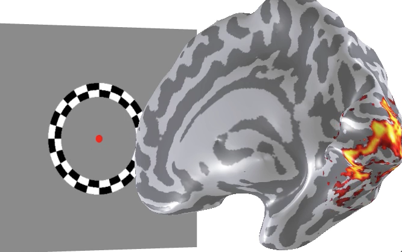{#fig-eccentricity-movie width="80%"}
:::

We also made measurements using a rotating wedge stimulus to measure the most effective angular position for each voxel. The angular responses subdivide the eccentricity map into different visual field maps. The data from the video are summarized in two pseudo-color maps showing the most effective visual field eccentricity for each cortical location

::: {#fig-maps layout-ncol="2"}
{#fig-eccentricity-map width="85%"}

{#fig-angle-map width="85%"}

Eccentricity and angle measurements, combined, are used to define a retinotopic map.
:::

Summarizing the information from the maps, we can label an entire retinotopic map using a single color, as in @fig-areas-magnification. Notice that these maps are not simply adjacent to one another. Rather, the V2 map surrounds V1, and it is surrounded, in turn, by the V3 map. Thus, the dorsal and ventral portions of the V2 and V3 maps—which represent the lower and upper visual fields, respectively—are well-separated from one another.

{#fig-areas-magnification width="80%"}

Alyssa Brewer noticed the secondary foveal representation on the ventral occipital surface and decided to explore it further [@brewer2005-visualFieldMaps-clusters]. To see the two clusters distinctly, she used a much smaller field of view for the expanding rings, moving them slowly through the central 3 deg. You can see the two eccentricity maps—plainly distinct from one another—in @fig-vo-cluster.

{#fig-vo-cluster width="80%"}

## Map Clusters

Over time, it became clear to us that there were multiple distinct eccentricity maps, illustrated in these two brief videos. These eccentricity maps can be subdivided into different individual visual field maps by also considering the angle representations, just as V1-V3 can be separated from the unified eccentricity map around the posterior pole and calcarine cortex in humans.

Here are two different visualizations of the clusters. In @fig-clusters-movie they are shown on a slightly inflated cortical surface.

::: {.content-visible when-format="html"}
{#fig-clusters-movie width="80%" loop="true" autoplay="true" muted="true"}
:::

::: {.content-visible when-format="pdf"}
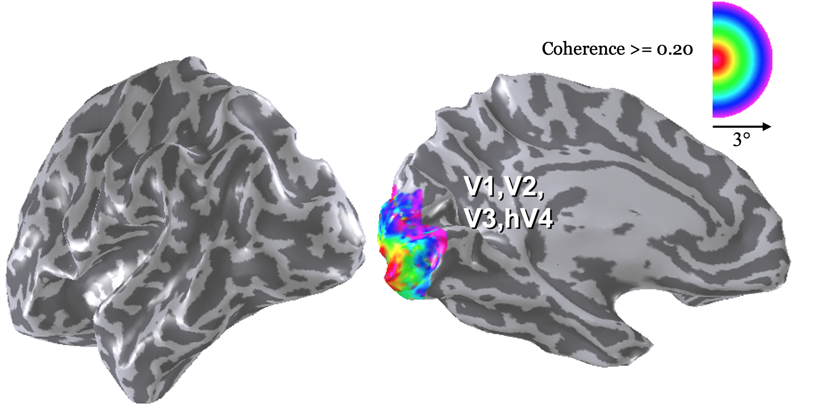{#fig-clusters-movie width="80%"}
:::

In @fig-clusters-flatmap the eccentricity maps of the clusters are represented on a flattened cortical surface; the video oscillates between the measured eccentricity and a cartoon overlay that emphasizes the pattern.

::: {.content-visible when-format="html"}
{#fig-clusters-flatmap width="80%" loop="true" autoplay="true" muted="true"}
:::

::: {.content-visible when-format="pdf"}
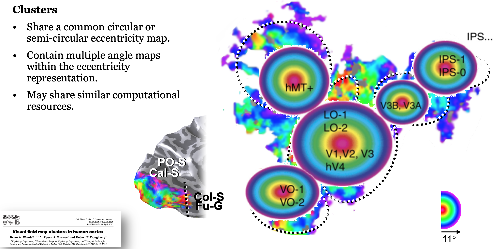{#fig-clusters-flatmap width="80%"}
:::

The clustering of cortical retinotopic maps has been confirmed by multiple groups. The clusters have been identified in posterior and anterior cortex [@mackey2017-clusters], non-human primates [@kolster2009-clusters; @kolster2014-macaque-mt; @barton2017-sts-cluster; @meyer2025-clusters-evolution], and also in the pulvinar [@arcaro2015-pulvinar-cluster]. The retinotopic map cluster appears to be a basic functional organizational principle that may have implications for development and plasticity.

::: {#nte-clusters .callout-note title="Clusters in the Human Brain"}
**Frontoparietal Clusters [@mackey2017-clusters]** Expanding the cluster model into higher-order cortex, this study identified multiple representations of polar angle and eccentricity in the human frontoparietal cortex. They discovered that these maps are organized into clusters sharing a confluent fovea, mirroring the organization of the visual cortex to facilitate efficient sensorimotor and cognitive processing.

**The Pulvinar Cluster [@arcaro2015-pulvinar-cluster]** In a significant extension of the theory, Arcaro and colleagues identified two visual field maps in the human ventral pulvinar (vPul1 and vPul2) . They proposed that these maps form a distinct visual field map cluster because they share an eccentricity representation and exhibit similar cortical connectivity patterns with early extrastriate areas.

**The pSTS "Cloverleaf" Cluster [@barton2017-sts-cluster]** This 2017 work with introduces a new cloverleaf cluster in the posterior superior temporal sulcus (pSTS). They characterized four distinct maps (pSTS-1 through pSTS-4) organized around a central foveal representation, suggesting this "radially orthogonal" structure is a fundamental principle for high-level visual and potentially multimodal processing.

**Macaque Motion Clusters [@kolster2009-clusters]** The Kolster and Vanduffel work is the primary reference for clusters in non-human primates, specifically identifying the MT cluster (MT, MST, FST, and V4t). Their work demonstrated that the cluster principle—minimizing wiring length between processing modules—is not unique to humans but is a general feature of the Old World primate visual system.

**Probabilistic Map Atlases [@wang2015-atlas-topography]** The Kastner group developed a probabilistic atlas of the human visual system that largely validates the cluster-based organization for more than 20 maps. This work is a large-scale confirmation of the cluster model across a large subject population in addition to being a very useful tool, widely used in neuroimaging.
:::

## Comparative anatomy
Initially, human fMRI groups relied on the macaque model—almost slavishly—to guide our interpretation of the retinotopic maps. Over time, investigators developed more confidence in the human fMRI data, and it became apparent that there are significant differences between the species. Some of these differences are discussed in @nte-comparative-organization.

Here are some of the agreed-upon differences:

* Human visual cortex contains a much larger number of neurons and a greater overall surface area, even though the human optic nerve contains roughly the same number of axons as the macaque's.
* The ratio of the surface area of human V2/V3/hV4 relative to V1 is much larger than the similar ratio in macaque (@fig-meyer-comparative); in general, the visual cortical maps and clusters are all larger in humans.
* The position of the nominal fourth visual map differs substantially between human and macaque—sufficiently so that I named it hV4 rather than V4, and spent years arguing this point with others.
* The functional responses to motion in human and macaque V3 and V3A do not match.

A recent paper used fMRI for a comparative anatomical analysis of human and macaque visual cortex [@meyer2025-clusters-evolution]. They report that the number of maps and their cluster-like organization are strikingly similar across species, suggesting that the cluster is an evolutionarily preserved unit. This figure from @meyer2025-clusters-evolution shows a measurement of the relative sizes of the V2/V3 portion of the V1 cluster in human and macaque.

![Comparative anatomical sizes of maps and clusters [@meyer2025-clusters-evolution]](images/meyer2025-comparative.png){#fig-meyer-comparative width="80%"}

::: {#nte-comparative-organization .callout-note title="Humans and monkeys"}
This is an expanded commentary on the more obvious differences between human and non-human primate clusters and retinotopic maps.

**Overall Size and Neuron Count:** Human visual field maps are substantially larger overall than those in the macaque, with human V1 estimated to be roughly two to four times larger. The human visual cortex correspondingly contains a much larger number of neurons, which is thought to reflect the increased processing required for human-specific cognitive demands, such as language and reading. Derived from: "Visual Field Maps in Human Cortex" [@wandell2007-VisualFieldMaps] and "Imaging retinotopic maps in the human brain" [@wandell2011-ImagingRetinotopicMaps]. The larger number of human cortical neurons contrasts with the similar number of ganglion cell axons in the human and macaque optic nerves [@fortune2014-optic-nerve; @mikelberg1989-optic-nerve; @kolb2011-webvision].

**Anatomical Location of V1:** In macaques, a large portion of the primary visual cortex (V1) is located on the operculum, extending posterior and lateral to the medial position of the calcarine sulcus. In humans, V1 is located largely within the calcarine sulcus, extending partially onto the lateral surface of the occipital pole. The human lateral extension is not as large or typical as it is in the macaque. Derived from: "Imaging retinotopic maps in the human brain" [@wandell2011-ImagingRetinotopicMaps].

**Proportional Size of Area V3:** A highly salient difference between the species is the relative size of area V3. In macaques, V3 occupies a very small surface area compared to V1 and V2. In humans, V3 is proportionately much larger, meaning the scale factor difference between human and monkey V3 is even greater than the difference between their V1 maps. This difference in the V3/V1 surface area ratio likely reflects a functional divergence between the visual systems of the two species. Derived from: "Imaging retinotopic maps in the human brain" [@wandell2011-ImagingRetinotopicMaps], "Visual field representations and locations of visual areas V1/2/3 in human visual cortex" [@dougherty2003-map-sizes; @benson2022-surface-area], and "Visual field map clusters in human cortex" [@wandell2005-visualFieldMap-clusters] and [@meyer2025-clusters-evolution].

**Motion Sensitivity in Area V3A:** Although the map topographies of V3A are similar between humans and macaques, their functional sensitivities are completely different. Human V3A is highly responsive to motion, whereas macaque V3A is not strongly motion-selective. Derived from: "Visual Field Maps in Human Cortex" [@tootell1997-v3a; @wandell2007-VisualFieldMaps] and "Imaging retinotopic maps in the human brain" [@wandell2011-ImagingRetinotopicMaps].

**V4 / hV4 and Color Processing Locations:** In the macaque, area V4 spans both the dorsal and ventral portions of the occipital lobe, and color-exchange experiments produce responses in both components. In humans, investigators have not reliably found a dorsal component for the fourth visual map; instead, the human map (hV4) and the regions critical for color vision (and those associated with cerebral achromatopsia) are confined almost entirely to the ventral surface. Derived from: "Mapping hV4 and ventral occipital cortex: The venous eclipse" [@winawer2010-venous-eclipse]. "Imaging retinotopic maps in the human brain" [@wandell2011-ImagingRetinotopicMaps], and "Visual Field Maps in Human Cortex" [@wandell2007-VisualFieldMaps].

There is considerable variability within species in both the optic nerve axon count and the surface area of the visual field maps [@stensaas1974-v1-area; @dougherty2003-map-sizes; @benson2022-surface-area].
:::

## Modern summary of map clusters
Over time, I have found the Felleman and Van Essen diagram less helpful for several reasons. First, the diagram makes no distinction between retinotopic maps and "visual areas"—a terminology I find to be fraught. Second, the diagram omits the modern functional specializations that have since been identified in human visual cortex. Third, the map strongly emphasizes the hierarchy concept, but I am not confident about the implied flow of information. Finally, the diagram omits the subcortical systems, which have become increasingly important in teaching, particularly with the discovery of ipRGCs.

![De-emphasize the hierarchy of maps in favor of clusters, as some clusters receive a very early signal directly from the retina. Add subcortical and cortical specializations [@jacques2025-non-hierarchical; @markov2013-hierarchicalanatomy]. Also, refer to the images in the atlas by Goebel [@rosenke2021-atlas].](images/fve-updated-cluster.png){#fig-clusters-specialization width="80%"}

# Experience-dependent map reorganization: Adult
As early as Henschen, who first localized the human visual cortex, scientists wondered whether visual experience might impact the size (surface area) of the visual cortex representation [@henschen1893-visual-center]. He reported that the size of visual cortex was smaller in blind people, but at that time, very little was known about the natural size variation in the population. We now know that the variation in surface area in the sighted population is quite large; a factor of 2.5 in surface area has been confirmed by a number of modern authors [@stensaas1974-v1-area; @dougherty2003-map-sizes; @benson2022-surface-area]. Thus, a case study finding a smaller V1 in a blind person than in a sighted control is not definitive proof of experience-dependent plasticity.

Another framing on the general issue of adult cortical plasticity—a framing that influenced many decades of science—came from Cajal. He spent years trying to find evidence of axonal regeneration in the adult brain and spinal cord, famously reporting that his efforts were met only with failure [@cajal1928-stability]:

> "In the adult centers, the nerve paths are something fixed, ended, and immutable. Everything may die, nothing may be regenerated. It is for the science of the future to change, if possible, this harsh decree." [@cajal1928-stability]

There was never any doubt that the brain undergoes massive change during development. It increases dramatically in size and myelination during the first year of life, and these are only the two most obvious and easily observed changes. But Cajal's assertion about the adult brain established a level of skepticism regarding adult plasticity that persisted for decades.

The story of brain plasticity took on new importance when Hubel and Wiesel reported that, at very young ages, cortical responses could be influenced by visual experience. They found that the width of ocular dominance columns (ODC) in the primary visual cortex could be altered by early visual experience. The period of this experience-dependent plasticity seemed to close around 8 years of age in humans. They named this window of significant experience-dependent plasticity the *critical period* [@hubel1970-criticalperiod]. Beyond this intermediate scale and timeframe, Cajal's stability seemed to hold.

## Animal models of map reorganization
In the 1980s, a series of papers from leading neuroscience groups reported a type of experience-dependent cortical plasticity in the adult, well beyond the critical period. They reported that there could be a reorganization of the visual and somatosensory maps in adult cortex [@merzenich1984-plasticity; @kaas1990-adult-plasticity-visual; @gilbert1992-rf-dynamics; @recanzone1992-adult-plasticity-somatosensory; @jenkins1990-adult-plasticity-somatosensory; @chino1992-rapid; @chino1995-receptive]. This plasticity, termed *remapping*, occurred when a cortical region was deprived of its input—such as following a retinal lesion or finger amputation. The extent of the reported remapping was several millimeters or more.

The extent of the remapping was a surprise. Few scientists would have been surprised at the idea that synapses come and go, that synaptic strength changes, or even that there might be adjustments in dendritic and axonal arbors over small (e.g., 100-micron) distances. But the possibility of a large-scale reorganization in adult cortex—spanning many millimeters or even centimeters—was extremely exciting. This excitement motivated a set of new commercial ventures premised on the idea that adult plasticity could keep us forever young. Prominent examples in the 1990s and 2000s include **Scientific Learning Corporation** (founded in 1996 by Michael Merzenich and colleagues to produce *Fast ForWord*), **Posit Science** (founded in 2003 by Merzenich, creating *BrainHQ*), and others like **Lumos Labs** (*Lumosity*, 2005) and **Cogmed** (2001), all of which capitalized on the public enthusiasm for using neuroplasticity to train and reshape the brain.

Nikos Logothetis and I thought understanding adult remapping in the visual cortex would be an excellent target of investigation, particularly one that could yield useful health applications. It was possible to measure the retinotopic maps routinely in humans and macaques. By working with macaques, we thought it might be possible to discover the molecular mechanisms that governed this plasticity, which could then lead to helpful treatments for stroke and other neurological conditions. 

We were fortunate to recruit Stelios Smirnakis to lead the project. He performed a series of experiments looking for significant reorganization in adult macaque V1 after binocular lesions in corresponding locations of the two retinae. We expected to find an initially unresponsive zone in V1 that would fill in with activation over time. We used functional MRI to measure the remapping, as it is relatively non-invasive and permits many repeated measurements. 

We easily measured both the typical retinotopic maps and the expected unresponsive zone in macaque V1 following the lesions (@fig-lpz). This unresponsive zone is called the *lesion projection zone* (LPZ). 

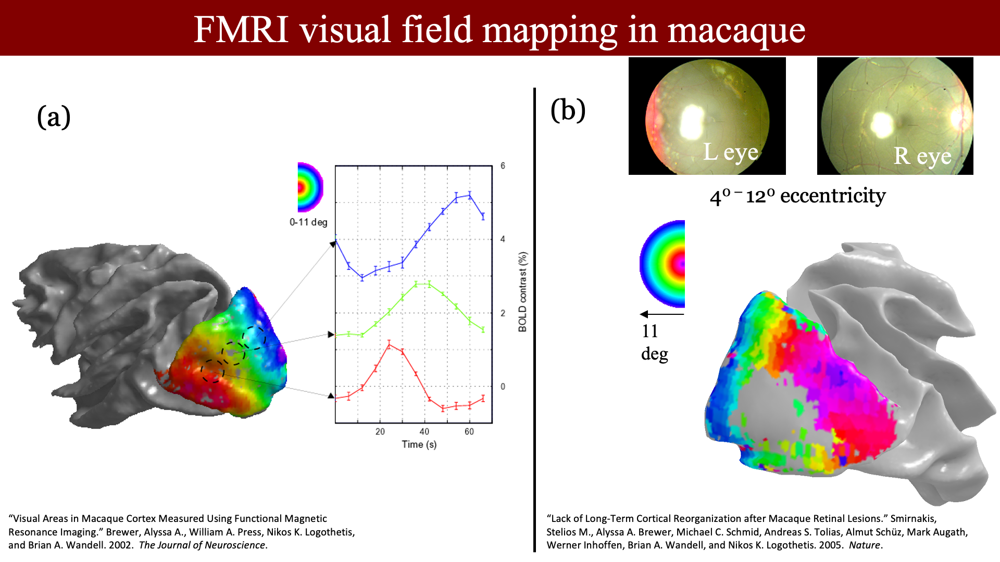{#fig-lpz width="80%"}

We expected that the area of the LPZ would shrink as we measured it over time. But over the ensuing months, we found very little—or perhaps no—remapping [@smirnakisLackLongtermCortical2005]. Surprised by this, Stelios made targeted electrophysiological measurements to find neural signals, but again he found no significant electrical response, mirroring the lack of fMRI response.

{#fig-lpz-stability width="80%"}

Our finding of map stability conflicted with prior reports, and its publication was met with a rebuke by several of the authors who had previously reported significant remapping [@calford2005-critique-smirnakis]. A principal objection to our work was that fMRI was a poor measure of neural activity, which simply ignored the fact that we had also used electrophysiology.

We too were puzzled by the discrepancy and decided to restudy the literature, which we had previously accepted without intense scrutiny. Upon closer review, Stelios and I discovered many serious inconsistencies in the animal literature, which we then summarized in a review paper [@wandell2009-plasticity-stability]. Those concerns remain largely unanswered[^1] and are outlined in @fig-disputes.

[^1]: A number of investigators spoke to me privately, reporting that they too had failed to find remapping. They were not looking for a fight and decided they had simply done something wrong. These comments were well-intentioned and gave us some comfort, but were also a bit disheartening regarding the state of scientific discourse.

![This review paper [@wandell2009-plasticity-stability] describes a series of experimental conflicts in papers that found topographic remapping in adult visual cortex. These are discussed in detail in the review paper.](images/review-disputes.png){#fig-disputes width="80%"}

Given what is known about cortical development, the idea of large-scale adult remapping seemed like a long shot (see @nte-map-development)—which is exactly why so many people found it exciting. The anatomical infrastructure for the maps is laid down by white matter connections. The axons find their targets (the "correct neighborhood") early in development [@feldheim2000-map-development-molecules; @mcLaughlin2003-map-sharpening]. This principle is broadly true across the brain, not just for visual maps [@agmon1993-development-maps; @huberman2008-review-maps; @mclaughlin2005-molecular-gradients-development].

@crowley2000-early-development-od showed that even finer anatomical inputs—the basis of the ocular dominance (OD) columns—are in place before the eyes open (in the ferret). They showed that even after removing the eyes during the period when retinal waves would normally occur (postnatal days 0 to 15 in the ferret; equivalent to embryonic days 42-57 in the cat), thalamocortical projections from the LGN still segregate into eye-specific cortical columns. Molecular cues that are part of the developmental program are sufficient to establish the ODC anatomy. The experience-dependent changes Hubel and Wiesel observed modulated ODC widths by a few hundred microns, but there was nothing on the scale of massive remapping. 

::: {.callout-note #nte-map-development title="How maps develop"}
To understand what would be required for remapping, it is useful to understand how the anatomy that supports the maps develops. The axonal connections develop through a series of critical stages that connect the axons carrying signals between the principal structures (retina, LGN, V1).

@feldheim2000-map-development-molecules demonstrated that the retinotopic mapping onto the LGN and Superior Colliculus is guided by gradients of Ephrins and Eph receptors, which are part of the innate developmental programs. These molecular markers are expressed and guide axons in the optic nerve and optic radiation to their specific topographic coordinates ("spatial addresses") well before photoreceptors are functional.

@molnar1995-early-map-development proposed that thalamocortical and corticothalamic axons meet in the subplate (the embryonic white matter) and use each other as scaffolding to establish topography. The topographic ordering in the white matter occurs extremely early, before the axons even penetrate the cortical plate to form Layer 4. Thus, retinotopic mapping is sorted in the white matter before any visual signal could possibly exist.

After the axons are in place, @mcLaughlin2003-map-sharpening showed that this rough draft might be fine-tuned by spontaneous waves of activity in the retina that sharpen the retinotopic map, again before the rods and cones are even connected to the ganglion cells. And, of course, Hubel and Wiesel showed that aspects of the functional organization are experience-dependent as well [@hubel1970-criticalperiod].

@striem-amit2015-blind-functionalconnectivity studied the functional connectivity of fMRI signals in the adult human cortex of the blind. Their findings support the idea that the large-scale organization remains fixed, despite drastically different life experiences. The functional connectivity of early visual cortex in the blind—individuals with no retinal input to the cortex—matches the connectivity in sighted controls.

More will be required to understand the full range of possible functional changes. Vision scientists have become increasingly aware that subcortical pathways are also part of the computational system, and some of the functional changes observed in cortex can be explained by changes in the signals within these structures. @kaas2007-pulvinar-review suggests that some of the changes we observe after lesions can be explained by properties of the pulvinar and subcortical pathways. Any hope of understanding the functional changes will require a computational model, which is a main point in our review [@wandell2009-plasticity-stability].

Finally, Hensch, Fawcett, and others have leaned into modern ideas concerning the stabilizing impact of inhibitory parvalbumin neurons and their *perineuronal nets* (PNNs) [@hensch2005-critical-period-review; @kwok2011-pnn; @fawcett2022-perineuronal-review; @nakayama2025-aggrecan-pnn; @jain2012-somatosensory-plasticity; @jain2025-kaas-spinal-critical]. I will speculate (wildly) about PNNs, and opportunities for human research in the living brain, at the end of this presentation.
:::

## Human measurements of map reorganization
The ability to measure retinotopic maps in humans affords the opportunity to evaluate map reorganization, both during development and in the adult. In the next section, I will briefly run through five different experimental measures of human map reorganization. 

In summary, fMRI methods are capable of measuring and quantifying key aspects of map reorganization. The predominant finding from multiple types of measurements is that retinal lesions do not cause large-scale remapping in visual cortex. When a large portion of an adult visual cortical map is deprived of input, the lesion projection zone remains unresponsive. 

### 1. Achiasmia
A particularly striking case of developmental plasticity in the visual system occurs when the retinal axons fail to find their way to the lateral geniculate. In most people, there is a standard crossing pattern in which the optic nerve axons from each nasal retina cross to the opposite hemisphere at the *optic chiasm* (@fig-chiasm). In a small number of people, the molecular guidance for this crossing fails and the optic chiasm never develops (@fig-achiasm). In these individuals, the retinal axons stay within the same hemisphere, so that the right eye projects to the right hemisphere and the left to the left [@victor2000-achiasma; @prakash2010-achiasmic; @hoffmann2012-achiasma].

::: {#fig-chiasmic-anatomy layout-nrow="2"}
{#fig-chiasm width="80%"}

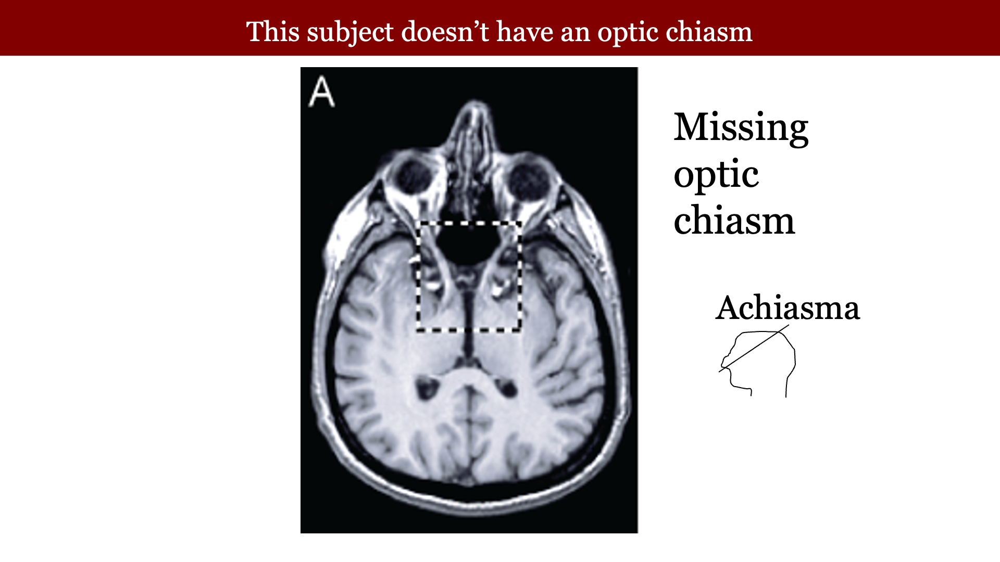{#fig-achiasm width="80%"}

The optic chiasm is normally easy to find in a structural anatomical image (a). In some rare cases, the retinal axons do not cross and each eye projects to the LGN on its side of the brain (b).  
:::

The anatomical wiring governs the map organization. If all the axons from an eye project to the LGN and V1 on the same side, then both the right and left visual fields will evoke a response in that hemisphere (@fig-achiasm-hemifield).  

Probing the organization in more detail using a methodology called population receptive field (pRF) mapping, we can also see how the two halves of the retina project through to V1. In typical development, the left hemisphere V1 voxels will only respond to stimuli in a small portion of the right visual field. This region is called the population receptive field (pRF). The population receptive field of a voxel in V1 of an achiasmic subject is quite different. It comprises two small, widely separated regions that arise from the nasal and temporal halves of the retina (@fig-achiasm-prf). 

::: {#fig-chiasmic-responses layout-ncol="2"}

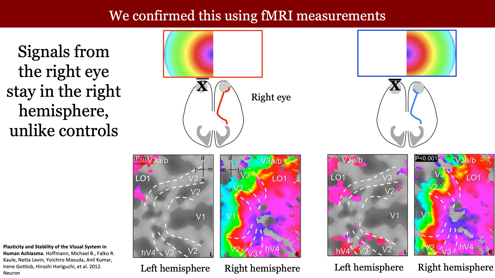{#fig-achiasm-hemifield width="80%"}

{#fig-achiasm-prf width="80%"}

In achiasmic individuals, both the left and right sides of the visual field initiate a response in V1 (a). The population receptive field of a V1 voxel in an achiasmic subject has two distinct regions, arising from the nasal and temporal halves of the retina (b) (after @hoffmann2012-achiasma).
:::

Even in the presence of such a large anatomical mis-wiring and the corresponding functional abnormalities, such individuals manage their visual perception in daily life effectively [@hoffmann2012-achiasma; @kaule2014-chiasma-downstream]. These individuals can read, navigate, and even engage in sports. They do not have stereovision, and they generally have nystagmus. But many people have these disorders, and thus they are not specifically diagnostic of achiasmia. Furthermore, other individuals with albinism have a less extreme form of this disorder and still manage to achieve reasonable visual function [@hoffmann2003-alibinism; @hoffmann2015-TICS-review].

<!--
@bao2015-achiasmic used achiasmic subject to test something about the quantitative properties of the BOLD signal.  Interesting.
-->

### 2. Achromatopsia—rod monochromats
After learning how to measure human retinotopic maps, we began exploring potential cases of remapping in people. Heidi Baseler and I were aware of work by our colleagues at UC Berkeley with individuals who had a relatively rare condition: rod monochromacy. Heidi made measurements in three such individuals. A problem with our original study was that only one of the subjects was genetically screened to be a true rod monochromat. The other two had minimal, but some, cone function. We reported that the foveal representation was responsive in these individuals, suggesting that a developmental loss of cone function might produce a remapping. This finding was accepted and reported in subsequent authoritative reviews [@hoffmann2015-TICS-review].[^2]

[^2]: We thought acquired foveal lesions would not fill in, but that developmental lesions might be different. Alas, we were wrong—and fortunately, after a few years, Heidi straightened us out. "In adults, the deafferented cortical foveal representation in rod achromatopsia is not silent, but driven by parafoveal input [@baseler2002-rod-monochromats]. In essence, the visual field maps are preserved, but only represent retina covered with functional photoreceptors, that is rods" [@hoffmann2015-TICS-review].

Twenty years on, the matter was taken up again by Baseler and colleagues using much better screening methods [@molz2023-achromatopsiavisualCortexStability2023]. Contrary to our original report, they found that individuals genetically classified as having *only* rods had a silent foveal projection zone. In returning to the @baseler2002-rod-monochromats paper, I could see that the one person we had securely identified as rod-only did seem different from the other two. He had no real filling-in of the foveal projection zone, while the other two we had emphasized did have filling-in.  

In this developmental case, the cortical map organization—which is initiated before the retina is even functional [@molnar1995-early-map-development]—is not altered. The absence of foveal input from the retina does not cause a major remapping.

> Remapping of the cortical representation of the central visual field is not a general feature in achromatopsia. [@molz2023-achromatopsiavisualCortexStability2023]

It is worth noting that this question already has practical clinical interest. The possibility that the adult human brain may regain or develop function following the correction of congenital deafferentation has fired the imagination of scientists over the years. In the visual domain, cases of recovery from congenital deficits are rare. Gene therapy for visual restoration of congenital *CNGA3*-achromatopsia, a disease caused by cone photoreceptor dysfunction, gave us the opportunity to examine cortical function—to the best of our knowledge, for the first time—both before and after restorative treatment. While behaviorally only minor improvements were observed post-treatment, fMRI analysis (including population receptive field algorithms) revealed cortical changes, specifically a decrease in receptive field size in the treated eyes. This suggests that the adult cortex retains some capacity to encode new input. Importantly, these findings illustrate how plasticity can differ by spatial scale: while the large-scale map representation (centimeters) remains stable, localized functional fine-tuning (e.g., millimeter-scale changes in receptive field size) remains possible.
  
TODO:  Describe the paper by McKyton and colleagues [@mckytonCorticalVisualMapping2021].

### 3. Macular degeneration
Further measurements of map plasticity have been made in the adult brain following the onset of different types of retinal disease that create retinal lesions. One might expect to see remapping in such individuals, perhaps by filling in the lesion projection zone (LPZ) corresponding to the disease.

Yet, publications on humans have found little support for cortical remapping in the adult subsequent to foveal disease [@sunness2004-md-retinotopy; @masuda2008-maculardegenerationV1; @masuda2021-maculardepgeneration; @rosenau2008-feedback; @baseler2011-LargescaleRemappingVisual]. The human literature contains one series of papers from Baker and colleagues that reported large-scale reorganization [@baker2007-reorganization; @baker2008-reorganization; @dilks2007-reorganization]. However, our review raised several methodological concerns regarding those findings [@wandell2009-plasticity-stability].

One possible explanation for the Baker findings concerned the control of the observer's attention. According to Masuda et al. [@masuda2008-maculardegenerationV1], the lesion projection zone (LPZ) was silent during passive viewing (@fig-masuda-passive).

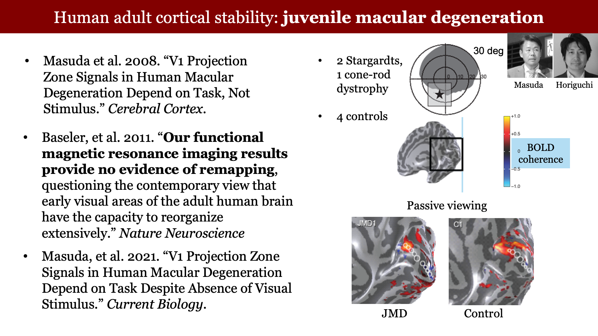{#fig-masuda-passive width="80%"}

However, when the subjects engaged in a one-back memory task, a small signal could be detected in the LPZ [@rosenau2008-feedback; @masuda2021-maculardepgeneration]. 

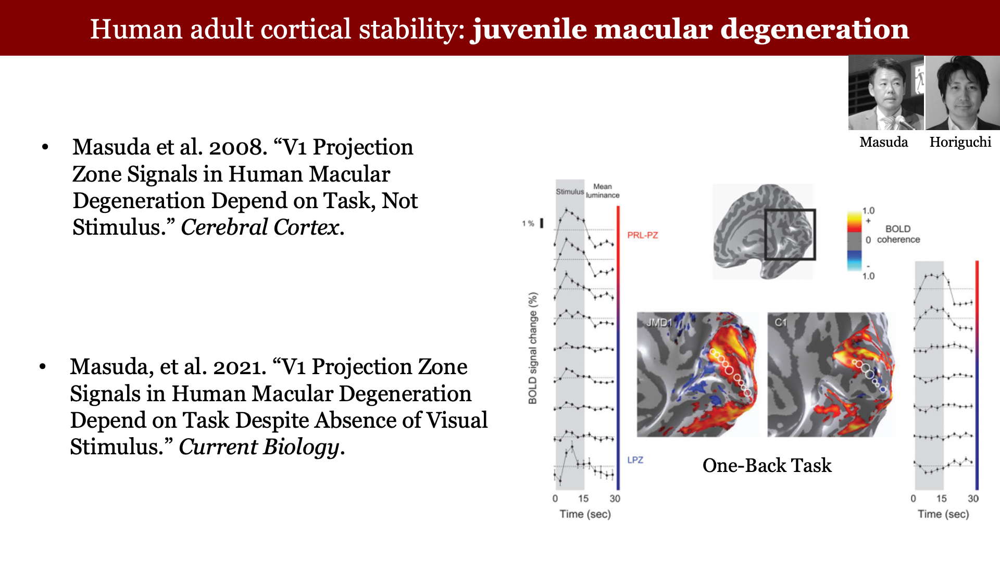{#fig-masuda-jmd-obt width="80%"}

These findings suggest that there may typically be cortico-cortical signals present in V1 that are associated with task judgments. In sighted individuals, these feedback signals are masked by the retinal signal. If we remove the retinal signal but still maintain a task, we can measure the feedback signal. @fig-masuda-model is a block diagram showing the concept. 

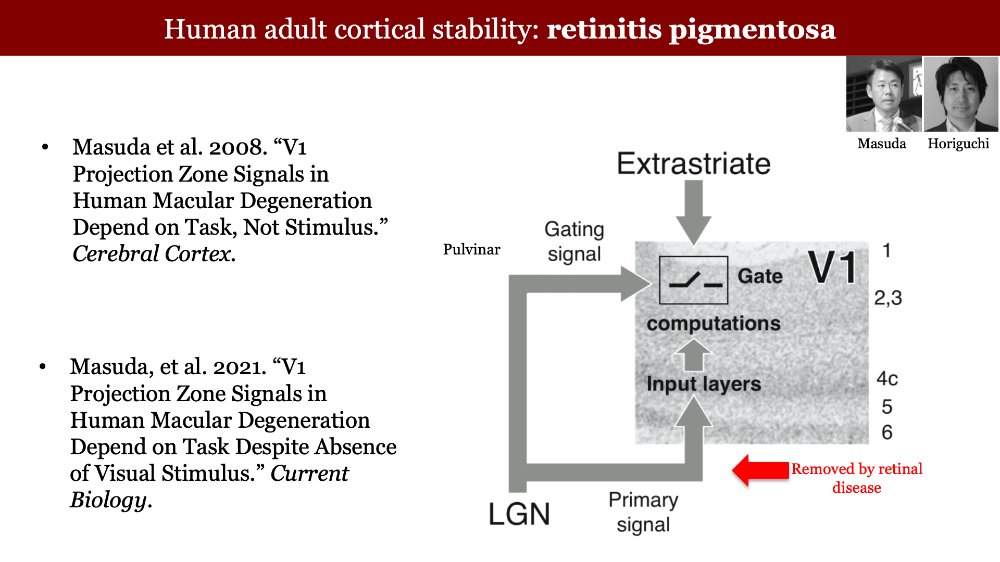{#fig-masuda-model width="80%"}

A later study showed that the V1 lesion projection zone of JMD patients responds to tactile and auditory stimuli, but only in the one-back memory task, not in the passive condition [@masuda2021-maculardepgeneration]. The modality-independent, task-dependent LPZ responses suggest they reflect task-related feedback signals rather than reorganized feedforward signals. Masuda is currently performing these experiments in blind subjects, and preliminary reports suggest he has found the same kind of signals, further supporting the idea.

### 4. Retinitis pigmentosa
Masuda also made measurements in patients with retinitis pigmentosa, a disease that spares the fovea but damages the peripheral retina [@masuda2010-retinitispigmentosa]. Once again, they found no significant reorganization in the adult cortex (@fig-masuda-rp).

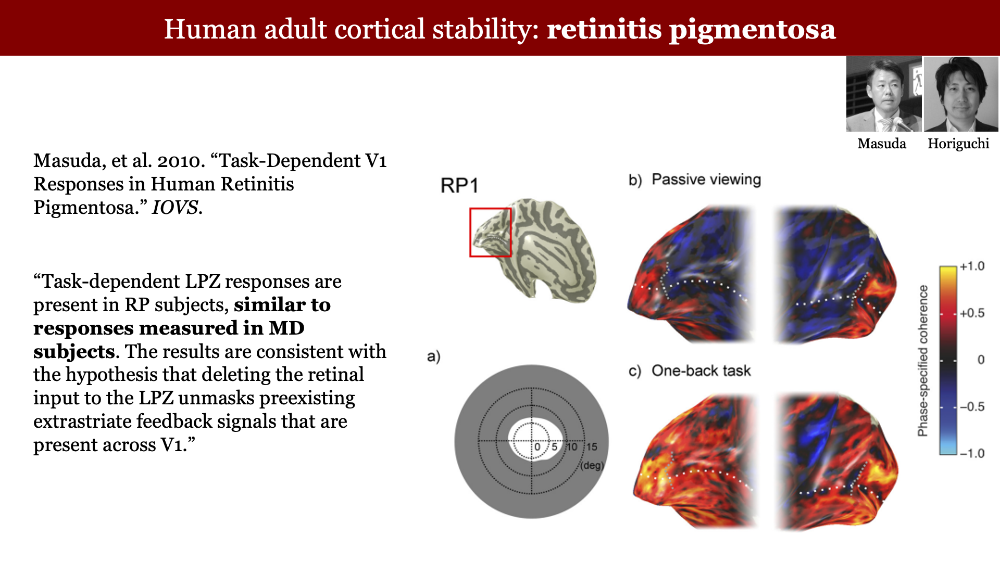{#fig-masuda-rp width="80%"}

It is worth noting that in both retinal diseases, remapping cortical signals into the LPZ would not solve the problem caused by the retinal lesion: an expansion of cortical signals does not replace the missing retinal signal. It is unclear what functional purpose a remapping would serve. From the point of view of retinal prosthetics, the absence of remapping is good news: if we replace the missing retinal signal, the LPZ seems to be preserved and ready to receive signals from the blinded retinal region.

### 5. Case study: Mike May
People who are deprived of vision from birth—most often due to cataracts or other optical distortions—and later have their sight restored provide a natural experiment on visual development. The earliest documented case is from Cheselden [@cheselden1728-recovered-sight], and more recent cases [@gregory1963-recovered-sight; @valvo1971-visualrehab; @sacks1993-recovered-sight] tell a consistent story: restoring a clear retinal image rarely restores normal vision.

The case of Michael May is one of the most thoroughly studied. His story is told in the book *Crashing Through*, and it raises two sharp questions: Would surgery restore high-quality vision? And what would fMRI reveal about visual cortex after decades without contrast input?

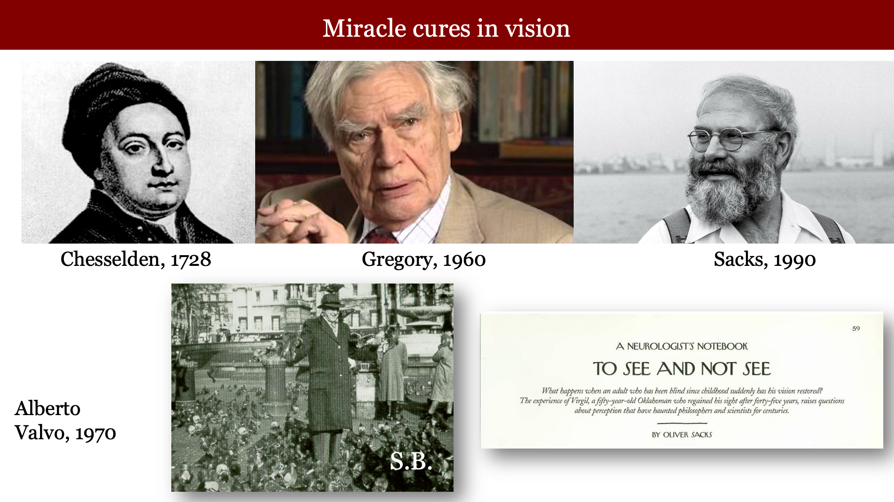{#fig-recovered-sight-historical width="80%"}

At age three, Mike found a jar in his family's garage. It contained calcium carbide, a chemical used in miners' lamps that releases highly volatile acetylene gas on contact with water. When he brought the jar to the sink, the resulting explosion was catastrophic. He required roughly 300 stitches and spent six months in the hospital. Both corneas were destroyed, as was one retina. For the next 43 years, he had almost no contrast vision and only minimal light perception in his remaining eye.

Early attempts to replace the damaged cornea and lens failed. A new procedure developed by Dr. Holland—involving the transplantation of limbal stem cells—eventually made surgery feasible. In March 2000, corneal specialist Dr. Daniel Goodman performed the operation in San Francisco. It succeeded: the new cornea and lens delivered a clear image to the retina.

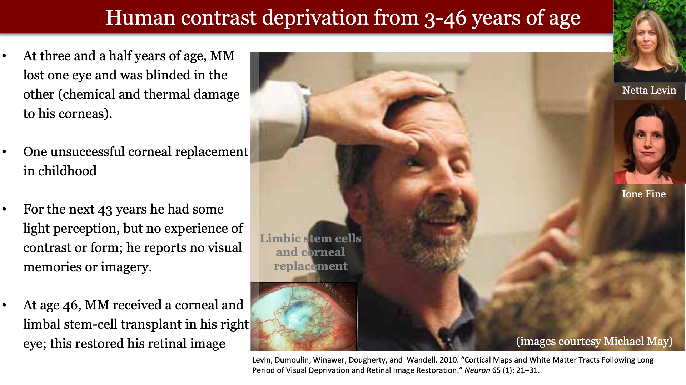{#fig-recovered-sight-mm-open width="80%"}

Yet, as Elizabeth Huber, Ione Fine, and their collaborators documented, restoring retinal image quality did not restore normal vision [@huber2015-mikemay]. Consistent with the historical literature, Mike's contrast sensitivity function remained severely impaired despite years of follow-up.

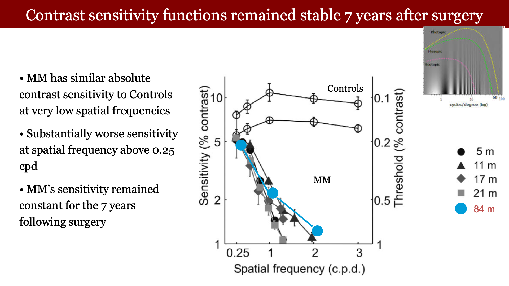{#fig-recovered-sight-csf width="80%"}

The second question—what had happened to visual cortex after 43 years without contrast input?—required fMRI to answer. Mike generously gave his time for scanning, and Netta Levin led the analyses of his visual field maps and white matter pathways [@levin2010-mikemay]. Despite the long period of visual deprivation and the complete loss of one eye, the basic retinotopic map was preserved in Mike's visual cortex, with a notable deviation from normal. The central (foveal) region of his visual field, a region in which the retinal ganglion cells typically carry relatively high-resolution signals, seems to have been disrupted.  

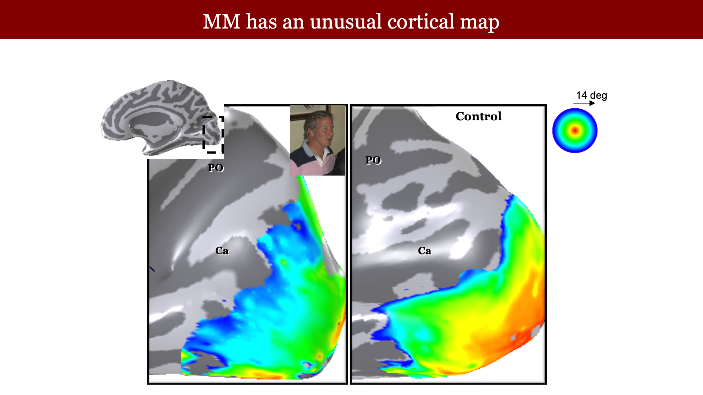{#fig-recovered-sight-V1 width="80%"}

We interpreted these measurements as suggesting that the foveal receptive fields were larger than normal, and thus their centers were more peripheral (green) than what is found in the typical case. This hypothesis was supported by measurements of the relationship between eccentricity and pRF size in V1–V3. 

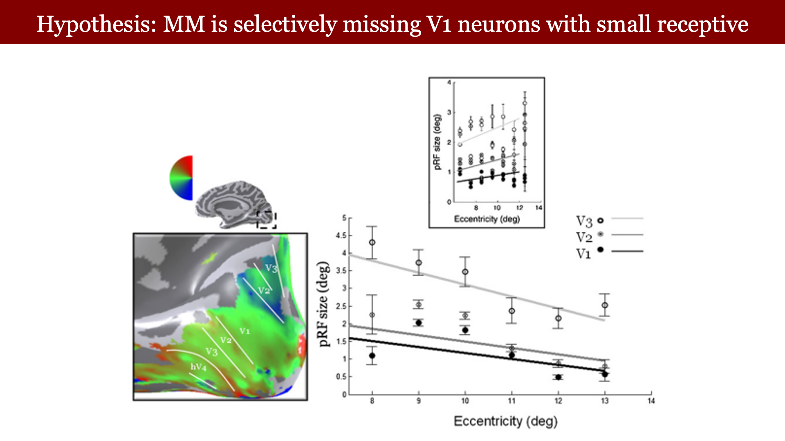{#fig-recovered-sight-prf-size width="80%"}  

The main graph shows MM’s estimated population receptive field sizes as a function of eccentricity. Different symbols indicate estimates from V1, V2, and V3. For comparison, average pRFsize estimates from three control subjects are shown in the inset. Solid lines are fit to the points from each map. In controls and MM, pRF-size increases systematically from V1 to V3. MM’s estimated receptive field sizes at eccentricities from 8-10 deg are larger than those in controls. The pRF sizes beyond 10 deg are similar or smaller compared to controls. 

Levin's paper also examined various structural aspects of the white matter, suggesting that there is a significant change in the inter-hemispheric callosal fibers from the occipital lobe [@levin2010-mikemay].

### Sacks' report on Virgil: To see or not to see
In an essay ('To see or not to see') that is included in his book, *An Anthropologist on Mars*, Oliver Sacks describes a case much like that of Michael May [@sacks1993-recovered-sight; @sacks1995-anthropologist-mars]. The experience of the subject of his essay, Virgil, is described as a catastrophe rather than a miracle. Virgil could see colors and movement, but he could not make sense of objects or faces—Virgil was "blind" to meaning. This caused great distress, just as Valvo [@valvo1971-visualrehab] reported for many of the patients in another 'miracle cures' exploration of recovered sight. Sacks suggests that Virgil's visual cortex had stabilized in a non-visual state, and the 45-year gap meant the critical period, which he called the "instructional window" for building functional maps, had long since closed.

### Project Prakash
A different take is provided by Sinha and his colleagues, who created [Project Prakash](https://www.projectprakash.org/). They emphasize a likely case of behavioral improvements and perhaps adult cortical plasticity for certain cases [@ostrovsky2006-recovered-sight; @ostrovsky2009-recovered-sight-parsing; @gandhi2017-recovered-sight-face]. In particular, Project Prakash includes people who lost and gained sight over a wide range of ages, and who have a wide range of deficits. 

Most of the published reports concern behavioral improvements; the authors initially found that prominent figural cues of grouping, such as good continuation and junction structure, were largely ineffective for image parsing. By contrast, motion cues were of profound significance in that they enabled intra-object integration and facilitated the development of object representations that permitted recognition in static images. Following 10 to 18 months of visual experience, the individuals' performance improved, and they were able to use the previously ineffective static figural cues to correctly parse many static scenes. These results suggest that motion information plays a fundamental role in organizing early visual experience and that parsing skills can be acquired even late in life.

The measurements are mainly behavioral, but there are some neuroimaging assessments including assessments of the white matter [@pedersini2023-recovered-sight-white-matter].

## The role of parvalbumin cells and PNNs
In recent years there have been substantial advances in our understanding of the molecular mechanisms that enforce local stability. These findings provide an understanding of why there may be relative stability of the relatively fine-resolution features, such as ocular dominance columns and receptive field properties. 

The stability mechanisms can be traced back to an observation by Camillo Golgi, quoted by Celio et al. [@celio1998-perineuronal-review]:

> Eminent colleagues, The communication which I ask leave to deliver to you this evening takes the form of brief comments on the preparations which I have the honour to present to you, and to which I ask you to dedicate a moment of your attention. In the group of preparations shown here, you will immediately recognize two different peculiarities in the organization of the nerve cells; peculiarities concerning: the external surface, on the one hand, and the interior or the thickness of the cellular body, on the other.

The external surface that Golgi and Cajal saw is a perineuronal coating, now called a perineuronal network (PNN), which is found mainly on parvalbumin-positive neurons (@fig-pnn-golgi). 

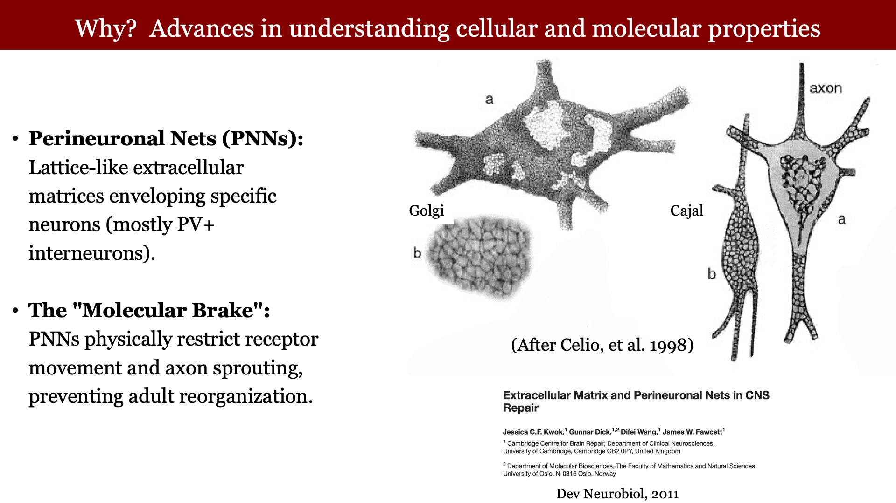{#fig-pnn-golgi width="80%"}

We know that these inhibitory cells are the primary modulators of cortical plasticity [@hensch2005-critical-period-review; @morishita2010-lynx1-hensch; @hensch2014-amblyopia-critical-period]. Additional work from the Maffei and Fawcett labs identified the specific molecules (proteoglycans) within Golgi’s PNN that stabilize these inhibitory circuits and prevent local plasticity that is observed in the juvenile brain [@sorg2016-pnn-review]. Various post-mortem analyses of the human brain reveal that the PNNs are established at different times in different locations within the brain, including some that stabilize around 8 years of age, coincident with Hubel and Wiesel's critical period [@rogers2018-pnn-epilepsy; @mauney2013-pnn-schizophrenia; @yew1997-pnn-human-cerebellum; @grateron2003-pnn-human-entorhinal; @fung2010-pnn-human-dlpfc].

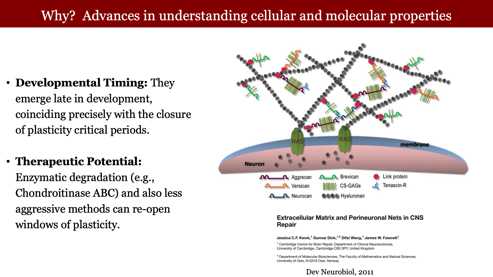{#fig-pnn-molecules width="80%"} 

Finally, very recently, we are learning more about the causal mechanisms for building this stability. Specifically, there is some activity-dependence for PNN development, and "Among the PNN-related genes examined, aggrecan alone exhibited strong activity-dependent transcriptional regulation" [@nakayama2025-aggrecan-pnn].

<!-- The Nakayama (2025) paper you asked about is the most modern measure of this process. It shows that aggrecan expression is not just a "clock" that runs out; it is activity-triggered.The Measure: Using quantitative PCR and Western blots, Nakayama showed that as neurons begin to fire in response to visual input, the Acan gene is upregulated specifically in Parvalbumin (PV) interneurons.

The Feedback Loop: Increased activity $\rightarrow$ Increased Aggrecan $\rightarrow$ Stronger PNNs $\rightarrow$ Reduced Plasticity (Stability).
-->

## Speculation: MRI and PNNs
An interesting question for those of us who study the human brain is this: Can we help establish or contradict this role of the PNNs using non-invasive methods, such as MRI? 

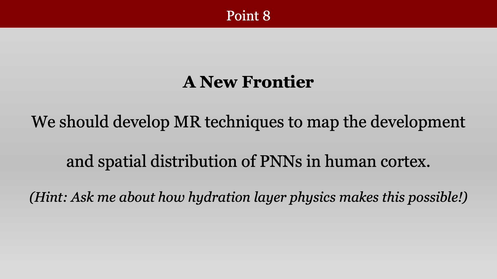{#fig-pnn-mri width="80%"}

We might be able to learn something about their development and spatial distributions in the human brain using MRI. The key determinant of the MR time constant, $T_1$, is the interaction between spins near the cell surface membranes, referred to as the hydration layer. Perhaps through careful study, we might find that the PNN molecules at the cell membrane impact the $T_1$ value of in vivo measurements, and thus variations could be informative about the development of PNNs at different locations and times. These measurements might inform us about healthy development, plasticity, and stability. This is quite speculative of course, but this is just a talk amongst friends.

<!--
Notes for future discussion with Stanford MR physicists:

1. The Molecular Composition of PNNs:
PNNs are dense extracellular matrix (ECM) structures composed heavily of chondroitin sulfate proteoglycans (CSPGs), hyaluronic acid, and link proteins. These macromolecules are highly negatively charged and bind massive amounts of structured water (forming the hydration layers).

2. Precedents in MRI (Cartilage & MSK Imaging):
In musculoskeletal MRI, we already image these exact same molecules. Techniques like gagCEST (Glycosaminoglycan Chemical Exchange Saturation Transfer), T1-rho imaging, and Magnetization Transfer (MT) are used specifically to quantify proteoglycan concentration in cartilage by measuring the interaction between the macromolecular hydration layer and bulk water.

3. Application to the Cortex:
In neuroimaging, myelin has historically dominated the conversation around T1 and MT because it is so highly concentrated in white matter. However, the ECM makes up roughly 20% of the brain's volume. As PNNs condense during development (wrapping around PV+ interneurons and locking in stability), the local density of proteoglycans and structured water must change. This would alter local macromolecular tissue volume (MTV) and change the relaxation times (T1, T2, and especially T1-rho or CEST contrast) in those specific cortical layers.
-->

## Summary
A working hypothesis about plasticity and stability is something like this: The relatively large scale (say, multiple centimeters) of axonal connections that determine the human visual field maps is established by the long-range axonal projections that develop from birth. These orderly representations are established during the earliest stages of development and are rather stable—except when they are not (e.g., achiasmia).

Activity-dependent fine-tuning impacts features at a smaller spatial scale, say 1–3 mm. This includes features such as receptive fields and local architecture (e.g., ocular dominance columns). 

The role of activity-dependent fine-tuning is highest in early development and systematically reduced over time, as the PNNs form on the parvalbumin (PV) inhibitory neurons. The formation of the PNNs stabilizes the neuronal structural and functional properties. To recreate the activity-dependent plasticity, one would need to dissolve the PNNs, and then it would be desirable to recreate them after achieving some functional goal. PNN removal might enable local changes (mm), but it would be unlikely to adjust the long-range guidance cues that established the maps at centimeter scale. The larger structures emerge from the Ephrin gradients early in development, and they will not be changed by dissolving the PNNs.

With respect to adult cortical remapping, we should consider the likelihood that the topographic coordinates are fixed, but the local fine-tuning becomes fixed after the critical period, and could potentially be unlocked.

| Term | Spatial Scale | Mechanism | Adult Status |
| :--- | :--- | :--- | :--- |
| **Synaptic Plasticity** | Microns | LTP/LTD, Gain Control | **Highly Plastic** |
| **Local Refinement** | 1–2 mm | PNN Removal, OD Shifts | **Reactivatable** |
| **Topographic Remapping** | 10 cm | Long-range Sprouting, Map Shifts | **Stable/Fixed** |
