*This is a draft document of a talk I will present at a meeting in London. The text and images here will eventually be transitioned into a new section of **Foundations of Vision (2nd Edition)**. Your comments and suggestions are very welcome.*

# Introduction

Today I will tell two stories about how meso-scale imaging has improved our understanding of the human brain.

The first describes advances in mapping retinotopic maps in human visual cortex. Over the last 30 years, a large group of investigators has significantly advanced our understanding of the organization of these visual field maps. While the organization of human visual cortex shares similarities with macaques, there are important differences that I will enumerate. Furthermore, the large field of view provided by human neuroimaging has revealed that these maps are organized in clusters. I will suggest that these discoveries warrant a revision of the widely used Felleman and Van Essen diagram, which emphasizes macaque data, blends the concepts of areas and maps, and does not capture the cluster organization of human maps.

The second is a story about measurements of adult cortical plasticity in the visual system. The idea of large-scale adult cortical plasticity, which generated much excitement around 1990, does not appear to hold true in sensory areas. A large body of human MRI work now shows that adult visual cortex is relatively stable and does not undergo large-scale reorganization in response to changes in retinal input. I will also discuss the cellular mechanisms that may underlie this stability, particularly their relationship to perineuronal nets. Recognizing this stability allows us to focus on mechanisms that might genuinely repair cortex after injury, avoiding the distraction of trying to explain non-existent large-scale reorganization in the healthy adult brain.

I plan to incorporate the material from this presentation into the second edition of my book *Foundations of Vision*, which is currently in preparation. Elements of each story will likely be familiar to many of you, particularly those who have studied visual neuroscience. My goal is to ensure the ideas and data are clear, accurate, and comprehensive, and that the figures are informative. I welcome your comments on any aspect of this talk, including the text, figures, and references.

# Visual Field Maps - Historical Perspective

The discovery of visual field maps in human cortex is a fun history to read about [@fishman1995-mistake; @glickstein1985-ferrier-mistake; @wandell2011-ImagingRetinotopicMaps]. The debates between Ferrier and Munk in the late 19th century about the location of visual cortex were heated. The disagreements were not just about the data, but also about the interpretation of the data and the implications for our understanding of brain function.

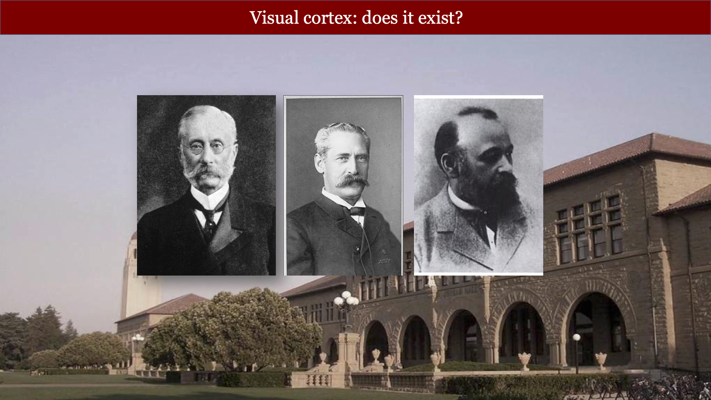{#fig-ferrier-munk-inouye-holmes width="80%"}

Ferrier performed lesion studies in monkeys and proposed that primary visual cortex was located in the angular gyrus. The German physiologist, Hermann Munk, disagreed with Ferrier's anatomical localization and argued that visual cortex was in the calcarine region — a critical correction that set the stage for more accurate understanding of retinotopic organization.

::: {#fig-ferrier-munk layout-ncol="2"}
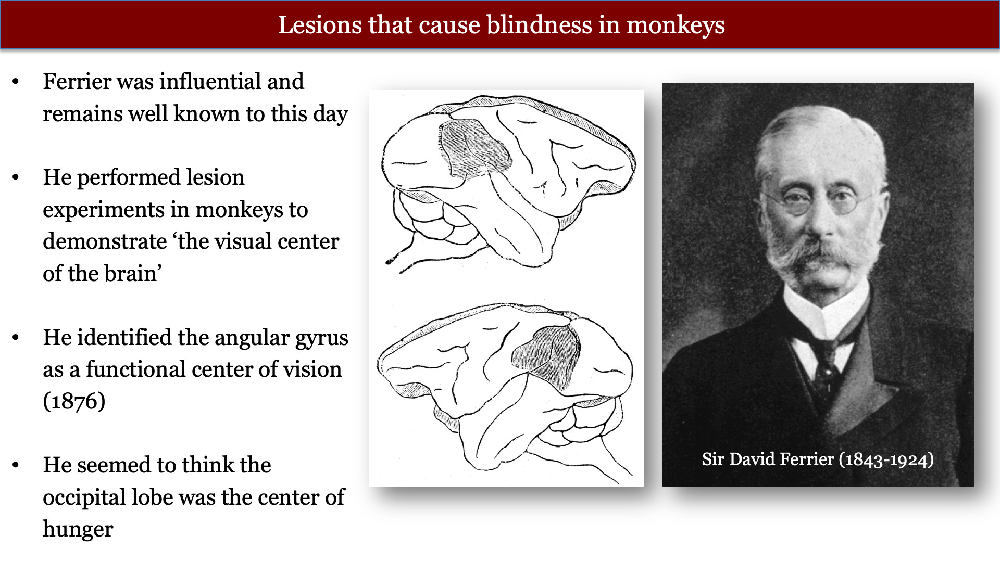{#fig-sub-ferrier-angular-gyrus width="85%"}

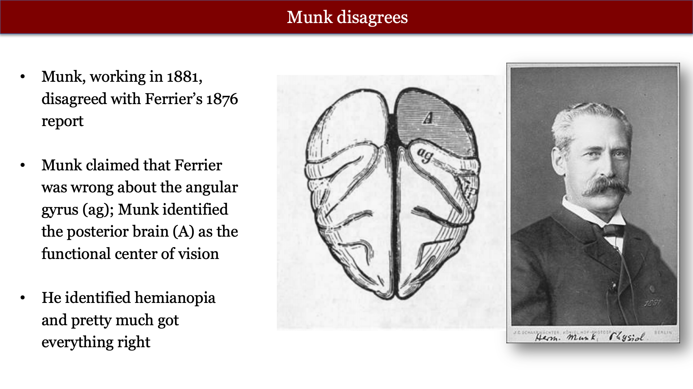{#fig-sub-munk-occipital-lobe width="85%"}

A comparison of visual cortex localization from Ferrier and Munk.
:::

::: {#nte-ferrier-munk-james .callout-note title="Ferrier and Munk"}
No need to wonder what Munk thought about Ferrier's work. Here are his own words.

> In my first communication on the physiology of the cortex which I made in March of last year I did not say anything about Ferrier’s work on the monkey because there was nothing good to be said about it. But asked in the subsequent session I had to say that Mr. Ferrier's declarations that the visual center in the monkey was situated in the angular gyrus \[… and other claims …\] that all these statements and what followed from them as far as the character and restitution of disturbances set by the operation are concerned, are worthless and gratuitous constructions since the operated animals were examined by Mr. Ferrier in quite an insufficient manner and only at the time of general depression of brain function.
>
> If I have gone too far in this statement which is based on a general survey of Mr. Ferrier’s experiments it was up to me to restore the injury, the sooner the better. However, as the experiments show now I have said at that time rather too little than too much, Mr. Ferrier had not made one correct guess, all his statements have turned out to be wrong.

Commenting on the debate from the other side of an ocean, William James wrote "Munk's absolute tone about his observations and his theoretic arrogance have led to his ruin as an authority. (@james1890-principles)”.

James went on to write about Munk:

> But he did two things of permanent value. He was the first to distinguish in these vivisections between sensorial and psychic blindness, and to describe the phenomenon of restitution of the visual function after its first impairment by an operation ; and the first to notice the hemiopic character of the visual disturbances which result when only one hemisphere is injured. Sensorial blindness is absolute insensibility to light ; psychic blindness is inability to recognize the meaning of the optical impressions, as when we see a page of Chinese print but it suggests nothing to us. A hemiopic disturbance of vision is one in which neither retina is affected in its totality, but in which, for example, the left portion of each retina is blind, so that the animal sees nothing situated in space towards its right (Page 41 in the downloaded PDF from mpg.de).

James also writes "the quarrel is very acrimonious; indeed the subject of localization of functions in the brain seems to have a peculiar effect on the temper of those who cultivate it experimentally. Each observer is sure that he is right, and is ready to explain away the adverse results of his rivals. ...".

Many of us have enjoyed Charlie Gross' book that is filled with interesting histories of neuroscience discovery [@gross1998-brain-book]. His book and James' book include more information about many other investigations of localization [; @james1950-principles].
:::

It was the Swedish neurologist, Henschen, who first carefully observed the visual loss in **human** patients with occipital lesions. He concluded that at least part of the visual field, the upper and lower portions, were represented in cortex in an orderly map with the lower visual field in the dorsal occipital lobe and upper visual field in the ventral occipital lobe. His findings were met with objections by many, and subsequently confirmed by many more. He expresses his feelings on the matter in the opening of a 1923 review paper\[\^Henschen1923\] [@henschen1923-review].

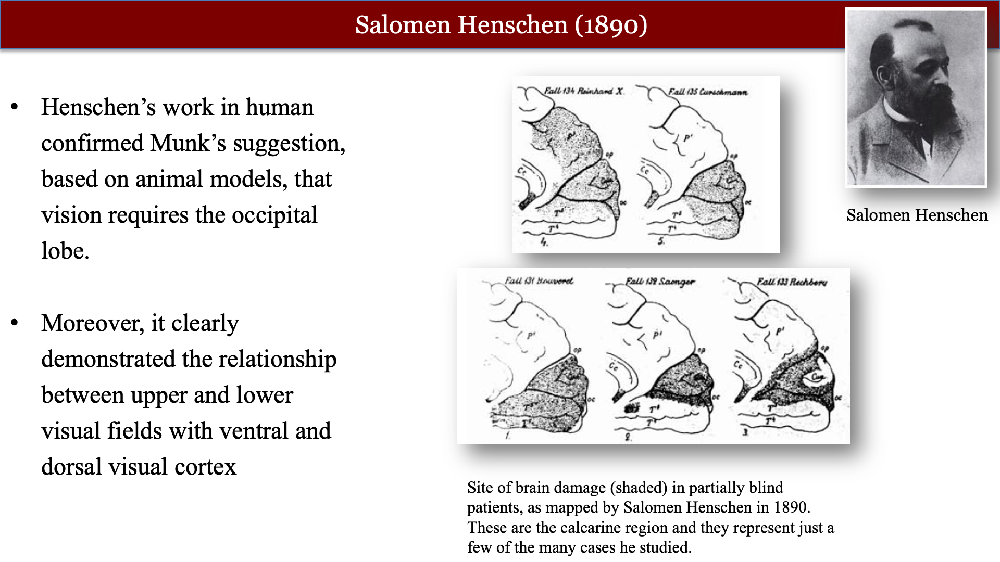{#fig-henschen width="80%"}

In fact, Henschen's observations about the organization of the visual cortex in the human were confirmed and extended by two clinicians working at opposite ends of the world: Gordon Holmes and Tatsuye Inouye. Both were studying visual field losses from soldiers injured in their countries' wars, Holmes in Europe and Inouye in Japan. In that era, the guns were not always lethal, and the helmets would permit bullets to enter and exit the posterior skull, effectively lesioning a portion of occipital cortex. Such lesions could cause a permanent but partial visual field loss. By accumulating data from a number of different cases, they deduced the retinotopic organization of the human visual cortex. In addition to the upper-lower field representation, they both reported on the eccentricity map as well as the fact that the central portion of the visual field occupied more cortical territory (per square degree) than the peripheral portion. This phenomenon is called 'cortical magnification', and though perhaps it should be called 'foveal magnification'.

::: {#fig-inouye-holmes layout-ncol="2"}
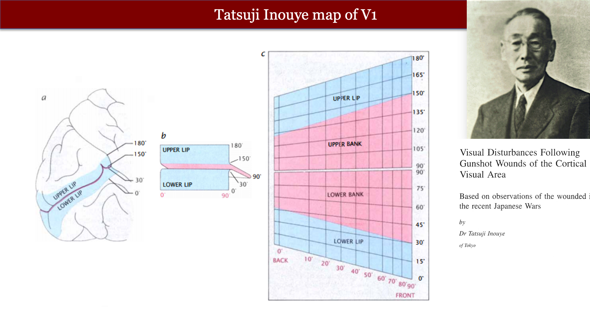{#inouye-map width="80%"}

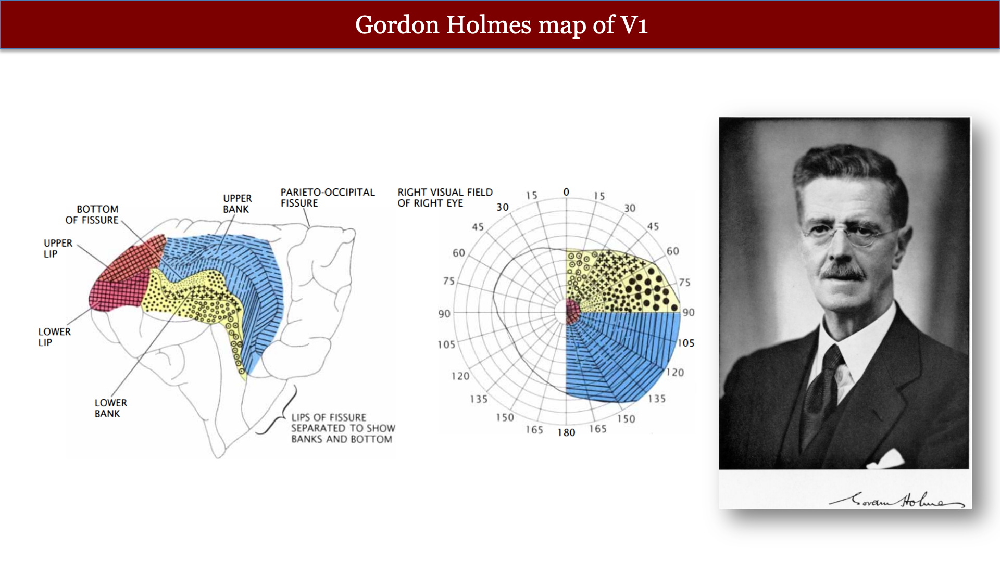{#holmes-map width="80%"}
:::

# Discovery of multiple maps

Talbot and colleagues in Wisconsin were the first to discover a second retinotopic maps (in rabbit). Cowey was the first to report a second visual map in a non-human primate [@cowey1964-v2]; Hubel and Wiesel reported two extrastriate maps in cat [@hubel1965-cat-v2-v3]. These reports were followed by a large collection of studies, identifying additional maps but also additional patches of cortex with distinct properties. Some of this history is summarized in the book by @zeki1993-book. Anatomical regions with visually responsive neurons and distinctive properties came to be known as 'visual areas', whether or not they were retinotopically organized.

::: {#nte-multiple-maps .callout-note title="Discovery of multiple maps"}
The effort to discover and map multiple visual areas in animal models expanded enormously between the 1940s and the 1990s. The major milestones include:

-   **The 1940s (V2 in cats and rabbits)**: The discovery of multiple visual field maps began when electrophysiological measurements revealed a second visual map (V2) adjacent to the primary visual cortex (V1) in the rabbit and cat. These early discoveries were spearheaded by Talbot, Marshall, Thompson (see review [@thompson1950-visual-maps]) from the Wisconsin laboratory established by Woolsey.
-   **The 1960s (V2 and V3 in monkeys and cats)**: Mapping efforts successfully extended to non-human primates when Cowey identified a second map in the squirrel monkey [@cowey1964-v2]. The following year, Hubel and Wiesel described a third map in the cat [@hubel1965-cat-v2-v3].
-   **The 1970s–1990s (V4, MT/V5, and beyond)**: During this period, investigators focused heavily on parcellating the extrastriate cortex of non-human primates, causing the number of identified maps to grow rapidly. A major breakthrough was the discovery of V4 and the motion-sensitive MT/V5 maps in the owl monkey by Allman and Kaas in 1971.
-   **Non-human primates** Around the same time, Semir Zeki conducted pioneering anatomical and single-unit studies that established a framework for the concentric organization of these maps in macaques [@zeki1969-multiple-maps; @zeki1974-mt]. It was during this period that he made an effort to associate specific functional (perceptual) properties to individual maps [@zeki1978-function; @zeki1993-book].
-   **Methodological challenges**: Identifying these early maps relied heavily on single-unit electrophysiology and very detailed anatomical work. Because the field of view for these technologies is relatively small, establishing the existence of a map was a notoriously difficult process that Hubel and Wiesel [@hubel1977-ferrierlecture] famously likened to "a dismaying exercise in tedium, like trying to cut the back lawn with a pair of nail scissors".
:::

The burst of activity reporting visual areas was summarized in an important article by [@felleman1991-hierarchy]. @fig-felleman-vanessen is an iconic image from that paper, which relies on the concept of a 'visual areas'. The authors propose that visual areas are organized into a hierarchy with signals flowing from the bottom (retina, LGN, V1) to the top (peri-hippocampal regions). The data supporting the specific organization were sparse, and over the last decade the measurements have been significantly augmented by data from Henry Kennedy's lab [@markov2013-hierarchicalanatomy; @markov2014-hierarchicalanatomy2]. I discuss an update to this diagram at the end of this section.

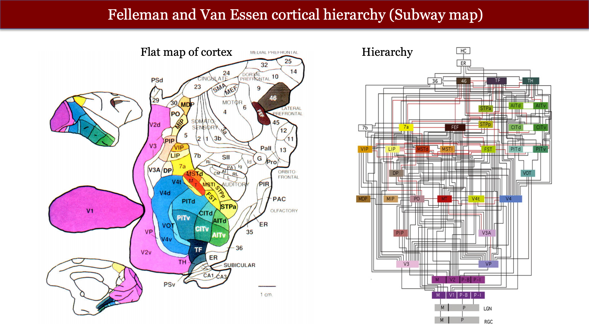{#fig-felleman-vanessen width="80%"}

::: {#nte-FACT .callout-note title="FACT:  Definitions"}
A generation of scientists were taught the definition of a visual area. Van Essen proposed that a cortical “visual area” is a region that can be distinguished from its neighbors by a convergence of evidence across function, anatomy, connectivity, and topographic organization (FACT), rather than by any single criterion alone. These are the criteria:

-   **F — Function**: Neurons in the region share distinctive response properties (e.g., motion selectivity, color bias, disparity tuning).
-   **A — Anatomy (architectonics)**: The region has distinguishable microstructure (e.g., cytoarchitecture, myeloarchitecture, laminar patterns).
-   **C — Connections**: It has a characteristic pattern of inputs and outputs (afferent/efferent connectivity distinct from neighboring cortex).
-   **T — Topography**: It contains an orderly map of the visual field (retinotopy), often with clear field boundaries (e.g., meridian reversals).
-   
:::

The *visual area* terminology was influential, but in my view and that of some others it is an arbitrary and often incoherent term.[@wandell2007-VisualFieldMaps; @hayden2025-rethinking-areas]. It is important to clarify the reason for identifying a region of cortex: it contains a retinotopic maps, neurons with common functional responses, similar cellular properties, or common input and output targets. The use of the concept of 'area', which could be any or some mixture of these without a clear rule, is less helpful than one might have thought in the early days.

# Human retinopic maps

Most scientists believed that the retinotopic maps found in non-human primates would be a good model for human visual cortex. But even as late as 1991, Horton and Hoyt observed that there was no proof of even two maps maps in human visual cortex [@horton1991-quadraticdefects; @horton1991-representationvisualfield]. The need for guessing changed with the introduction of functional magnetic resonance imaging (fMRI). That technology enabled investigators to identify retinotopic maps in the living human brain at the resolution of a few milimeters in experiments lasting less than an hour. Over time, the spatial precision and duration of the experiments has decreased dramatically.

Steve Engel and I - helped by many others - developed a technique to measure eccentricity and angle maps that was widely adopted [@engel1994-fmri; @engelRetinotopicOrganizationHuman1997]. The stimulus and cortical responses (fMRI) for measuring eccentricity are shown in the @fig-eccentricity-movie. If you look at the video casually, you will see the wave from the occipital pole traveling in the anterior direction of the main map. If you look a little more closely, you will also see a secondary ripple on the ventral occippital-temporal surface. That ripple starts when the stimulus is in the fovea and then fades out as the ring expands about half way (10 deg). The VOT eccentricity map is a second eccentricity map, confined mainly to the perifoveal visual field, that is distinct from the calcarine map.

{#fig-eccentricity-movie width="80%" loop="true" autoplay="true" muted="true"}

We also made measurements using a rotating wedge stimulus to measure the most effective angular position for each voxel. The angular responses subdivide the eccentricity map into different visual field maps. The data from the video are summarized in two pseudo-color maps showing the most effective visual field eccentricity for each cortical location

::: {#fig-maps layout-ncol="2"}
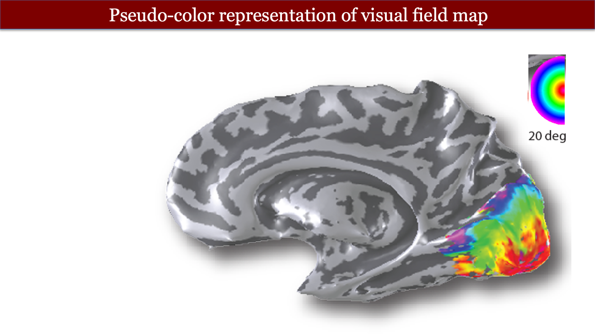{#fig-eccentricity-map width="85%"}

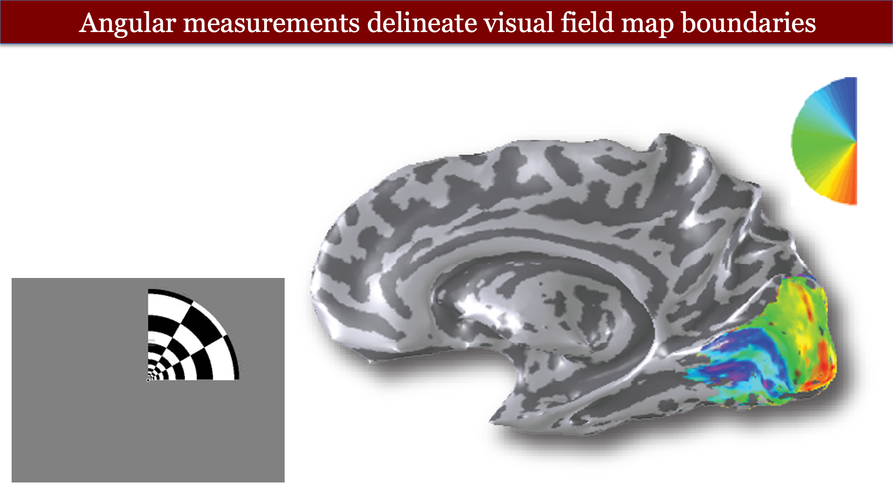{#fig-angle-map width="85%"}

Eccentricity and angle measurements, combined, are used to define a retinotopic map.
:::

Summarizing the information from the maps, we can label an entire retinotopic map using a single color, as in @fig-areas-magnification. Notice that these maps are not simply adjacent to one another. Rather, the V2 map surrounds V1, and it is surrounded, in turn by the V3 map. Thus the dorsal and ventral portions of the V2 and V3 map - which represent the lower and upper visual field - are well-separated from one another.

{#fig-areas-magnification width="80%"}

Get the Dougherty and Benson-Winawer surface area paper in here, too.

Alyssa Brewer noticed the secondary fovea on the ventral occipital surface and decided to explore it further [@brewer2005-visualFieldMaps-clusters]. To see the two clusters distinctly, she decided to use a much smaller field of view for the rings, expanding them slowly through the central 3 deg. You can see the two eccentricity maps - plainly distinct from one another in @fig-vo-cluster.

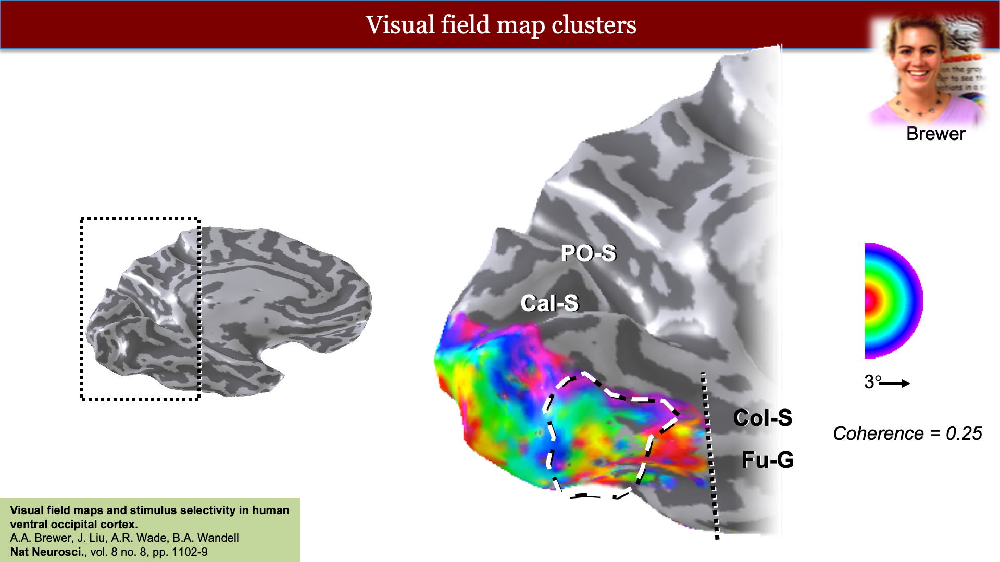{#fig-vo-cluster width="80%"}

## Clusters

Over time, it become clear to us that there were multiple distinct eccentricity maps, illustrated in each of these two brief videos. These eccentricity maps can be subdivided into different individual maps by also considering the angle representations, just as V1-V3 can be separated from the unified eccentricity map around the posterior pole and calcarine cortex in human.

Here are two different visualizations of the clusters. In @fig-clusters-movie they are shown on a slightly inflated cortical surface.

{#fig-clusters-movie width="80%" loop="true" autoplay="true" muted="true"}

In @fig-clusters-flatmap the eccentricity maps of the clusters are represented on a flattened cortical surface; the video oscillates between the measured eccentricity and a cartoon overlay that emphasizes the pattern.

{#fig-clusters-flatmap width="80%" loop="true" autoplay="true" muted="true"}

## Confirmation of clusters

The clustering of cortical retinotopic maps has been confirmed in by multiple groups. The clusters have been identified in posterior and anterior cortex, [@mackey2017-clusters], non-human primates [@kolster2009-clusters; @kolster2014-macaque-mt; @barton2017-sts-cluster; @meyer2025-clusters-evolution] and also in the pulvinar [@arcaro2015-pulvinar-cluster]. The retinotopic map clusters appear to be a basic functional principle that may have implications for development and plasticity.

::: {#nte-clusters .callout-note title="Clusters in the Human Brain"}
**Frontoparietal Clusters [@mackey2017-clusters]** Expanding the cluster model into higher-order cortex, this study identified multiple representations of polar angle and eccentricity in the human frontoparietal cortex. They discovered that these maps are organized into clusters sharing a confluent fovea, mirroring the organization of the visual cortex to facilitate efficient sensorimotor and cognitive processing.

**The Pulvinar Cluster [@arcaro2015-pulvinar-cluster]** In a significant extension of the theory, Arcaro and colleagues identified two visual field maps in the human ventral pulvinar (vPul1 and vPul2) . They proposed that these maps form a distinct visual field map cluster because they share an eccentricity representation and exhibit similar cortical connectivity patterns with early extrastriate areas.

**The pSTS "Cloverleaf" Cluster [@barton2017-sts-cluster]** This 2017 work with introduces a new cloverleaf cluster in the posterior superior temporal sulcus (pSTS). They characterized four distinct maps (pSTS-1 through pSTS-4) organized around a central foveal representation, suggesting this "radially orthogonal" structure is a fundamental principle for high-level visual and potentially multimodal processing.

**Macaque Motion Clusters \[\@{kolster2009-clusters\]** The Kolster and Vanduffel work is the primary reference for clusters in non-human primates, specifically identifying the MT cluster (MT, MST, FST, and V4t). Their work demonstrated that the cluster principle—minimizing wiring length between processing modules—is not unique to humans but is a general feature of the Old World primate visual system.

**Probabilistic Map Atlases [@wang2015-atlas-topography]** The Kastner group developed a probabilistic atlas of the human visual system that largely validates the cluster-based organization for more than 20 maps. This work is a large-scale confirmation of the cluster model across a large subject population in addition to being a very useful tool, widely used in neuroimaging.
:::

# Comparative anatomy

A recent paper used fMRI for a comparative anatomical analysis of human and macaque visual cortex [@meyer2025-clusters-evolution]. They report that the number of maps and their cluster-like organization are strikingly similar across species, suggesting that the cluster is an evolutionarily preserved unit.

Initially, the human fMRI groups relied on the macaque model - almost slavishly - to guide our interpretation of the retinotopic maps. Over time, investigators developed more confidence in the human fMRI data, and it has become clear that there are clear differences. Some of the differences are discussed in @nte-comparative-organization.

Here are some of the agreed upon differences

```         
* Human visual cortex contains a much larger number of neurons and surface area, even though the human optic nerve contains roughly the same number of axons as the macaque
* The ratio of the surface area of human V2/V3/V4 is much larger than the similar ratio in macaque (@fig-meyer-comparative); in general the visual cortical maps and clusters are all larger.
* The postion of the nominal fourth visual map differs substantially between human and macaque; sufficiently so that I named it hV4 rather than V4 and spent years arguing about this others 
* The functional responses to motion in human and macaque V3 and V3A do not match
```

This nice figure from @meyer2025-clusters-evolution shows a measurement of the relative size of the V2/V3 portion of the V1 cluster in human and macaque.

![Comparative anatomical sizes of maps and clusters [@meyer2025-clusters-evolution]](images/meyer2025-comparative.png){#fig-meyer-comparative width="80%"}

::: {#nte-comparative-organization .callout-note title="Humans and monkeys"}
This note is an expanded commentary on the more obvious differences between human and non-human primate clusters and retinotopic maps.

**Overall Size and Neuron Count:** Human visual field maps are substantially larger overall than those in the macaque, with human V1 estimated to be roughly two to four times larger. The human visual cortex correspondingly contains a much larger number of neurons, which is thought to reflect the increased processing required for human-specific cognitive demands, such as language and reading Derived from: "Visual Field Maps in Human Cortex" [@wandell2007-VisualFieldMaps] and "Imaging retinotopic maps in the human brain" [@wandell2011-ImagingRetinotopicMaps]. The larger number of human cortical neurons contrasts with the similar number of ganglion cell axons in the human and macaque optic nerves [@fortune2014-optic-nerve; @mikelberg1989-optic-nerve; @kolb2011-webvision].

**Anatomical Location of V1:** In macaques, a large portion of the primary visual cortex (V1) is located on the operculum, extending posterior and lateral to the medial position of the calcarine sulcus. In humans, V1 is located largely within the calcarine sulcus, extending partially onto the lateral surface of the occipital pole. The human lateral extension is not as large or typical as it is in the macaque. Derived from: "Imaging retinotopic maps in the human brain" [@wandell2011-ImagingRetinotopicMaps].

**Proportional Size of Area V3:** A highly salient difference between the species is the relative size of area V3. In macaques, V3 occupies a very small surface area compared to V1 and V2. In humans, V3 is proportionately much larger, meaning the scale factor difference between human and monkey V3 is even greater than the difference between their V1 maps. This difference in the V3/V1 surface area ratio likely reflects a functional divergence between the visual systems of the two species. Derived from: "Imaging retinotopic maps in the human brain" [@wandell2011-ImagingRetinotopicMaps], "Visual field representations and locations of visual areas V1/2/3 in human visual cortex" [@dougherty2003-map-sizes; @benson2022-surface-area], and "Visual field map clusters in human cortex" (@wandell2005-visualFieldMap-clusters) and [@meyer2025-clusters-evolution].

**Motion Sensitivity in Area V3A:** Although the map topographies of V3A are similar between humans and macaques, their functional sensitivities are completely different. Human V3A is highly responsive to motion, whereas macaque V3A is not strongly motion-selective. Derived from: "Visual Field Maps in Human Cortex" [@tootell1997-v3a; @wandell2007-VisualFieldMaps] and "Imaging retinotopic maps in the human brain" [@wandell2011-ImagingRetinotopicMaps]

**V4 / hV4 and Color Processing Locations:** In the macaque, area V4 spans both the dorsal and ventral portions of the occipital lobe, and color-exchange experiments produce responses in both components. In humans, investigators have not reliably found a dorsal component for the fourth visual map; instead, the human map (hV4) and the regions critical for color vision (and those associated with cerebral achromatopsia) are confined almost entirely to the ventral surface. Derived from: "Mapping hV4 and ventral occipital cortex: The venous eclipse" [@winawer2010-venous-eclipse]. "Imaging retinotopic maps in the human brain" [@wandell2011-ImagingRetinotopicMaps], and "Visual Field Maps in Human Cortex" [@wandell2007-VisualFieldMaps].

There is considerably variability within species in both the optic nerve axon count and the surface area of the visual field maps [@stensaas1974-v1-area; @dougherty2003-map-sizes; @benson2022-surface-area].
:::

```{=html}
<!--
# Modeling fMRI responses:  Population receptive fields (pRF)

Not for London

Needed in the future to explain the achiasma results.  Also pRFs are now standard methodology and thus need explanation.

# Functional specializations

Not for London.

Functional specialization has become a focus of the field.  Motivates the new diagram.  Still controversial.

Plasticity relateds to functional specializations via the Dehaene claims about 'cortical recycling'. Possibility of cortical color blindness and word blindness and face blindness.
-->
```

# Modern summary

These days, when I teach, I find the Felleman and Van Essen diagram less than helpful. There are several reasons. First, the diagram makes no distinction between retinoptic maps and 'visual areas', a concept I find to be fraught. Second, it omits the modern functional specializations that have been identified in the human visual cortex. Third, the map emphasizes the hierarchy concept strongly, but I not confident about the flow of information. Finally, it omits the subcortical systems which have become become increasingly important in teaching with the discovery of the ipRGCs.

Maybe get the grill-spector and kevin weiner diagram up as a better alternative. Or even start with the Zeki one and then get that one as the next generation.

De-emphasize the hierarchy of maps in favor of the clusters, because some of the clusters receive a very early signal from the retina. [@jacques2025-non-hierarchical; @markov2013-hierarchicalanatomy]

Incorporate pulvinar and other subcortical regions more clearly.

::: {#fig-multipane layout-ncol="2"}
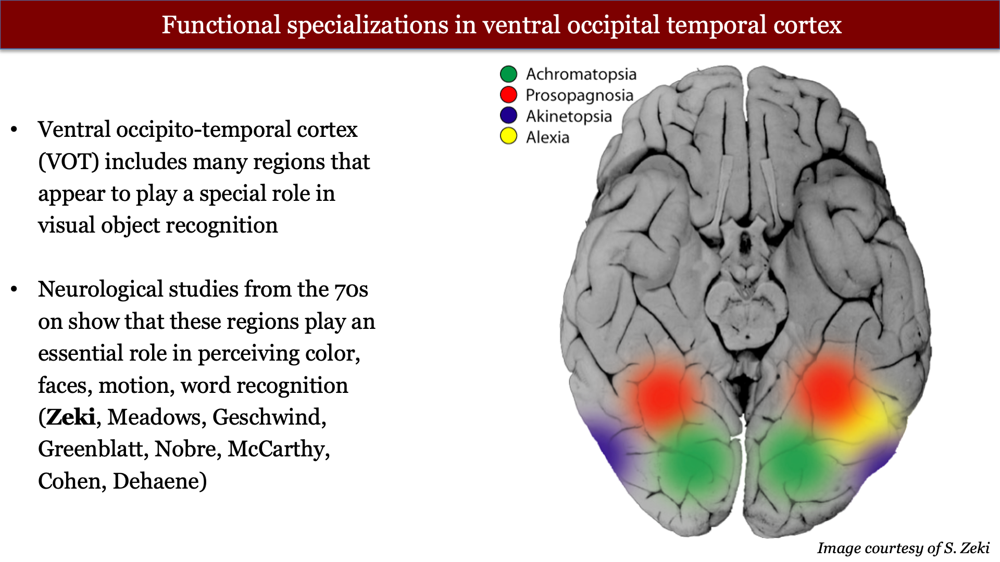{#fig-zeki-specialization}

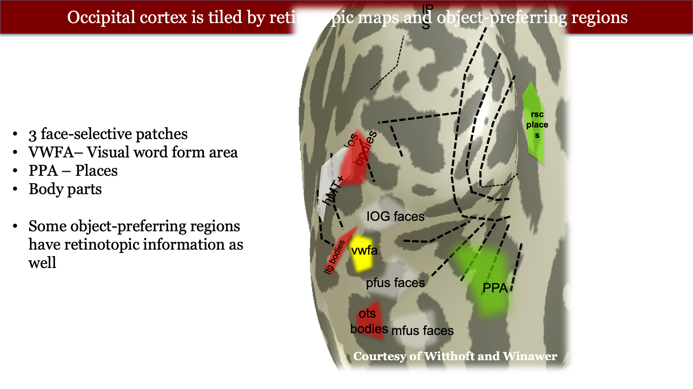{#fig-weiner-specialization}

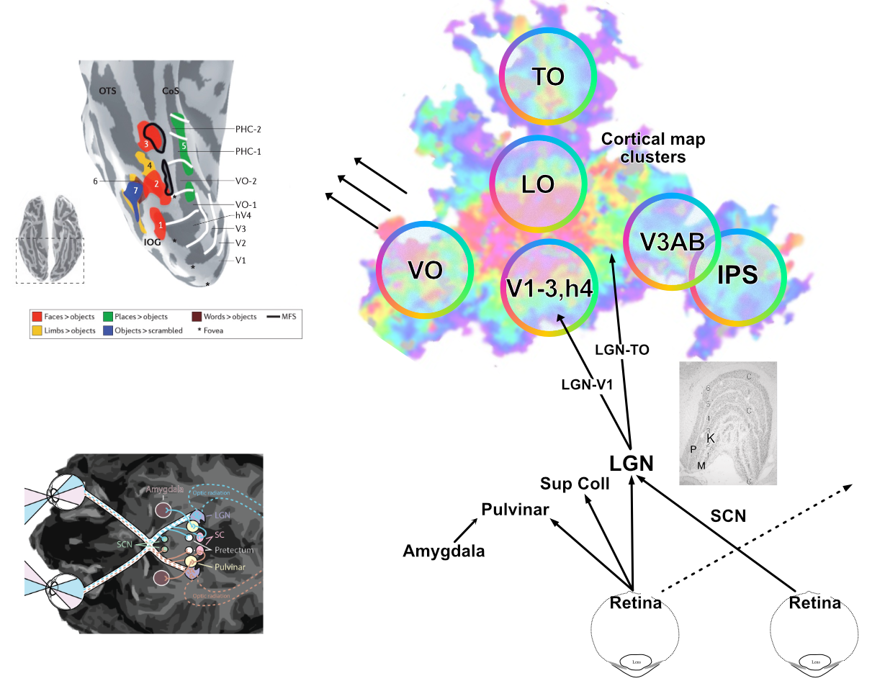{#fig-clusters-specialization}

Here is the main caption that applies to the entire figure group. Also, look at the images in this atlas from Goebel. @rosenke2021-atlas
:::

# Map reorganization

The interest in cortical development and cortical plasticity has a long history, paralleling the work on understanding the organization of cortical structures and function.

Even as Henschen first localized the human visual cortex, he wondered whether visual experience might have an impact on the size (surface area) of the visual cortex representation [@henschen1893-visual-center]. He reported that the size of visual cortex was smaller in blind people, but at that time very little was known about the size variation in the population. The variation in surface area is quite large, a factor 2.5 in surface area has been confirmed by a number of modern authors [@stensaas1974-v1-area; @dougherty2003-map-sizes; @benson2022-surface-area]. Thus, a case study finding a smaller V1 in a blind person than a control sighted person is not definitive proof of an experience-dependent plasticity.

But the main framing of adult cortical plasticity, that spanned many decades, was from the work of Cajal. He spent years trying to find evidence of axonal regeneration in the adult brain and spinal cord, Cajal reported that his efforts were only met with failure.In a famous passage, Cajal\[\^Cajal-stability\] referred to the anatomical stability of the brain

> "In the adult centers, the nerve paths are something fixed, ended, and immutable. Everything may die, nothing may be regenerated. It is for the science of the future to change, if possible, this harsh decree. @cajal1928-stability."

Although the adult appeared stable, There is no doubt from conception and through infance the brain undergoes a massive amount of change, developing in size and myelination or only the two most obvious and easiest to observe changes. Hubel and Wiesel observed that at very young ages cortical responses could be influenced by visual experience. They reported that this specific type of experience-dependent plasticity seemed to end, perhaps at 8 years of age in human. The idea that during development there is a period of significant plasticity, called the *critical period*, was the dominant view from about 1970 to 1990 [@hubel1970-criticalperiod].

## Animal models of adult cortical plasticity

In the middle of the 1980s a series of papers appeared from leading groups in the US reporting a specific type of adult cortical plasticity in both visual and somatosensory cortex [@merzenich1984-plasticity; @kaas1990-adult-plasticity-visual; @gilbert1992-rf-dynamics; @recanzone1992-adult-plasticity-somatosensory; @jenkins1990-adult-plasticity-somatosensory; @chino1992-rapid; @chino1995-receptive]. This type of plasticity described the reorganization of the visual field and somatosensory maps, at quite a large scale. Not many people would have been surprised at the idea that synapses come and go, or that they change their strength. Or even the idea that there would be some adjustment in dendritic and axonal arbors over the extent of 100s of microns.

But the possibility of a large-scale reorganization in the adult cortex, spanning many millimeters or even centimeters, was very exciting to many people. The notion that there was large scale reorganization of somatosensory and visual maps in the adult - which we might call adult map plasticity - lead to new commercial ventures premised on the idea that adult plasticity could keep us forever young. *Find some references here*.

Nikos Logothetis and I thought understanding adult cortical plasticity of the visual maps would be an excellent target of investigation, one that could find useful health applications. By working in macaque we thought it might be possible to discover and learn to control the molecular mechanisms that governed the plasticity. We were fortunate to recruit Stelios Smirnakis to lead the project, and he performed an experiment looking for significant reorganization in adult macaque V1 after binocular lesions in corresponding locations of the two retinae.

We expected to find an initial unresponsive zone in V1 that would fill-in with activation over time. To measure this remapping, we used functional MRI, as it is less invasive and would permit many repeated measurements over time. And, indeed, we could measure an unresponsive zone the macaque operculum following the lesions as expected. This is the 'lesion projection zone' (LPZ).

{#fig-lpz width="80%"}

As we measured repeated over time, we expected to that the LPZ area would shrink. But, over the months, we found very little, maybe no, remapping, [@smirnakisLackLongtermCortical2005]. Surprised by this, Stelios made measurements trying to find electrophysiological signals, but he found no significant electrical response, in agreement with the fMRI response.

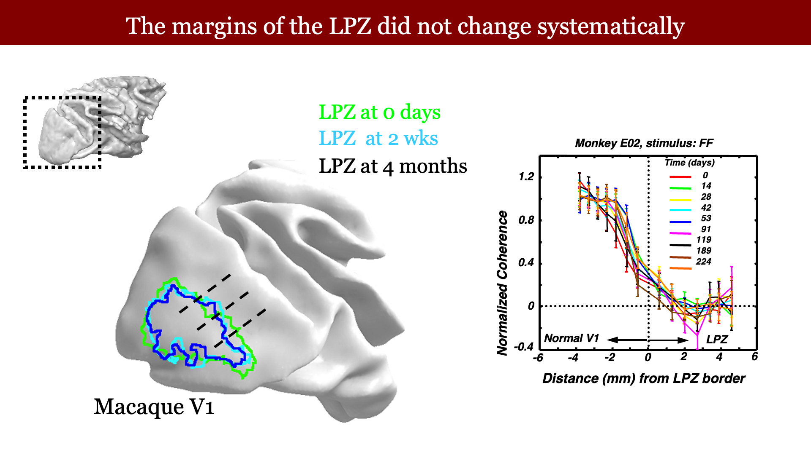{#fig-lpz-stability width="80%"}

Our finding of map stability conflicted with the prior reports, and its publication was met with a rebuke by authors who had reported significant remapping [@calford2005-critique-smirnakis]. A principal objection to our work was that fMRI was a poor measure. This ignored the fact that we had used both fMRI and electrophysiology.

But we too were puzzled about the difference and decided to study the literature, which we had previously accepted without much scrutiny. Stelios and I discovered that there were many serious inconsistencies in the animal literature, and we listed them in a review paper[@wandell2009-plasticity-stability]. Those concerns remain largely unanswered[^1] and are summarized in @fig-disputes.

[^1]: A number of investigators spoke to me privately, reporting that they too failed to find remapping. They were not looking for a fight and decided they had simply done something wrong. These comments were well-intentioned, gave us some comfort but also were a bit disheartening about the state of scientific discourse.

![This review paper [@wandell2009-plasticity-stability] describes a series of experimental conflicts in papers that found topographic remapping in adult visual cortex. These are discussed in detail in the review paper.](images/review-disputes.png){#fig-disputes}

::: {.callout-note title="Unanswered biological questions"}
But the absence of an effect caused me to return to using functional MRI to study naturally occurring lesions. Heidi Baseler, Tony Morland and I had already studied one case that we found interesting - rod monochromats [@baseler2002-rod-monochromats].

In 2005, we were debating whether the map changed. We wrote a reply to Gilbert and Kaas that, frankly, focused too much on the mechanics of the BOLD signal. But twenty years later, the molecular and modeling evidence suggests something much more profound: the primary visual cortex is structurally 'locked' to preserve the topographic blueprint, and what we once called 'plasticity' may be the brain's ability to flexibly read out that stable map.
:::

## Human measurements of map reorganization
The ability of fMRI to measure human retinotopic maps in human also afforded the opportunity to assess map reorganization, both during development and in the adult.  I draw your attention to five different experimental measures here that explored map organization in different ways.

A summary is this: there is a fascinating instance of a significant developmental change in the V1 map. But there has been no large-scale reorganization of the human V1 map following retinal lesions. 

### Achromatopsia - rod monochromats

My group was the first to recognie that we could explore the visual field map in people who lacked functional cones. These individuals, called rod monochromats, are rare but possible to find. The first study we performed, led by Heidi Baseler, measured only three such individuals and none of them were carefully screened for the disease - either genetically or behaviorally. We described this limitation as well as the basic result. Although these individuals had only functional rods and no cones - as far as we could tell - retinal signals produced functional signals in the location of the classic foveal projection. This finding was accepted and reported in subsequent authoritative reviews [@hoffmann2015-TICS-review][^3]

[^3]: We thought acquired foveal lesions would not fill in, but developmental was different. Alas, we were wrong for a few years until Heidi straightened us out. \>In adults [@baseler2011-LargescaleRemappingVisual], the deafferented cortical foveal representation in rod achromatopsia is not silent, but driven by parafoveal input [@baseler2002-rod-monochromats]. In essence, the visual field maps are preserved, but only represent retina covered with functional photoreceptors, that is rods [@hoffmann2015-TICS-review]."

Twenty years on, the matter was taken up again by Baseler and colleagues, using much better screening method [@molz2023-achromatopsiavisualCortexStability2023]. They found, contrary to our original measurement, that iindividuals who could be absolutely identified as having only rods had a silent foveal projection zone. Thus, even in this case of development the cortical map organization - which is initiated before the retina is functional \[shatz1992-developingbrain with that guy from duke who died sadly\] is not altered. The absence of foveal input does not cause the map to be reorganized. The initial map organization appears to be quite stable in the absence of any input. Quote Molz here.

@molz2023-achromatopsiavisualCortexStability2023 \> Remapping of the cortical representation of the central visual field is not a general feature in achromatopsia.

Gene therapy

@mckytonCorticalVisualMapping2021 Netta a co-author. They focus on color. <!--
The possibility that the adult human brain may regain or develop function following correction of congenital deafferentation has fired the imagination of scientists over the years. In the visual domain, cases of recovery from congenital deficits are rare. Gene therapy visual restoration for congenital  CNGA3-achromatopsia, a disease caused by cone photoreceptor dysfunction, gave us the opportunity to examine cortical function, to the best of our knowledge for the first time, both before and after restorative treatment. While behaviorally only minor improvements were observed post-treatment, fMRI analysis, including size algorithms of population-receptive fields, revealed cortical changes, specifically receptive field size decrease in the treated eyes. This suggests that, at least to some degree, the adult cortex is able to encode new input.
-->

### Achiasmia and albinism

There are many examples in the literature, but a particularly interesting case for the visual system is the disruption of how the retinal axons find their way to the lateral geniculate.

In a small number of people, the standard crossing pattern in which the optic nerve axons from the nasal retina cross to the opposite hemisphere does not occur. The optic chiasm never develops, and the retinal axons stay within the same hemisphere.

This arises during development. And these people see perfectly well despite having completely atypical cortical functional responses.

::: {#fig-chiasmic-subject layout-ncol="2"}
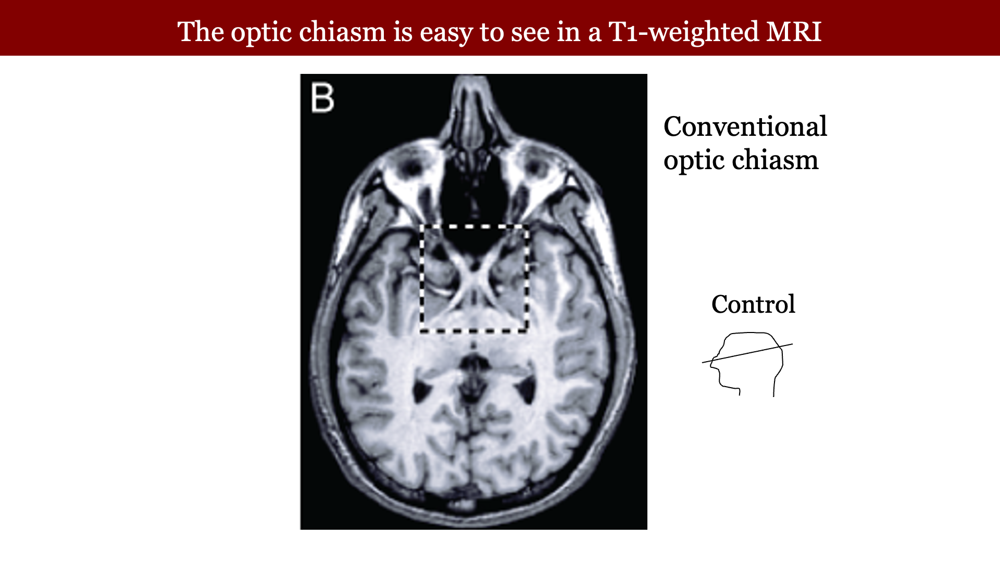{#fig-chiasm}

{#fig-achiasm}

{#fig-achiasm-hemifield}

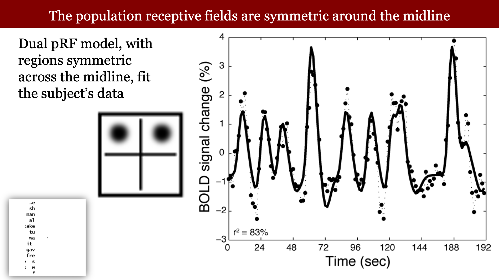{#fig-achiasm-prf}

Caption
:::

@victor2000-achiasma @prakash2010-achiasmic @hoffmann2012-achiasma \> "The absence of the optic chiasm is an extraordinary and extreme abnormality in the nervous system. The abnormality produces highly atypical functional responses in the cortex, including overlapping hemifield representations and bilateral population receptive fields in both striate znd extrastriate visual cortex. Even in the presence of these large functional abnormalities, the effect on visual perception and daily life is not easily detected. @hoffmann2012-achiasma

@bao2015-achiasmic @daviesThompson2013-achiasmic

Must be some more Morland studies

@hoffmann2003-alibinism

@hoffmann2015-TICS-review

Further measurements of map plasticity have been made in the adult brain following the onset of different types of retinal disease. These diseases act as naturally ocurring retinal lesions. In the presence of significant cortical remapping, one might expect to see the maps in such individuals differ, perhaps by filling in the lesion projection zone (LPZ) corresponding to the disease.

### Macular degeneration

Early publications in human @sunness2004-md-retinotopy found little support for cortical remapping in the adult subsequent to foveal disease. In contrast, Baker and colleagues in the Kanwisher group [@baker2007-reorganization; @baker2008-reorganization; @dilks2007-reorganization] reported large scale reorganization. @wandell2009-plasticity-stability reviewed the problems with these papers.

A thorough and authoritative analysis concluded that there was no large scale reorganization in passive viewing [@baseler2011-LargescaleRemappingVisual].

The lesion project zone (LPZ) was silent Masuda and colleagues obsersved that a task, such as a one-back memory task, could evoke a signal in the LPZ [@masuda2008-maculardegenerationV1; @masuda2021-maculardepgeneration; @rosenau2008-feedback]. His findings suggest that the absence of the feed forward signal from the retina unmasked the cortico-cortical signal associated with task judgments.

### Retinitis pigmentosa

Masuda used the same methodology in patients with retinitis pigmentosa, a disease that spares the fovea but damages the peripheral retina [@masuda2010-retinitispigmentosa]. Once again, they found no significant reorganization in the adult cortex.

It is worth noting that expansion of the cortical signals does not solve the basic problem of a retinal lesion: no signal is acquired when the retina is damaged. Expanding the cortical signal to deafferented cortical regions does not mean one can see the blinded portion of the visual field. It is not really clear what purpose such an expansion of the signals would serve.

## Mike May

::: {.callout-note title="Rethinking the findings"}
There is a genral move towards integrating subcortical pathways as part of the computational system. Kaas, in particular, has asserted that many of tehe changes we observe after lesions can be explained by properties of the pulvinar and subcortical pathways. Here is some early work leading in that direction @collins2003-mt-v1-lesions @kaas2007-pulvinar-review

Maybe mention Murray Sherman's book here.

Kaas and his colleagues have leaned into this alternative explanation in recent years, particularly in work with Neeraj Jain, which includes specific work on PNNs using Chondroitinase. @jain2012-somatosensory-plasticity @jain2025-kaas-spinal-critical
:::

## Cellular advances and PNNs

Parallel to the systems-level evidence for stability in the human brain, we have seen very meaningful advances in our understanding of the molecular 'brakes' that enforce it. This story brings us full circle to Camillo Golgi, who first identified a delicate 'perineuronal' coating on neurons over a century ago. Today, thanks to the work of Takao Hensch, we know that these parvalbumin-positive cells are the primary modulators of cortical plasticity. Furthermore, through the critical work of the Maffei and Fawcett labs, we can now identify the specific molecules (proteoglycans) within Golgi’s PNN that serve as the physical armor, stabilizing these inhibitory circuits and preventing the large-scale remapping that characterized the juvenile brain.

Parvalbumin cell development papers @hensch2014-amblyopia-critical-period

@yew1997-pnn-human-cerebellum @grateron2003-pnn-human-entorhinal @fung2010-pnn-human-dlpfc

General review @sorg2016-pnn-review

@morishita2010-lynx1-hensch

PNN papers in human @rogers2018-pnn-epilepsy @mauney2013-pnn-schizophrenia @nakayama2025-aggrecan-pnn - "Among the PNN-related genes examined, aggrecan alone exhibited strong activity-dependent transcriptional regulation"

\<!-- The Nakayama (2025) paper you asked about is the most modern measure of this process. It shows that aggrecan expression is not just a "clock" that runs out; it is activity-triggered.The Measure: Using quantitative PCR and Western blots, Nakayama showed that as neurons begin to fire in response to visual input, the Acan gene is upregulated specifically in Parvalbumin (PV) interneurons.

The Feedback Loop: Increased activity $\rightarrow$ Increased Aggrecan $\rightarrow$ Stronger PNNs $\rightarrow$ Reduced Plasticity (Stability).