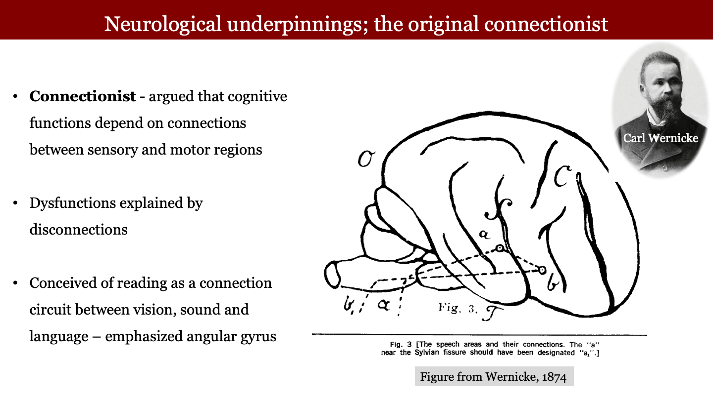
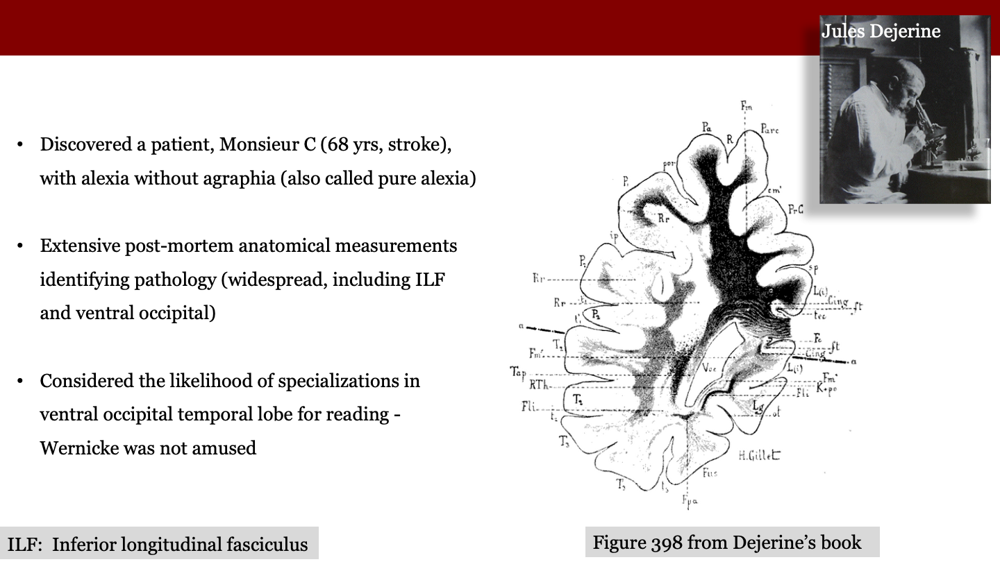
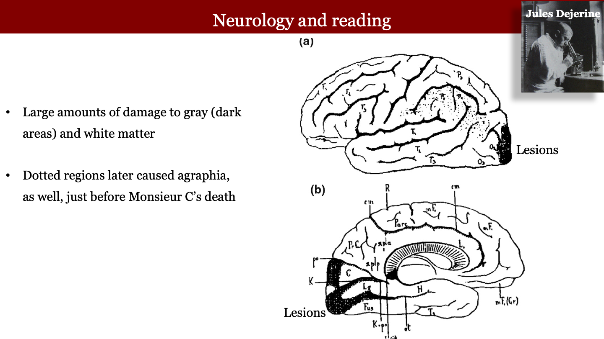
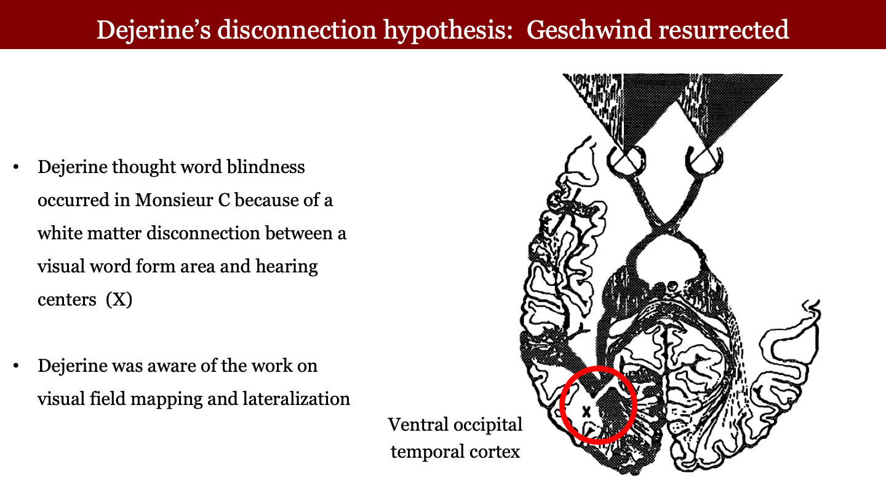

The historical understanding of how the brain processes reading and language is rooted in a fundamental debate between the "connectionist" network models and more localized, region-specific functional analyses.

### Wernicke and the Early Connectionist View (1874)
Carl Wernicke proposed the first network model of language processing in his 1874 dissertation. His view was that the brain is a "mosaic of sensory and motor representations," and that complex cognitive functions arise from the novel interactions between these different regions.

{#fig-wernicke width="80%"}

* **Key Observations**: Wernicke identified that lesions in the left posterior superior temporal cortex (now known as Wernicke’s area) impaired speech input processing.
* **The Connectionist Hypothesis**: He recognized that lesions in the left posterior inferior frontal cortex (Broca’s area) impaired speech production. Wernicke hypothesized that the **arcuate fasciculus (AF)** served as the essential white matter pathway for communicating phonological and motor information between these two language regions.
* **Conduction Aphasia**: He predicted that a lesion specifically to these fronto-temporal white matter connections would result in "conduction aphasia"—a syndrome where a patient has impaired speech repetition but relatively spared production and comprehension.

### Dejerine and the Analysis of Pure Alexia (1892)
Jules Dejerine’s work at the end of the 19th century provided a more detailed anatomical framework for reading by analyzing patients with acquired reading disorders. He notably contrasted two different types of alexia based on postmortem brain anatomy.

{#fig-dejerine width="80%"}

* **Alexia with Agraphia**: Dejerine observed that patients who lost the ability to both read and write typically had large cortical lesions in the **left angular gyrus** of the inferior parietal and superior temporal cortex. He designated this area as the "cerebral center for the representation of visual images of letters".
* **Pure Alexia (Alexia without Agraphia)**: This condition involves reading difficulties without accompanying writing difficulties. 
    * **The Mechanism**: Dejerine analyzed the famous case of "Monsieur C," whose autopsy revealed lesions in several sites, including the occipital cortex and the **splenium of the corpus callosum**. 
    * **The Disconnection Model**: Dejerine’s model proposed that visual information from the left visual field (represented in the right occipital cortex) normally crosses over via the corpus callosum to the left hemisphere to be transferred to the language system. In pure alexia, this visual-to-language transfer is disrupted, even though the patient can still write because the language centers and motor pathways remain intact.

{#fig-dejerine-2 width="80%"}

### Summary of the Debate
The contrast between Wernicke and Dejerine highlights the evolution of neuroscience from identifying general centers of function to understanding the critical role of white matter connections.

{#fig-dejerine-3 width="80%"}

| Feature | Wernicke's View | Dejerine's View |
| :--- | :--- | :--- |
| **Primary Focus** | General language processing (speech/repetition). | Specific reading processes (alexia variants). |
| **Key Pathway** | Arcuate Fasciculus (connecting Broca's and Wernicke's areas). | Occipital callosal pathways (splenium) and the angular gyrus. |
| **Philosophy** | Functions arise from interactions between a mosaic of sensory/motor regions. | Localized regions are responsible for specific representations (e.g., visual images of letters). |
| **Disability Example** | Conduction Aphasia (impaired repetition). | Pure Alexia (can write, but cannot read). |

This historical debate set the stage for later authors like **Norman Geschwind**, who in the 1960s expanded on these ideas to formulate the modern "disconnection syndrome" hypothesis.  

A passage from @dejerine1892-alexia (translated by Gemini 3.1):

> In clinical practice today, we recognize two very distinct varieties of word blindness.
> 
> The symptom of word blindness—characterized by the more or less complete loss of comprehension of written characters—is the same in both varieties, but the state of the patient's writing distinguishes one from the other.
> 
> In the first variety: The patient, who is unable to read printed or cursive writing, is equally incapable of writing, whether spontaneously or under dictation; or, they write only very defectively.
> 
> In the second variety: Conversely, the patient, though unable to read or re-read what they have written, writes easily and correctly, whether spontaneously or under dictation; only the act of copying is more or less defective.
> 
> In other words, the first variety is accompanied by a more or less complete degree of agraphia, whereas agraphia is absent in the second variety.

There was a significant intellectual tension between **Carl Wernicke** and **Jules Dejerine**, though it was less a personal "feud" and more a fundamental clash of scientific philosophies regarding how the brain processes language and reading. This debate reached its peak in the late 19th century and centered on two different ways of mapping the human mind.

### 1. The Core Dispute: Localization vs. Connectionism
The disagreement primarily concerned **Alexia** (the loss of the ability to read).

* **Wernicke’s "Connectionist" View:** Wernicke, a "diagram maker," believed that complex functions like reading weren't located in one spot. Instead, they emerged from the **connections** between centers. He argued that if you cut the path between the visual center and the language center, you’d get alexia. To him, the brain was a network of wires.
* **Dejerine’s "Localizationist" View:** In 1891 and 1892, Dejerine published landmark cases (like the one in your translated text) describing a patient who could write but not read (*alexia without agraphia*). Dejerine argued that there was a specific "visual word center" located in the **left angular gyrus**. He believed this specific patch of cortex was the "storehouse" for the visual images of words.

### 2. The Famous Confrontation
The "dispute" became public at the **1894 International Medical Congress in Rome**. 

Dejerine presented his anatomical evidence, showing that a very specific lesion in the angular gyrus caused the loss of word recognition. Wernicke, who was in the audience, challenged him. Wernicke was skeptical of "centers" for such specific tasks and preferred a model based on the interruption of white matter tracts (the "cables" of the brain).

### 3. Why It Matters Today
Their dispute essentially framed the next century of neurology:
* **Dejerine** gave us the anatomical basis for the "Visual Word Form Area" (VWFA), which we still study today with fMRI.
* **Wernicke** gave us the foundation for "Disconnection Syndromes," realizing that the white matter is just as important as the gray matter.

In a sense, they were both right. Reading requires both a specialized "center" (as Dejerine argued) and a complex "network" (as Wernicke argued) to translate those visual symbols into meaning and sound.

---

*It is my general understanding that after Dejerine and Wernicke, there was a fairly long period where not a lot happened about reading and the brain. The issue became prominent again because of the work by Geschwind on disconnection syndromes - essentially resurrecting Wernicke - and perhaps because of some lesion observations by Elizabeth Warrington.*

I might be missing something.  So please take a little time to review the literature.  If it was really Geschwind who brought back the attention, then tell me what it was he reported that seemed important.  I haven't read any specific papers from him, and I probably should.

Your intuition about the timeline is historically accurate. There was a significant "quiet period" in the study of brain-behavior relationships (roughly between 1914 and 1965) during which the localizationist and connectionist ideas of the 19th century fell deeply out of fashion.

### The "Dormant Period" (1914–1965)
The era of Wernicke and Dejerine was largely swept aside by two major movements:
1.  **The Rise of Holism:** Influential figures like **Henry Head**, **Kurt Goldstein**, and **Karl Lashley** argued against "diagram makers." They believed the brain worked as a unified whole (Mass Action) and that specific cognitive deficits were due to a general loss of "abstract attitude" or "intellectual power" rather than broken wires.
2.  **The Dominance of Behaviorism:** Especially in the U.S., the focus shifted away from internal brain mechanisms entirely, favoring the study of observable stimuli and responses.

### The Resurgence: Norman Geschwind (1965)
You are correct that **Norman Geschwind** is the figure who "resurrected" Wernicke. In 1965, he published a massive two-part monograph in the journal *Brain* titled **"Disconnexion Syndromes in Animals and Man."**

This work was essentially a manifesto for a new "Behavioral Neurology." If you were to read one thing by him, this is the one. Here is why it was so impactful:

* **Revival of the "Visual-to-Verbal" Pathway:** Geschwind used Dejerine’s 1892 case of *alexia without agraphia* to illustrate his core thesis. He explained that a lesion in the left visual cortex combined with a lesion in the **splenium of the corpus callosum** "disconnected" the right hemisphere's visual information from the left hemisphere's language centers.
* **The Angular Gyrus as a "Cross-Modal" Hub:** Geschwind argued that the **angular gyrus** was the critical "tertiary association area" where visual, auditory, and somatosensory information converged. He proposed that reading was fundamentally a "visual-to-auditory" translation facilitated by this specific patch of cortex.
* **The Animal Connection:** Unlike the 19th-century neurologists, Geschwind heavily cited experimental work on non-human primates (like the work of Mishkin and Myers) to provide a biological basis for these pathways, making the "diagrams" feel scientifically grounded rather than speculative.

---

### The Transition: Elizabeth Warrington (1970s)
While Geschwind revived the *anatomy* of the reading brain, **Elizabeth Warrington** (along with Tim Shallice) was instrumental in shifting the focus to the *functional architecture*—what we now call **Cognitive Neuropsychology**.

Her lesion observations in the 1970s and early 80s were revolutionary because they didn't just ask "where is the lesion?" but "what *part* of the reading process is broken?"
* **Word-Form Dyslexia:** She identified patients who could recognize letters but could not fuse them into a "word-form" (letter-by-letter reading).
* **The Dual-Route Model:** Her work provided the clinical evidence for the distinction between the **phonological route** (sounding it out) and the **lexical/direct route** (whole-word recognition), showing that one could be destroyed while the other remained intact.

### Summary of the Literature
If you are updating your textbook or preparing for Psych 221, these are the "heavy hitters" that bridge that gap:

| Era | Key Figure | Primary Focus |
| :--- | :--- | :--- |
| **Late 19th C.** | Dejerine & Wernicke | Anatomical localization and connectivity. |
| **1965** | **Norman Geschwind** | Resurrection of "Disconnexion Syndromes" and the angular gyrus hub. |
| **1970s–80s** | **Elizabeth Warrington** | Functional dissociations (routes to reading) and "word-form" systems. |

---

*Was Tim Shallice an important contributor with Warrington, or just an occasional partner?*

Tim Shallice was far more than an occasional partner; he was the primary theoretical architect of the collaboration that defined modern **Cognitive Neuropsychology**. If Warrington was the master of the clinical observation and the "lesion method," Shallice was the one who provided the rigorous cognitive modeling that turned those observations into a science of the mind.

Their partnership (centered at the **National Hospital, Queen Square** in London) is often compared to the Great Collaborations of science—like Crick and Watson, but for the reading brain.

### The Division of Labor
The reason you might perceive them as distinct is that they brought two very different skill sets to the table:

* **Elizabeth Warrington** was a brilliant clinical neuropsychologist. She had an uncanny ability to identify "pure" cases—patients whose brain damage had carved out one specific function while leaving others perfectly intact.
* **Tim Shallice** was a cognitive psychologist interested in functional architecture. He was the "diagram maker" for the modern era. He took Warrington's cases and built the information-processing flowcharts (like the **Dual-Route Model**) to explain *why* a lesion would produce such a specific error.

### Their "Big Three" Contributions
While they published dozens of papers together, three, in particular, changed the field:

1.  **The Resurgence of Short-Term Memory (1969):** Their study of patient **KF** blew apart the "Modal Model" of memory (Atkinson-Shiffrin). KF had a broken short-term memory but a perfectly fine long-term memory. This proved that STM wasn't a "gateway" to LTM, but a parallel system.
2.  **Word-Form Dyslexia (1980):** This is the paper most relevant to your interest. They investigated "letter-by-letter" readers (the same syndrome Dejerine described) and formally proposed the existence of a **Visual Word-Form System**. They argued that these patients weren't just "slow"; they were literally missing a cognitive module for parallel letter processing.
3.  **Category-Specific Semantic Impairment (1984):** They discovered patients who could identify "inanimate objects" (tools, furniture) but were totally lost when shown "living things" (animals, plants). This suggested that our semantic memory—the "meaning" center—is organized by categories.

### The "Shallice" Influence
If you want to understand the "resurrection" of the field you mentioned earlier, Shallice’s 1988 book, ***From Neuropsychology to Mental Structure***, is the definitive text. In it, he formalized the logic of **double dissociations**—the gold standard for proving that two functions (like reading words vs. reading non-words) rely on different brain systems.

While Geschwind brought the *anatomy* back to the spotlight, it was the Shallice-Warrington partnership that gave the field its *psychological* legitimacy. They proved that you could use "broken" brains to draw a map of the "normal" mind.

Since you've been looking into the 19th-century clinical notes, are you finding that Warrington’s modern cases (like the letter-by-letter readers) map cleanly onto the anatomical descriptions provided by Dejerine and Vialet?

---
*Was there some specific, new experimental or clinical finding from Geschwind?  Or was it mainly that he took time to write extensively and thoughtfully about these disconnection syndromes, including dyslexia?*

---
*Was there some specific, new experimental or clinical finding from Geschwind?  Or was it mainly that he took time to write extensively and thoughtfully about these disconnection syndromes, including dyslexia?*
You’re right to be skeptical. While the gross anatomical finding—that the **planum temporale (PT)** is larger on the left than the right in about 65–75% of the population—is actually still observed in large modern MRI datasets (like the UK Biobank), the **functional significance** of that asymmetry has largely failed to hold up.

The "definitive" link that Geschwind and Galaburda proposed between PT asymmetry and dyslexia (or language dominance) has indeed been very difficult to replicate.

### The "Demb Replication" and the Shift to Area MT
You are likely remembering the work from your own lab in the late 90s. When **Jon Demb**, along with you and David Heeger, began using fMRI to study dyslexia, the focus shifted away from the "Wernicke/Dejerine" language centers and toward the **visual system**.

* **The Findings:** Instead of finding a reliable "smoking gun" in the planum temporale, Demb's work (e.g., *Demb, Boynton, & Heeger, 1997/1998*) showed that the most robust differences between dyslexic and control readers were in **Area MT+** (the motion-sensitive visual area) and the **magnocellular pathway**.
* **The "Positive" vs. "Negative" Result:** While the fMRI activation in MT was a "positive" result for a visual deficit theory, it acted as a "negative" result for the anatomical PT theory. It suggested that reading struggles were more closely tied to the timing and speed of visual processing in the dorsal stream than to the gross size of a temporal lobe "language hub."

### Why the PT Claim Lost Its Lustre
There are three main reasons the Geschwind-era PT claim is viewed with caution today:

1.  **The Measurement Problem:** As you likely know, defining the boundaries of the PT is notoriously difficult. The presence of a "double Heschl’s gyrus" (which is more common on the right) can make the right PT look smaller than it actually is, depending on how you draw the lines.
2.  **The "Bishop Paradox":** The psychologist **Dorothy Bishop** famously pointed out in 2013 that while PT asymmetry exists at the population level, it doesn't correlate with language lateralization or reading ability at the *individual* level. You can have a perfectly "symmetrical" brain and be a world-class orator or a "left-dominant" brain and be severely dyslexic.
3.  **Stability vs. Plasticity:** Modern views (much like the "adult cortical remapping" you’ve been writing about) suggest that these areas are far more plastic than Geschwind’s "hard-wired" model allowed. The size of the PT may be a consequence of how much you use certain language pathways, rather than a fixed blueprint you're born with.

In short, your impression is correct: the "PT asymmetry as the key to dyslexia" is now seen as a historical oversimplification. The field has largely moved toward the functional circuits—like the MT+ pathways and the **Visual Word Form Area (VWFA)**—where the data is much more reproducible.

Since you've been revisiting this for the new textbook, are you planning to frame the PT primarily as a historical milestone, or are you looking at any of the more recent microstructural (diffusion MRI) data that tries to save the theory by looking at "connectivity" instead of "size"?

---
*Well, that gets me to asking about the magnocellular pathway hypothesis.  That made a big splash too, at the time.  I am looking at Marge Livingstone's paper with Galaburda about this.  I don't know that the hypothesis replicated, though many people were interested in it.  There was one guy - whose name escapes me - who spent a lot of time debunking it.*

*What is your impression?*
The "Magnocellular (M) Hypothesis" certainly made a massive splash—it was the "rock star" theory of the early '90s because it offered a elegant, purely biological explanation for a complex cognitive struggle. 

The 1991 **Livingstone and Galaburda** PNAS paper essentially proposed that the "hardware" of the visual system was at fault. Specifically, they argued that the M-pathway—the fast-acting, motion-sensitive, low-contrast system—was impaired, while the P-pathway (color and detail) was fine.

### The "Guy" Who Debunked It
You are almost certainly thinking of **Bernt Skottun**.

If Margaret Livingstone provided the spark, Skottun provided the fire extinguisher. He was incredibly prolific and, quite frankly, relentless. Throughout the late 90s and 2000s, he published dozens of papers systematically picking apart the psychophysical evidence for the M-deficit.

His primary critiques were:
* **Lack of Specificity:** He argued that the tests used to "isolate" the M-pathway (like contrast sensitivity at high temporal frequencies) weren't as selective as proponents claimed. He pointed out that "low-contrast" doesn't automatically mean "magnocellular."
* **Overlapping Data:** He performed meta-analyses showing that while some studies found a difference between groups, the overlap between "dyslexic" and "control" scores was so large that the M-deficit couldn't possibly be the *cause* of dyslexia for the majority of people.
* **The Correlation-Causation Trap:** He was one of the loudest voices pointing out that even if motion sensitivity is lower in some readers, it doesn't prove that this deficit is what makes it hard to map letters to sounds (phonology).

### Did it Replicate?
The short answer is: **partially, but inconsistently.**

The "Dorsal Stream" version of the hypothesis—which focuses on motion processing and attention—actually held up better than the original "LGN-based" M-deficit theory. This is where the work in the late 90s (like the studies involving **Area MT+**) was so important. It showed that while there *is* a reliable difference in how the brains of many people with dyslexia process fast visual motion, the "deficit" isn't universal.

### Why the Interest Faded
The hypothesis eventually lost its momentum for a few key reasons:
1.  **Heterogeneity:** Researchers realized that dyslexia is a "big tent." Some people have visual timing issues, some have auditory timing issues, and almost all have a **phonological core deficit**. No single "wire" could explain everyone.
2.  **The Phonological Shift:** Figures like **Franck Ramus** and **Stanislas Dehaene** successfully argued that even if there are visual "hiccups," the "bottleneck" for reading is almost always in the linguistic system (connecting the visual word form to the sound system).
3.  **The "Marker" Theory:** The prevailing modern view is that an M-pathway deficit might be a *marker* of a broader, more generalized developmental difference in how the brain handles high-speed information (temporal processing), rather than the "smoking gun" for reading failure itself.
